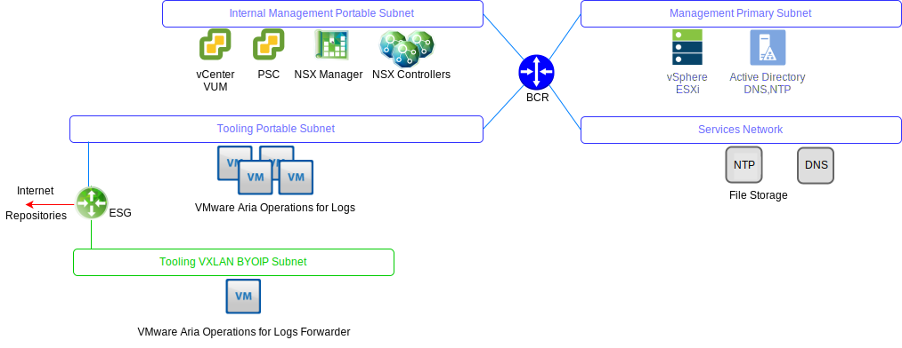

---

copyright:

  years:  2016, 2023

lastupdated: "2023-06-13"

subcollection: vmwaresolutions

---

{{site.data.keyword.attribute-definition-list}}

# VMware Aria Operations for Logs
{: #opsmgmt-vrli}

The VMware Aria Operations™ for Logs (formerly known as VMware vRealize® Log Insight™) environment consists of four virtual machines (VMs) with an integrated Load Balancer.

This pattern supports:
* 30,000 VMs
* 75 Gbs log ingestion per day
* 5,000 events per second

VMware Aria Operations for Logs enables real-time logging for components in the {{site.data.keyword.vmwaresolutions_full}} environment. The design deploys a VMware Aria Operations for Logs cluster that consists of four nodes in each instance. This configuration provides continued availability and increased log ingestion rates.

{: caption="Figure 1. VMware Aria Operations for Logs networking" caption-side="bottom"}

In this design, each location has an independent VMware Aria Operations for Logs cluster that is deployed on the management cluster. The VMware Aria Operations for Logs cluster is deployed on the tooling subnet by using {{site.data.keyword.cloud_notm}} Portable IP addresses. The deployment facilitates communication to all components that are addressed out of the {{site.data.keyword.cloud_notm}} RFC1918 address space. The components include vSphere® hosts, vCenter, Platform Services Controller, NSX Manager, and NSX Controllers. A VMware Aria Operations for Logs cluster contains a primary node and at least two worker nodes with an Integrated Load Balancer.

* Primary Node - required initial node in the Cluster. The primary node is responsible for queries and log ingestion. The primary node web UI is the single pane of glass for that VMware Aria Operations for Logs Cluster. All queries against data are directed against the primary, which in turn distributes the workload to the workers.
* Worker Node - three nodes minimum are required to form a cluster with the ability to add more workers for scale-out. A worker node ingests logs and stores logs locally.
* Integrated Load Balancer - provides high availability by using proprietary load-balancing configuration (no external load balancer required).
* VMware Aria Operations for Logs Forwarder - deployed to receive logs from the NSX overlay components. Additionally, it can be used by a client if they want to send logs from compute VMs. The VMware Aria Operations for Logs Forwarder is a single VMware Aria Operations for Logs primary node that is used as a remote syslog aggregator to forward alerts to the VMware Aria Operations for Logs cluster. As the VXLAN-backed addresses are outside of the BYOIP address space, NAT rules must be implemented on the NSX ESG.

The following sizes are available and the appropriate one is selected:
* Small – 2,000 events per second
* Medium – 5,000 events per second
* Large – 15,000 events per second

{: caption="Figure 2. VMware Aria Operations for Logs components" caption-side="bottom"}

VMware Aria Operations for Logs collects logs to provide monitoring information about the environment from a central location.

VMware Aria Operations for Logs collects log events from the following virtual infrastructure and cloud management components (logging clients):
* vCenter
* ESXi hosts
* NSX Manager
* NSX Controllers
* NSX Edge services gateways
* NSX distributed logical router instances
* NSX universal-distributed logical routers
* NSX distributed firewall ESXi kernel module
* VMware Aria® Operations™ Manager Analytics cluster nodes and Remote collectors
* VMware Aria Operations for Logs instance in the other instances as a result of event forwarding

The following logging clients are supported but not integrated in this design:
* Realize Automation Appliance
* VMware Aria Orchestrator (embedded in the VMware Aria® Automation™ Appliance)
* VMware Aria IaaS Web Server
* VMware Aria IaaS Management Server
* VMware Aria IaaS DEM
* VMware Aria IaaS Proxy Agents
* VMware Aria Business server
* VMware Aria Business data collector

## System requirements
{: #opsmgmt-vrli-requirements}

To accommodate all log data from the log sources in the environment, the VMware Aria Operations for Logs nodes need to be sized correctly. This design is based on the Medium size appliance:

| Attribute                | Specification                     |
| ------------------------ | --------------------------------- |
| vCPU                     | 8                                 |
| Memory                   | 18 GB                             |
| Disk (thick provisioned) | 530 GB (490 GB for event storage) |
{: caption="Table 1. VMware Aria Operations for Logs Primary and Replica Node system settings" caption-side="bottom"}

Each VMware Aria Operations for Logs virtual appliance has three default virtual disks and can use more virtual disks for storage.
* Hard disk 1 - 20 GB for the root file system
* Hard disk 2 - 510 GB for medium-size deployment and contains two partitions:
   * `/storage/var` - for system logs
   * `/storage/core` storage - for collected log files (approximately 475 GB disk space available)

## Networking
{: #opsmgmt-vrli-network}

Deployment of the VMware Aria Operations for Logs appliance requires three IP addresses from the tooling-private portable subnet. VMware Aria Operations for Logs requires access to the following items.
* vCenter Appliance
* VMware Aria Operations for Logs Appliance
* NSX-T or NSX-V Appliances
* Tooling Expansion VXLAN
* Customer Networks
* NTP server (`time.services.softlayer.com`)
* {{site.data.keyword.vmwaresolutions_short}} Active Directory/DNS
* The Remote Collectors require NAT rules on the NSX ESG to enable connectivity to the primary node, primary node replica, and data nodes

## Ports
{: #opsmgmt-vrli-ports}

| Description                                                   | Port       | Protocol |
| ------------------------------------------------------------- | ---------- | -------- |
| Outbound syslog traffic that is configured as a Forwarder destination | 514        | TCP, UDP |
| Syslog data over SSL                                          | 1514, 6514 | TCP      |
| VMware Aria Operations for Logs Ingestion API                                     | 9000       | TCP      |
| VMware Aria Operations for Logs Ingestion API over SSL                            | 9543       | TCP      |
| SSH Access to appliance                                       | 22         | TCP      |
| User Interface                                                | 80, 443    | TCP      |
| NTP                                                           | 123        | UDP      |
| SMTP                                                          | 25         | TCP      |
| DNS                                                           | 53         | UDP      |
| LDAP/LDAPS                                                    | 389, 636   | TCP      |
| LDAP GC                                                       | 3268/3269  | TCP      |
| vCenter                                                       | 443        | TCP      |
| VMware Aria Operations Manager appliance                         | 443        | TCP      |
{: caption="Table 2. VMware Aria Operations for Logs ports" caption-side="bottom"}

## Authentication
{: #opsmgmt-vrli-auth}

User Management for VMware Aria Operations for Logs requires VMware® Identity Manager (vIDM), which integrates with Active Directory. Service accounts are used for application-to-application communication from VMware Aria Operations Manager to the following adapters with the minimum set of permissions that are required for metric collection and topology mapping.
* NSX Manager
* vCenter
* vSAN

## Content packs in VMware Aria Operations for Logs
{: #opsmgmt-vrli-content}

Content packs provide more granular monitoring on the virtual infrastructure and enable logs to be retrieved, extracted, and parsed into a human-readable format. In this way, VMware Aria Operations for Logs saves log queries and alerts, and you can use dashboards for efficient monitoring.

The following are installed by default:
* General
* VMware vSphere
* VMware vSAN
* VMware Aria Operations

This design also installs:
* VMware NSX for vSphere
* VMware Aria Operations™ for Networks

Other content packs can be obtained from [VMware Solution Exchange](https://marketplace.vmware.com/vsx/?contentType=2&listingStyle=table){: external}.

The VMware Aria Operations for Logs content pack for NSX-T™ provides more dashboards for viewing log information. For installation instructions, see the [VMware documentation](https://docs.vmware.com/en/VMware-Validated-Design/4.3/com.vmware.vvd.sddc-nsxt-domain-deploy.doc/GUID-EB5EDB4D-C4A1-4906-A6A9-379F898BA372.html){: external} about installing the content pack for NSX-T.

## Related links
{: #opsmgmt-vrli-related}

* [Sizing the VMware Aria Operations for Logs Virtual Appliance](https://docs.vmware.com/en/VMware-Aria-Operations-for-Logs/8.12/Getting-Started-Operations-for-Logs/GUID-284FC5F4-B832-47A7-912E-D407A760CAE4.html){: external}
* [VMware Aria Operations for Logs Documentation](https://docs.vmware.com/en/VMware-Aria-Operations-for-Logs/index.html){: external}
