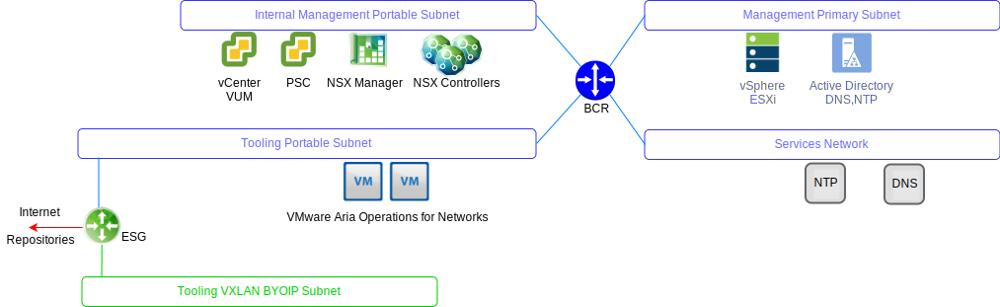
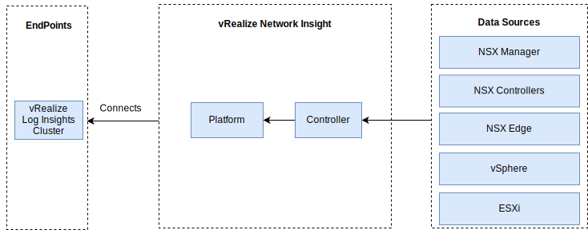

---

copyright:

  years:  2016, 2024

lastupdated: "2024-06-12"

subcollection: vmwaresolutions

---

{{site.data.keyword.attribute-definition-list}}

# VMware Aria Operations for Networks
{: #opsmgmt-vrni}

The VMware Aria Operations™ for Networks (formerly known as VMware vRealize® Network Insight) environment consists of two virtual machines (VMs), a Platform (UI) and a controller node.

{: caption="VMware Aria Operations for Networks networking" caption-side="bottom"}

The VMware Aria Operations for Networks Platform appliance provides the analytics, user interface, and data management and connects to the controller appliance, which collects from the various data sources such as NSX Edges, vCenter. All VMware Aria Operations for Networks components use {{site.data.keyword.cloud}} Private portable IP addresses. VMware Aria Operations™ for Logs is configured as the syslog server for VMware Aria Operations for Networks.

{: caption="VMware Aria Operations for Networks components" caption-side="bottom"}

## System requirements
{: #opsmgmt-vrni-requirements}

This architecture supports 3,000 VMs by using a Medium brick size.

| Attribute | Specification |
|-----------|---------------|
| vCPU | 8 |
| Memory | 32 GB |
| Disk (thin provisioned) | 1 TB |
{: class="simple-tab-table"}
{: caption="VMware Aria Operations for Networks Platform system requirements" caption-side="bottom"}
{: #table1}
{: tab-title="Platform system requirements"}
{: tab-group="sys-req"}

| Attribute | Specification |
|-----------|---------------|
| vCPU | 4 |
| Memory | 12 GB |
| Disk (thin provisioned) | 200 GB |
{: caption="VMware Aria Operations for Networks Collector system requirements" caption-side="bottom"}
{: #table2}
{: tab-title="Collector system requirements"}
{: tab-group="sys-req"}
{: class="simple-tab-table"}

## Networking
{: #opsmgmt-vrni-network}

Deployment of the VMware Aria Operations for Networks appliance requires two IP addresses from the Tooling private portable subnet. Network connectivity VMware Aria Operations for Networks requires access to the following items:
* vCenter Appliance
* VMware Aria Operations for Logs Appliance
* NSX-T or NSX-V Appliances
* Tooling Expansion VXLAN
* Customer Networks
* NTP server (`time.services.softlayer.com`)
* {{site.data.keyword.vmwaresolutions_short}} Active Directory DNS

## Ports
{: #opsmgmt-vrni-ports}

| Description | Port | Protocol |
|-------------|------|----------|
| Communication between the VMs of VMware Aria Operations for Networks | 443 | HTTPS |
| Services that require internet access \n `svc.ni.vmware.com` \n `support2.ni.vmware.com` \n `reg.ni.vmware.com` | 443 | HTTPS |
| VMware Aria Operations for Logs Ingestion API | 9000 | TCP |
| VMware Aria Operations for Logs Ingestion API over SSL | 9543 | TCP |
| User Interface | 80,443 | TCP |
| NTP |123 | UDP |
| SMTP | 25 | TCP |
| DNS| 53 | UDP |
| LDAP/LDAPS | 389, 636 | TCP |
| ESXi | 2055 | TCP |
| VMware vSphere® and NSX | 443 | TCP |
{: caption="VMware Aria Operations for Networks ports" caption-side="bottom"}

## Authentication
{: #opsmgmt-vrni-auth}

VMware Aria Operations for Networks user authentication is directly with an Active Directory Server.
