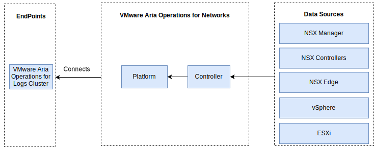

---

copyright:

  years:  2016, 2022

lastupdated: "2022-01-21"

subcollection: vmwaresolutions

---

{{site.data.keyword.attribute-definition-list}}

# vRealize Network Insight
{: #opsmgmt-vrni}

The vRealize® Network Insight (vRNI) environment consists of two virtual machines (VMs), a Platform (UI) and a controller node.

{: caption="Figure 1. Network Insights networking" caption-side="bottom"}

The vRNI Platform appliance provides the analytics, user interface, and data management and connects to the controller appliance, which collects from the various data sources such as NSX Edges, vCenter. All vRNI components use {{site.data.keyword.cloud}} Private portable IP addresses. vRLI is configured as the syslog server for vRNI.

{: caption="Figure 2. Network Insights components" caption-side="bottom"}

## System requirements
{: #opsmgmt-vrni-requirements}

This architecture supports 3000 VMs by using a Medium brick size.

| Attribute | Specification |
|-----------|---------------|
| vCPU | 8 |
| Memory | 32 GB |
| Disk (thin provisioned) | 1 TB |
{: class="simple-tab-table"}
{: caption="Table 1. Network Insight Platform system requirements" caption-side="top"}
{: #table1}
{: tab-title="Platform system requirements"}
{: tab-group="sys-req"}

| Attribute | Specification |
|-----------|---------------|
| vCPU | 4 |
| Memory | 12 GB |
| Disk (thin provisioned) | 200 GB |
{: caption="Table 1. Network Insight Collector system requirements" caption-side="top"}
{: #table2}
{: tab-title="Collector system requirements"}
{: tab-group="sys-req"}
{: class="simple-tab-table"}

## Networking
{: #opsmgmt-vrni-network}

Deployment of the vRNI appliance requires two IP addresses from the Tooling private portable subnet. Network connectivity vRNI requires access to the following items:
* vCenter Appliance
* vRealize Log Insight Appliance
* NSX-T or NSX-V Appliances
* Tooling Expansion VXLAN
* Customer Networks
* NTP server (`time.services.softlayer.com`)
* {{site.data.keyword.vmwaresolutions_short}} Active Directory/DNS

## Ports
{: #opsmgmt-vrni-ports}

| Description | Port | Protocol |
|-------------|------|----------|
| Communication between the VMs of vRealize Network Insight | 443 | HTTPS |
| Services that require internet access  \n `svc.ni.vmware.com`  \n `support2.ni.vmware.com`  \n `reg.ni.vmware.com` | 443 | HTTPS |
| Log Insight Ingestion API | 9000 | TCP |
| Log Insight Ingestion API over SSL | 9543 | TCP |
| User Interface | 80,443 | TCP |
| NTP |123 | UDP |
| SMTP | 25 | TCP |
| DNS| 53 | UDP |
| LDAP/LDAPS | 389, 636 | TCP |
| ESXi | 2055 | TCP |
| VMware vSphere® and NSX | 443 | TCP |
{: caption="Table 2. Network Insight ports" caption-side="bottom"}

## Authentication
{: #opsmgmt-vrni-auth}

vRNI user authentication is directly with an Active Directory Server.

**Next topic:** [VMware Update Manager](/docs/vmwaresolutions?topic=vmwaresolutions-opsmgmt-vum)
