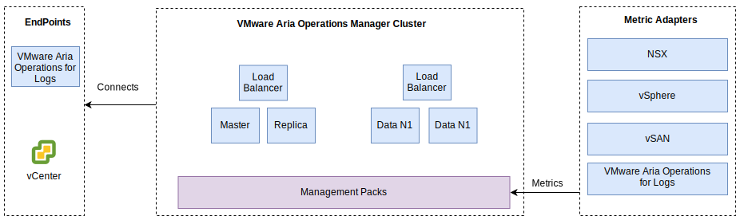

---

copyright:

  years:  2016, 2022

lastupdated: "2022-06-16"

subcollection: vmwaresolutions

---

{{site.data.keyword.attribute-definition-list}}

# vRealize Operations Manager design
{: #opsmgmt-vrops}

The vRealize® Operations Manager™ (vROps) Analytics Cluster contains the nodes that analyze and store data from the monitored components. In this deployment, four nodes are deployed and two VMware NSX® Load Balancers. This size allows monitoring of up to 30,000 VMs and 9,000,000 metrics to be collected.

The 4-node analytics cluster consists of the following components:
* Primary node – The primary node is the initial node in a vROps cluster. In a large environment, this node manages all the other nodes.
* Primary node replica – This node enables high availability of the primary node.
* Data nodes – The data node enables scale out of vROps in larger environments, two are deployed in this design.

Additionally, the design uses Remote Collector nodes, which act as a proxy or relay server to collect data only and forward collected data to the primary and data nodes. Data nodes and Remote Collectors can be added to scale up depending on environment size. The placement of vROps components onto VLANs or VXLANs is shown in the following diagram.

{: caption="Figure 1. Operations Manager networking" caption-side="bottom"}

* Primary node, primary node replica, and data nodes are deployed on the tools subnet by using {{site.data.keyword.cloud}} Portable IP addresses. This deployment facilitate communication to all components that are addressed out of the {{site.data.keyword.cloud_notm}} RFC1918 address space. These components include vSphere hosts, vCenter, Platform Services Controller (PSC), NSX Manager, and NSX Controllers™. An NSX Load Balancer is used along with a VIP for HA.
* Customer workloads use IP addressing from the BYOIP address space so this design uses Remote Collectors that are hosted in a VXLAN. These remote collectors are not configured as part of the {{site.data.keyword.vmwaresolutions_full}} automation and must be manually implemented by the client.

{: caption="Figure 2. Operations Manager components" caption-side="bottom"}

The vROps Analytics Cluster is accessed by using a management user interface or by using an API and it integrates with the following components:
* vCenter
* vRealize Log Insight™

The client can manually integrate into the following products if they are deployed.
* vRealize Automation
* vRealize Business

vROps collects data from the following items.
* vSphere - vCenter, PSC, vSphere hosts
* NSX - NSX Manager, NSX Controllers, and NSX Edges
* vRLI

The client can configure vROps manually to collect data from vRealize Automation and vRealize Business for Cloud.

## System requirements
{: #opsmgmt-vrops-requirements}

The analytics cluster consists of one primary node, one primary replica node, and two data nodes to enable scaling out and high availability. More data nodes are added to scale up. The analytics cluster can scale to a maximum of eight medium-sized nodes.

| Attribute | Specification |
|-----------|---------------|
| vCPU | 8 |
| Memory | 32 GB |
| Disk (thick provisioned) | 254 GB |
{: class="simple-tab-table"}
{: caption="Table 1. Operations Manager primary/replica node system settings" caption-side="bottom"}
{: #table1}
{: tab-title="Primary/replica node system settings"}
{: tab-group="sys-settings"}

| Attribute | Specification |
|-----------|---------------|
| vCPU | 8 |
| Memory | 32 GB |
| Disk (thick provisioned) | 254 GB |
{: caption="Table 1. Operations Manager data node system settings" caption-side="bottom"}
{: #table2}
{: tab-title="Data node system settings"}
{: tab-group="sys-settings"}
{: class="simple-tab-table"}

When the compute VM monitoring is required, the client installs two remote collector nodes on a VXLAN. The size of a Standard Remote Collector Virtual Appliance is 2 vCPU with 4 GB of RAM and the default appliance VMDK size is sufficient. The remote collector nodes are deployed with thin-provisioned disks as the remote collectors do not run analytics operations or store data.

| Setting | Load balancer 1 | Load balancer 2|
|:------- |:--------------- |:-------------- |
| Name | vrops-ui | vrops-data |
| Interval | 30 | 5 |
| Timeout | 5 | 15 |
| Max Retries | 3 | |
| Type | HTTPS | TCP |
| Method | Get |  |
| URL | /suite-api/api/deployment/node/status |   |
| Receive | Online |   |
| Algorithm | ROUND-ROBIN | LEASTCONN |
| Pool | Four nodes of vROPs | Four nodes of vROPs |
{: caption="Table 2. Operations Manager Load Balancer settings" caption-side="bottom"}

For more information, see [vRealize Automation Load Balancing](https://docs.vmware.com/en/vRealize-Automation/7.5/vrealize-automation-load-balancing.pdf){: external}.

## Networking
{: #opsmgmt-vrops-network}

Deployment of the vROps appliance requires six IP addresses from the Tooling private portable subnet. Network connectivity vROps requires access to the following items.
* vCenter Appliance
* vRealize Log Insight Appliance
* VMware NSX-T™ or NSX-V Appliances
* Tools Expansion VXLAN
* Customer Networks
* NTP server (`time.services.softlayer.com`)
* {{site.data.keyword.vmwaresolutions_short}} Active Directory, DNS
* The Remote Collectors require NAT rules on the NSX ESG to enable connectivity to the primary node, primary node replica, and data nodes

## Ports
{: #opsmgmt-vrops-ports}

| Component | Protocol | Port |
|:--------- |:-------- |:---- |
| vCenter Server | TCP | 443 |
| DNS | TCP/UDP | 53 |
| LDAP/LDAPS | TCP | 389/636 |
| LDAP GC | TCP | 3268/3269 |
| NTP | UDP | 123 |
| SMTP | TCP | 25 |
| SNMP | UDP | 161 |
{: caption="Table 3. Operation Manager ports" caption-side="bottom"}

### Authentication
{: #opsmgmt-vrops-auth}

User Management for vROps requires VMware Identity Manager (vIDM), which integrates with Active Directory. Service accounts are used for application-to-application communication from vRealize Operations™ Manager to the following adapters with the minimum set of permissions that are required for metric collection and topology mapping:

* NSX Manager
* vCenter
* vSAN™

## Management Packs
{: #opsmgmt-vrops-management}

Management Packs for vROps extend operational management capabilities of the vROps platform to provide product-specific alerts and dashboards.

The following Management Packs are installed in vROps by default:
* Management Pack for VMware vCenter Server®
* Management Pack for vRealize Log Insight
* Management Pack for vSAN
* Management Pack for vRealize Automation
* Management Pack for vRealize Business for Cloud

The following components are installed by {{site.data.keyword.vmwaresolutions_short}}:
* VMware SDDC Health Management Pack
* Management Pack for NSX for vSphere
* vRealize Operations Federation Management pack
* Management Pack for Hybrid Cloud Extension (HCX™)

Other management packs can be installed by the client. For more information, see [VMware Solution Exchange](https://marketplace.vmware.com/vsx/?contentType=1&listingStyle=table){: external}.

### Management Pack for VMware vCenter Server
{: #opsmgmt-vrops-management-vCenter}

This default Management Pack extends the functions of vROps to vCenter to enable the collection of objects, metrics, and alerts.

### Management Pack for vRealize Log Insight
{: #opsmgmt-vrops-management-vrli}

This default Management Pack extends the functions of vROps to vRLI to enable the monitoring of the vRLI environment and the integration of events and alerts from vRLI into vROps.

### Management Pack for vSAN
{: #opsmgmt-vrops-management-vsan}

vRealize Operations Management Pack for vSAN enables vSAN specific dashboards to evaluate, manage, and optimize the performance of vSAN objects and vSAN-enabled objects.

### VMware SDDC Health Management Pack
{: #opsmgmt-vrops-management-sddc}

The VMware SDDC Health Management Pack for vROps monitors the SDDC management stack. Color-coded metrics are provided for health and efficiency of different components present as part of the SDDC management stack. With the dashboards in the VMware SDDC Health Management Pack, you can monitor the following components of the vCenter Server instance and management tools:
* vRealize Operations Manager
* NSX for vSphere and VMware NSX-T
* VMware vSAN
* vRealize Log Insight
* vCenter Server

If the client installed the following, you can monitor them.
* vRealize Automation
* vRealize Orchestrator
* vRealize Business for Cloud
* VMware Site Recovery Manager

The VMware SDDC Health Management Pack provides the following dashboards:
* SDDC Management Health Overview Dashboard - You can use SDDC Management Health overview dashboard to view and analyze the application-specific problems in the SDDC components.
* SDDC Health Historic Trend Dashboard - The VMware SDDC Health Management Pack consists of SDDC health historic trend dashboard, which displays the health trend for each component in the SDDC stack.
* SDDC vRealize Operations Manager Sizing Dashboard - The SDDC vRealize Operations Manager Sizing Dashboard provides vRealize Operations Manager cluster capacity to process object and metrics.

The plug-ins in the VMware SDDC Health Management Pack collect metrics for object types that are contained in the plug-ins. The Management Pack collects health metrics for the following components:
* vCenter Server
* Management Pack for NSX for vSphere
* vRealize Automation
* vRealize Operations Manager
* vRealize Business
* vRealize Log Insight
* VMware Site Recovery Manager
* vCenter HA
* vMware vSAN Health
* Services in vCenter Server Appliance
* vRealize Operations Manager Sizing
* vRealize Orchestrator

### Management Pack for NSX-T
{: #opsmgmt-vrops-management-nsxt}

The NSX-T management pack extends vROps core analytics, correlation, predictive capacity, and visualization capabilities to virtual networks. The pack includes the following items.
* Configuration assurance
* Health
* Performance
* Capacity
* Troubleshooting for NSX-T objects

### Management Pack for NSX for vSphere
{: #opsmgmt-vrops-management-nsxv}

The NSX for vSphere management pack offers operations management coverage for deployments of VMware's NSX virtual networking technologies. This management pack extends vROps core analytics, correlation, predictive capacity, and visualization capabilities to virtual networks. Coverage includes configuration assurance, health, performance, capacity, and troubleshooting for NSX logical switches, logical routers, edge services, distributed firewall, and load balancers.

The NSX for vSphere management pack is tightly integrated with vROps and vSphere host data is correlated with the NSX services that run with these hosts. With log integration by vRLI, error and outage conditions, triggered by log messages, are alerted within the management pack object and problem windows.

### vRealize Operations Federation Management Pack
{: #opsmgmt-vrops-management-federation}

vRealize Operations Federation Management Pack enables a multisite vROps deployment into a single pane of glass. It allows a deployment of vROps with the capability of receiving key metrics for specified objects from vROps deployments.

### Management Pack for Hybrid Cloud Extension (HCX)
{: #opsmgmt-vrops-management-hcx}

vRealize Operations Management Pack for HCX extends the Operations Management capabilities of vROps to hybrid capabilities presented by HCX. With the management pack, you can collect metrics, change events, and resource topology information from HCX. It enables the monitoring, isolation, and resolution of performance bottlenecks in the HCX Interconnects, Migrations, or Protected workloads.

## Related links
{: #opsmgmt-vrops-links}

* [vRealize Operations Manager 7.0 sizing guidelines](https://kb.vmware.com/s/article/57903){: external}
* [vRealize Operations Manager documentation](https://docs.vmware.com/en/vRealize-Operations-Manager/index.html){: external}
* [vRealize Operations Management Pack for vSAN 1.0 Guide](https://marketplace.vmware.com/resources/vsx/product_files/31742/original/Management-Pack-for-vSAN-Guide6d2a8895b022a5f626a86e8e84b031b5.pdf){: external}
* [Updating vSAN clusters](/docs/vmwaresolutions?topic=vmwaresolutions-vum-updating-vsan)
* [vSAN Health Check Information](https://kb.vmware.com/s/article/2114803){: external}
* [Operationalizing VMware NSX](https://www.vmware.com/content/dam/digitalmarketing/vmware/en/pdf/products/nsx/vmware-operationalizing-nsx.pdf){: external}
