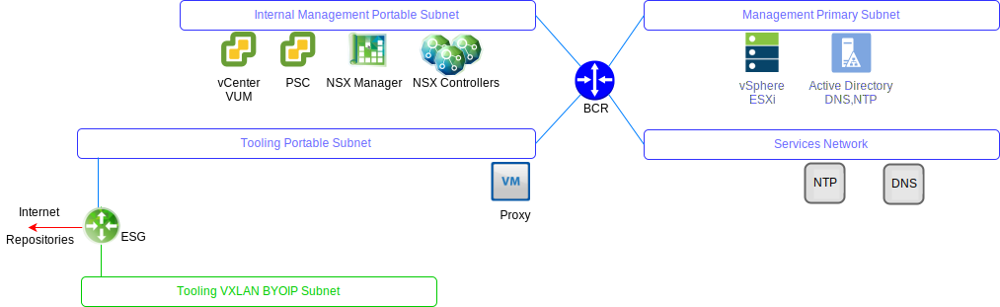

---

copyright:

  years:  2016, 2019

lastupdated: "2019-11-04"

---

{:external: target="_blank" .external}

# VMware Update Manager
{: #opsmgmt-vum}

VMware Update Manager (VUM) enables centralized, automated patch and version management for VMware vSphere and allows you to complete the following tasks in your VMware vCenter Server on {{site.data.keyword.cloud}} environment:
* Upgrade and patch the vSphere ESXi hosts
* Install and update third-party software on the hosts
* Upgrade virtual machine (VM) hardware, VMware Tools, and virtual appliances

For the detailed design of VMware Update Manager, see [VMware Update Manager introduction](/docs/services/vmwaresolutions?topic=vmware-solutions-vum-intro).

{: caption="Figure 1. VUM network" caption-side="bottom"}

**Next topic**: [Integration](/docs/services/vmwaresolutions?topic=vmware-solutions-opsmgmt-integration)

## Related links
{: #opsmgmt-vum-links}

* [About Installing and Administering VMware vSphere Update Manager](https://docs.vmware.com/en/VMware-vSphere/6.5/com.vmware.vsphere.update_manager.doc/GUID-F7191592-048B-40C7-A610-CFEE6A790AB0.html){:external}
