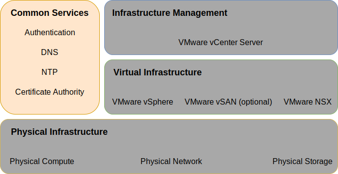
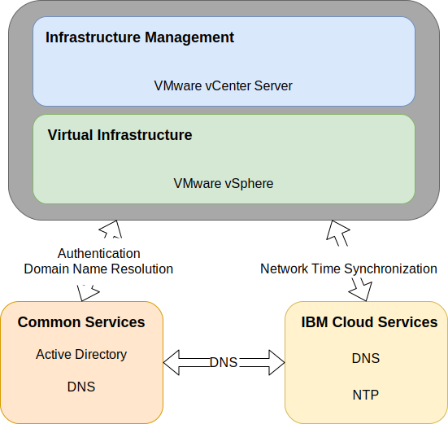

---

copyright:

  years:  2016, 2019

lastupdated: "2019-03-19"

subcollection: vmware-solutions

---

{:tip: .tip}
{:note: .note}
{:important: .important}

# Common services design
{: #design_commonservice}

Common services provide the services that are used by other services in the cloud management platform. The common services of the solution include identity and access services, domain name services, NTP services, SMTP services, and certificate authority services.

Figure 1. Common services 

## Identity and access services
{: #design_commonservice-identity-access}

In this design, Microsoft Active Directory (MSAD) is used for Identity  Management. The design deploys one or two Active Directory virtual machines as part of the vCenter Server deployment automation. vCenter is configured to use the MSAD authentication.

### Microsoft Active Directory
{: #design_commonservice-msad}

By default, a single Active Directory VSI is deployed onto the {{site.data.keyword.cloud}} infrastructure.

The design also provides the option to deploy two highly available MSAD servers as dedicated Windows Server VMs in the management cluster.

If you choose the option with two highly available MSAD servers, you're responsible to provide Microsoft licensing and activation.
{:note}

Active Directory serves to authenticate accesses to manage the VMware instance only and not to house users of the workloads in the deployed instances. The forest root domain name of the Active Directory server equals to the DNS domain name that you specify. This domain name is specified only for the primary vCenter Server instance if multiple instances are linked. For linked instances, each instance contains an Active Directory server that sits in the forest root replica ring. The DNS zone files are also replicated on the Active Directory servers.

### vSphere SSO domain
{: #design_commonservice-vsphere-sso}

The vSphere Single Sign On (SSO) domain is used as the initial authentication mechanism for a single instance or multiple linked instances. The SSO domain also serves to connect a VMware instance or multiple linked instances to the MSAD server. The following SSO configuration is applied:  
* The SSO domain of `vsphere.local` is always used
* For VMware instances that are tied to an existing instance, the integrated PSC is joined to the existing instance’s SSO domain
* The SSO site name equals to the instance name

## Domain name services
{: #design_commonservice-dns}

Domain name services (DNS) in this design is for the cloud management and infrastructure components only.

### Primary vCenter Server instance
{: #design_commonservice-primary-vcs}

The vCenter Server deployment uses the deployed AD VSIs as DNS servers for the instance. All deployed
components (vCenter with embedded PSC, NSX, ESXi hosts) are configured to point to the AD as their default DNS. You can customize the DNS zone
configuration if it does not interfere with the configuration of the deployed components.
- This design integrates DNS services on the AD VSIs in the following configuration:
- The domain structure is specified by the user. The domain name can be any number of levels up to the maximum that all vCenter Server components handle, ensuring that the lowest level is the subdomain for the instance.
    - The DNS domain name that you provide is used as the vCenter Server deployed AD root forest domain name. For example, if the DNS domain name is cloud.ibm.com, then the AD domain forest root is cloud.ibm.com. The DNS domain and AD domain are the same across all federated instances of vCenter Server.
    - Select an extra name as the vCenter Server instance subdomain. This subdomain name must be unique across all linked vCenter Server instances.
- The AD DNS servers are configured to be authoritative for both the DNS domain and subdomain space.
- The AD DNS servers are configured to point to the {{site.data.keyword.cloud_notm}} DNS servers for all other zones.
- Any secondary cloud regions that are integrated to the first or target deployed cloud region must use the same DNS name structure above the subdomain.
- Optionally deploy redundant DNS servers within the vCenter Server cluster. Two AD/DNS servers are configured unlicensed. It is the user's responsibility to provide licenses for the Windows operating systems for these servers.
- If a single site is provisioned with only one AD/DNS server, then all configured vCenter Server components must have ONLY that single IP as a DNS entry.

### Secondary vCenter Server instances
{: #design_commonservice-secondary-vcs}

For cross instance redundancy; when the first secondary vCenter Server instance is added to an existing primary vCenter Server instance or current stand-alone vCenter Server instance, that primary instance AD DNS server IP address is used in the secondary vCenter Server instance and any subsequent secondary vCenter Server instance “secondary DNS” entry for all components that require a DNS server entry. For example, ESXi, vCenter, and NSX manager. This includes add on components, such as, HCX, Zerto, and Veeam. The primary site secondary DNS entry is then changed to the first secondary vCenter Server instances AD/DNS IP address.

## NTP services
{: #design_commonservice-ntp}

This design utilizes the {{site.data.keyword.cloud_notm}} infrastructure NTP servers. All deployed components are configured to utilize these NTP servers. Having all components within the design using the same NTP server is critical for certificates and Active Directory authentication to function correctly.

Figure 2. NTP and DNS services 

## Certificate authority services
{: #design_commonservice-cas}

By default, VMware vSphere uses TLS certificates that are signed by the VMware Certificate Authority (VMCA), which resides on the VMware Platform Services Controller appliance. These certificates are not trusted by the end­ user devices or browsers. It is a security best practice to replace user-facing certificates with certificates that are signed by a third-party or enterprise certificate authority (CA). Certificates for machine-to-machine communication can remain as VMCA–signed certificates, however, you are recommended to follow best practices for your organization, which typically involve using an identified enterprise CA.

You can use the Windows AD servers within this design to create certificates that are signed by the local instance. However, you can also choose to configure CA services if needed.

## Related links
{: #design_commonservice-related}

* [Physical infrastructure design](/docs/services/vmwaresolutions/archiref/solution?topic=vmware-solutions-design_physicalinfrastructure)
* [Virtual infrastructure design](/docs/services/vmwaresolutions/archiref/solution?topic=vmware-solutions-design_virtualinfrastructure)
* [Infrastructure management design](/docs/services/vmwaresolutions/archiref/solution?topic=vmware-solutions-design_infrastructuremgmt)
