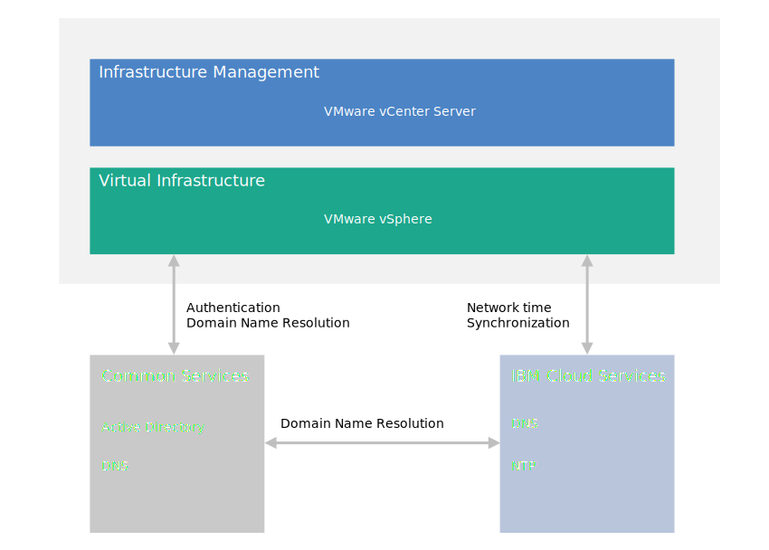

---

copyright:

  years:  2016, 2019

lastupdated: "2019-02-15"

---

{:tip: .tip}
{:note: .note}
{:important: .important}

# Common services design
{: #design_commonservice}

Common services provide the services that are used by other services in the cloud management platform. The common services of the solution include identity and access services, domain name services, NTP services, SMTP services, and certificate authority services.

## Identity and access services
{: #design_commonservice-identity-access}

In this design, Microsoft Active Directory (AD) is used for Identity  Management. The design deploys one or two Windows Active Directory virtual machines as part of the Cloud Foundation and vCenter Server deployment automation. vCenter is configured to use the AD authentication.

### Microsoft Active Directory
{: #design_commonservice-msad}

By default, a single Active Directory VSI is deployed onto the {{site.data.keyword.cloud}} infrastructure. The design also provides the option to deploy two highly available Microsoft Active Directory servers as dedicated Windows Server VMs in the management cluster.

You're responsible to provide Microsoft licensing and activation if you choose this option.
{:note}

Active Directory serves to authenticate accesses to manage the VMware instance only and not to house users of the workloads in the deployed instances. The forest root domain name of the Active Directory server equals to the DNS domain name that you specify. This domain name is specified only for the primary Cloud Foundation and vCenter Server instance if multiple instances are linked. For linked instances, each instance contains an Active Directory server that sits in the forest root replica ring. The DNS zone files are also replicated on the Active Directory servers.

### vSphere SSO domain
{: #design_commonservice-vsphere-sso}

The vSphere Single Sign On (SSO) domain is used as the initial authentication mechanism for a single instance or multiple linked instances. The SSO domain also serves to connect a VMware instance or multiple linked instances to the Microsoft Active Directory server. The following SSO configuration is applied:  
* The SSO domain of `vsphere.local` is always used
* For VMware instances that are tied to an existing instance, the PSC is joined to the existing instance’s SSO domain
* The SSO site name equals to the instance name

## Domain name services
{: #design_commonservice-dns}

Domain name services (DNS) in this design is for the cloud management and infrastructure components only.

### VMware vCenter Server
{: #design_commonservice-vcenter}

The vCenter Server deployment uses the deployed Active Directory servers as the DNS servers for the instance. All deployed components (vCenter, PSC, NSX, and ESXi hosts) are configured to point to the Active Directory server as their default DNS server. You can customize the DNS zone configuration if your configuration does not interfere with the configuration of the deployed components.

This design integrates DNS services on the Active Directory servers through the following configuration:
* You can specify the domain structure. The domain name can be any number of levels (up to the maximum that the vCenter Server components can handle). The lowest level is the subdomain for the instance.
   * The DNS domain name that you specify is used as the Active Directory root forest domain name. For example, if the DNS domain name is `cloud.ibm.com` then the Active Directory forest root domain name is `cloud.ibm.com`. This DNS and Active Directory domain name is the same across all linked vCenter Server instances.
   * Additionally, you can specify a subdomain name for the instance. The subdomain name must be unique across all linked vCenter Server instances.
* The Active Directory DNS servers are configured to be authoritative for both DNS domain and subdomain space.
* The Active Directory DNS servers are configured to point to the {{site.data.keyword.cloud_notm}} DNS servers for all other zones.
* Any instance to be integrated to an existing target instance must use the same domain name as the primary instance.

### VMware Cloud Foundation
{: #design_commonservice-cf}

The Cloud Foundation deployment uses VMware Cloud Foundation automation, which uses its own DNS server that resides within the SDDC Manager VM component. Cloud Foundation components that are managed by SDDC Manager, including vCenter, PSC, NSX, and ESXi hosts, are configured to use the SDDC Manager VM IP address as their default DNS by design.

Because the SDDC Manager generates and maintains the host names for the components it manages, it is not recommended to tamper with its DNS zone file directly for adding and removing hosts.

This design integrates DNS services on the Active Directory servers with the SDDC Manager VM in the following configuration:
* You can specify the domain structure. The domain name can be any number of levels (up to the maximum that the Cloud Foundation components will handle).
* The lowest level is the subdomain that the SDDC Manager is authoritative for.
* The DNS domain name that you specify will be used as the Active Directory root forest domain name. For example, if the DNS domain name is `cloud.ibm.com`, then the Active Directory domain forest root is `cloud.ibm.com`. This DNS domain and Active Directory domain are the same across all linked Cloud Foundation instances.
* Additionally, you can specify a subdomain name for the instance. The subdomain name must be unique across all linked Cloud Foundation instances.  
* The SDDC Manager DNS configuration is altered to point to the Active Directory servers for all zones except for the zone that it is responsible for.
* The Active Directory DNS servers are configured to be authoritative for the DNS domain space over the SDDC Manager and Cloud Foundation instance subdomain.
* The Active Directory DNS servers are configured to point to the SDDC Manager IP address for the subdomain delegation of the zone the SDDC Manager is authoritative for.
* The Active Directory DNS servers are configured to point to the 	{{site.data.keyword.cloud_notm}} DNS servers for all other zones.
* Any secondary instance that is to be integrated to the first or target instance must utilize the same DNS name structure over the SDDC Manager subdomain.

## NTP services
{: #design_commonservice-ntp}

This design utilizes the {{site.data.keyword.cloud_notm}} infrastructure NTP servers. All deployed components are configured to utilize these NTP servers. Having all components within the design using the same NTP server is critical for certificates and Active Directory authentication to function correctly.

Figure 1. NTP services

## Certificate authority services
{: #design_commonservice-cas}

By default, VMware vSphere uses TLS certificates that are signed by the VMware Certificate Authority (VMCA), which resides on the VMware Platform Services Controller appliance. These certificates are not trusted by the end­ user devices or browsers. It is a security best practice to replace user-facing certificates with certificates that are signed by a third-party or enterprise certificate authority (CA). Certificates for machine-to-machine communication can remain as VMCA–signed certificates, however, you are recommended to follow best practices for your organization, which typically involve using an identified enterprise CA.

You can use the Windows AD servers within this design to create certificates that are signed by the local instance. However, you can also choose to configure CA services if needed.

## Related links
{: #design_commonservice-related}

* [Physical infrastructure design](/docs/services/vmwaresolutions/archiref/solution/design_physicalinfrastructure.html)
* [Virtual infrastructure design](/docs/services/vmwaresolutions/archiref/solution/design_virtualinfrastructure.html)
* [Infrastructure management design](/docs/services/vmwaresolutions/archiref/solution/design_infrastructuremgmt.html)
