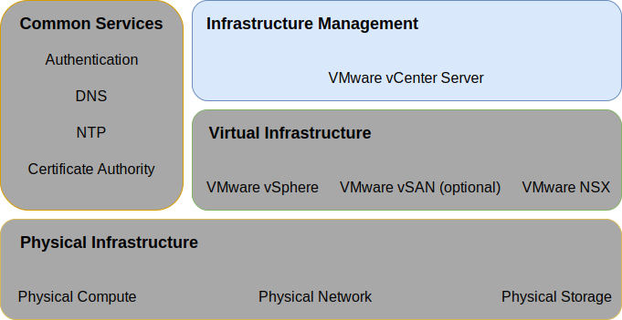

---

copyright:

  years:  2016, 2019

lastupdated: "2019-03-19"

subcollection: vmwaresolutions

---

{:tip: .tip}
{:note: .note}
{:important: .important}

# Infrastructure management design
{: #design_infrastructuremgmt}

Infrastructure management refers to the components that are managing the VMware infrastructure.
* The vCenter Server with an embedded Platform Services Controller (PSC) is the centralized platform for managing vSphere environments and is one of the fundamental components in this solution.
* The PSC is used in this solution to provide a set of infrastructure services, which include VMware vCenter Single Sign On, license service, lookup service, and VMware certificate authority.

This design uses a PSC function that is integrated into an instance of vCenter Server. The PSC and vCenter Server are housed within the same virtual machine (VM).

Figure 1. Infrastructure management 

The PSC located in the primary instance is assigned the default SSO domain of `vsphere.local`.

## vCenter Server design
{: #design_infrastructuremgmt-vcenter}

The vCenter Server with an embedded PSC is installed on a portable subnet on the private VLAN that is associated with management VMs. Its default gateway is set to the IP address assigned on the BCR for that particular subnet. The virtual appliance is configured with the specifications in the following table.

Table 1. vCenter Server Appliance specifications

| Attribute                    | Specification                       |
|------------------------------|-------------------------------------|
| vCenter Server               | Virtual appliance                   |
| Appliance installation size  | Large (up to 1,000 hosts and 10,000 VMs) |
| Platform Services Controller | Integrated                            |
| Number of vCPUs              | 16                                   |
| Memory                       | 32 GB                               |
| Disk                         | 990 GB on local datastore (Large disk deployment) |
| Disk type                    | Thin provisioned                    |

### vCenter Server database
{: #design_infrastructuremgmt-vcenter-db}

The vCenter Server configuration uses a local, embedded PostgreSQL database that is included with the appliance. The embedded database is used to remove any dependencies on external databases and licensing.

### vCenter Server cluster specification
{: #design_infrastructuremgmt-vcenter-cluster}

With this design, you can cluster the vSphere ESXi hosts that are provisioned through the solution. However, before clusters can be created a data center object is created that signifies the location of the vSphere ESXi hosts as well as the pod within the data center. A cluster is created after the data center object is created. The cluster is deployed with VMware vSphere High Availability (HA) and VMware vSphere Distributed Resource Scheduler (DRS) enabled.

### vSphere Distributed Resource Scheduler
{: #design_infrastructuremgmt-vsphere-drs}

This design uses vSphere Distributed Resource Scheduling (DRS) in the initial cluster to place VMs and uses DRS in additional clusters to dynamically migrate VMs to achieve balanced clusters. The automation level is set to fully automated so that initial placement and migration recommendations are run automatically by vSphere. Additionally, the migration threshold is set to moderate so that vCenter applies priority 1, 2, 3 recommendations to achieve at least a decent improvement in the load balance of the cluster.

Power management via the **Distributed Power Management** feature is not used in this design.
{:note}

### vSphere High Availability
{: #design_infrastructuremgmt-vsphere-ha}

This design uses vSphere High Availability (HA) in the initial cluster and extra clusters to detect compute failures and recover VMs that run within a cluster. The vSphere HA feature in this design is configured with both the **Host Monitoring** and **Admission Control** options enabled in the cluster. Additionally, the initial cluster reserves one node’s resources as spare capacity for the admission control policy.

You are responsible to adjust the admission control policy when the cluster is later expanded or contracted.
{:note}

By default, the **VM restart priority** option is set to medium and the **Host isolation response** option is disabled. Additionally, **VM monitoring** is disabled and the **Datastore Heartbeating** feature is configured to include any of the cluster data stores. This approach uses the NAS data stores if they are present.

## Enhanced vMotion compatibility
{: #design_infrastructuremgmt-evc}

To simplify vMotion compatibility across cluster nodes with potentially differing CPU capabilities, Enhanced vMotion Compatibility (EVC) mode is enabled at a Skylake level to ensure vMotion compatibility across cluster nodes when newer processors arrive within {{site.data.keyword.cloud_notm}} inventory and allows for cluster expansion in the future if Skylake processor servers aren't in inventory.

### IBM CloudDriver
{: #design_infrastructuremgmt-cloud-driver}

Cornerstone to these solutions is automation. Automation reduces the complexity of deployment, drastically reduces deployment time, and ensures the VMware instance is deployed in a consistent manner.

IBM CloudBuilder is an ephemeral {{site.data.keyword.cloud_notm}} VM virtual server instance (VSI) which
works to bring up a new VMware instance and perform lifecycle management functions. It is deployed when overall vCenter Server instance management is required and is destroyed when the process is complete.

IBM CloudDriver can be configured to communicate back to the {{site.data.keyword.vmwaresolutions_short}}  management infrastructure over public or optionally, over a private network connection through {{site.data.keyword.cloud_notm}} object storage as the message queue. IBM CloudDriver is an IBM developed component, is not user accessible, and has the following attributes and function:

- Deployment and configuration of the vCenter Server instance within the user account.
- Add and remove hosts from the vCenter Server clusters.
- Add and remove clusters from vCenter Server instances.
- Add and remove add on services or function to vCenter Server
instances.

### Automation flow
{: #design_infrastructuremgmt-auto-flow}

The following describes the order of events when you use the {{site.data.keyword.vmwaresolutions_short}} console to order a VMware instance:
1. Ordering VLANs and subnets for networking from {{site.data.keyword.cloud_notm}}.
2. Ordering {{site.data.keyword.cloud_notm}} {{site.data.keyword.baremetal_short}} with vSphere Hypervisor installed.
3. Ordering of Microsoft Windows VSI to serve as the Active Directory domain controller.
4. Deployment of the Cloud Driver VSI.
5. Validation of the networking and deployed hardware.
6. If applicable, the initial configuration of the single node vSAN.
7. Deployment and configuration of vCenter (with embedded PSC) and NSX.
8. Clustering of remaining ESXi nodes, expansion of vSAN if applicable, and configuration of NSX components (VTEP).
9. Validating the installation and configuration of the environment.
10. Deployment of optional services, such as backup server and storage.
11. Removal of the Cloud Driver VSI.

## IDs and passwords
{: #design_infrastructuremgmt-ids-pwd}

IC4V management infrastructure stores all vCenter Server contained IDs and passwords encrypted within the {{site.data.keyword.cloud_notm}} management plane. Any change to these passwords by the user can disrupt the automation capabilities within vCenter Server.

You can provide changed passwords in the IC4V solutions portal so that the automation can process functions uninterrupted. The solutions portal optionally allows for verification of the entered passwords.

## Related links
{: #design_infrastructuremgmt-related}

* [Physical infrastructure design](/docs/services/vmwaresolutions/archiref/solution?topic=vmware-solutions-design_physicalinfrastructure)
* [Virtual infrastructure design](/docs/services/vmwaresolutions/archiref/solution?topic=vmware-solutions-design_virtualinfrastructure)
* [Common services design](/docs/services/vmwaresolutions/archiref/solution?topic=vmware-solutions-design_commonservice)
