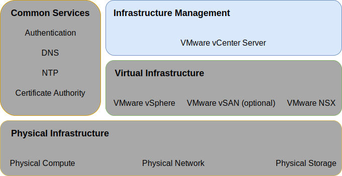

---

copyright:

  years:  2016, 2025

lastupdated: "2025-10-09"

subcollection: vmwaresolutions

---

{{site.data.keyword.attribute-definition-list}}

# Infrastructure management design
{: #design_infrastructuremgmt}

Infrastructure management refers to the components that are managing the VMware® infrastructure. The VMware vCenter Server® appliance is the centralized platform for managing VMware vSphere® environments and is one of the fundamental components in this solution.

{: caption="Infrastructure management" caption-side="bottom"}

The vCenter Server appliance is assigned the default SSO domain of `vsphere.local`.

## vCenter Server design
{: #design_infrastructuremgmt-vcenter}

The vCenter Server appliance is installed on a portable subnet on the private VLAN that is associated with management VMs. Its default gateway is set to the IP address assigned on the BCR for that particular subnet. The virtual appliance is configured with the specifications in the following table.

| Attribute                    | Specification                       |
|:---------------------------- |:----------------------------------- |
| vCenter Server               | Virtual appliance                   |
| Appliance installation size  | Medium (up to 400 hosts or 4,000 VMs) |
| Platform Services Controller | Integrated                            |
| Number of vCPUs              | 8                                   |
| Memory                       | 28 GB                               |
| Disk                         | 700 GB on local datastore (Large disk deployment) |
| Disk type                    | Thin provisioned                    |
{: caption="vCenter Server Appliance specifications" caption-side="bottom"}

### vCenter Server database
{: #design_infrastructuremgmt-vcenter-db}

The vCenter Server configuration uses a local, embedded PostgreSQL database that is included with the appliance. The embedded database is used to remove any dependencies on external databases and licensing.

### vCenter Server cluster specification
{: #design_infrastructuremgmt-vcenter-cluster}

With this design, you can cluster the vSphere ESXi® hosts that are provisioned through the solution. However, before clusters can be created a data center object is created that signifies the location of the vSphere ESXi hosts and the pod within the data center. A cluster is created after the data center object is created. The cluster is deployed with vSphere high availability (HA) and vSphere Distributed Resource Scheduler (DRS) enabled.

### vSphere Distributed Resource Scheduler
{: #design_infrastructuremgmt-vsphere-drs}

This design uses vSphere Distributed Resource Scheduling (DRS) in the initial cluster to place VMs and uses DRS in additional clusters to dynamically migrate VMs to achieve balanced clusters. The automation level is set to fully automated so that initial placement and migration recommendations are run automatically by vSphere. Additionally, the migration threshold is set to moderate so that vCenter applies priority 1, 2, 3 recommendations to achieve at least a decent improvement in the load balance of the cluster.

Power management through the **Distributed Power Management** feature is not used in this design.
{: note}

### vSphere high availability
{: #design_infrastructuremgmt-vsphere-ha}

This design uses vSphere HA in the initial cluster and in the additional clusters to detect compute failures and recover VMs that run in a cluster. The vSphere HA feature in this design is configured with both the **Host Monitoring** and **Admission Control** options that are enabled in the cluster. Additionally, the initial cluster reserves one node’s resources as spare capacity for the admission control policy.

You are responsible for adjusting the admission control policy when the cluster is later expanded or contracted.
{: note}

By default, the **VM restart priority** option is set to medium and the **Host isolation response** option is disabled. Additionally, **VM monitoring** is disabled and the **Datastore Heartbeating** feature is configured to include any of the cluster data stores. This approach uses the NAS data stores if they are present.

### Enhanced vMotion compatibility
{: #design_infrastructuremgmt-evc}

To simplify vMotion compatibility across cluster nodes with potentially differing CPU capabilities, Enhanced vMotion Compatibility (EVC) mode is enabled at the highest available level that is supported by the vSphere version. This setting ensures vMotion compatibility across cluster nodes when newer processors arrive within {{site.data.keyword.cloud}} inventory. The setting allows for cluster expansion in the future if the original processor is no longer in inventory. An exception to this rule is that EVC mode is not set for a management cluster with Intel® Cascade Lake processors where Cascade Lake EVC is not supported by the vSphere version.

## IBM CloudDriver
{: #design_infrastructuremgmt-cloud-driver}

The cornerstone to these solutions is automation. Automation reduces the complexity of deployment, drastically reduces deployment time, and ensures the VMware instance is deployed in a consistent manner.

IBM CloudDriver is an ephemeral {{site.data.keyword.cloud_notm}} VM virtual server instance (VSI), which is deployed as needed for initial deployment and for Day 2 operations such as adding hosts, clusters, or add-on services to your VMware instance. CloudDriver is deleted when the all current processes are completed.

CloudDriver is deployed only on the private network that connects to the IBM management plane over a private message queue. They are IBM-developed components, are not user accessible, and have the following attributes and functions:
* Deployment and configuration of the {{site.data.keyword.vcf-auto}} instance within the user account.
* Add and remove hosts from the Automated clusters.
* Add and remove clusters from Automated instances.
* Add and remove add-on services or functions to Automated instances.

### Automation flow
{: #design_infrastructuremgmt-auto-flow}

The following flow describes the order of events when you use the {{site.data.keyword.vmwaresolutions_short}} console to order a VMware instance:
1. Ordering VLANs and subnets for networking from {{site.data.keyword.cloud_notm}}.
2. Ordering {{site.data.keyword.cloud_notm}} bare metal servers with vSphere Hypervisor installed.
3. Ordering of Microsoft® Windows® VSI to serve as the Active Directory™ domain controller.
4. Deployment of the Cloud Driver VSI.
5. Validation of the networking and deployed hardware.
6. If applicable, the initial configuration of the single node vSAN.
7. Deployment and configuration of vCenter and NSX.
8. Clustering of remaining ESXi nodes, expansion of vSAN if applicable, and configuration of NSX components (VTEP).
9. Validating the installation and configuration of the environment.
10. Deployment of optional services, such as backup server and storage.
11. Removal of the Cloud Driver VSI.

## IDs and passwords
{: #design_infrastructuremgmt-ids-pwd}

{{site.data.keyword.vmwaresolutions_short}} automation retains a set of user IDs and passwords encrypted within the {{site.data.keyword.cloud_notm}} management plane. Automation user IDs are separate from the user IDs displayed in the {{site.data.keyword.vmwaresolutions_short}} console and which are reserved for your use.

Change these passwords and use your own password information management (PIM) system to store and manage these passwords. You cannot change or disable the passwords that are used by automation without disrupting the automation. For more information, see [IBM user IDs](/docs/vmwaresolutions?topic=vmwaresolutions-audit_user_ids).

## Related links
{: #design_infrastructuremgmt-related}

* [Physical infrastructure design](/docs/vmwaresolutions?topic=vmwaresolutions-design_physicalinfrastructure)
* [Virtual infrastructure design](/docs/vmwaresolutions?topic=vmwaresolutions-design_virtualinfrastructure)
* [Common services design](/docs/vmwaresolutions?topic=vmwaresolutions-design_commonservice)
