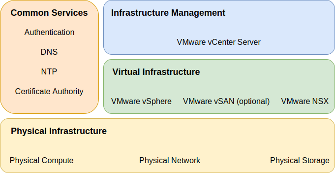

---

copyright:

  years:  2016, 2021

lastupdated: "2021-05-05"

subcollection: vmwaresolutions

---

{:tip: .tip}
{:note: .note}
{:important: .important}
{:external: target="_blank" .external}

# VMware Solutions components
{: #design_overview}

{{site.data.keyword.vmwaresolutions_full}} provides automation to deploy VMware® technology components into {{site.data.keyword.cloud}} data centers across the globe.

The offerings in this solution portfolio include VMware vSphere® products within an automatically deployed and configured cluster: VMware vSphere ESXi™, VMware vCenter Server® Appliance with an embedded Platform Services Controller (PSC), VMware NSX-T™, and optionally, VMware vSAN™.

The architecture consists of a single cloud region and it allows you to extend into more cloud regions that are located in another geography and in another {{site.data.keyword.cloud_notm}} pod within the same data center. A region is defined as a unique vCenter Server instance. This design also allows for automated expansion and contraction of virtual capacity within a vCenter Server instance.

{: caption="Figure 1. Solution components of {{site.data.keyword.vmwaresolutions_short}}" caption-side="bottom"}

**Next topic:** [Physical infrastructure design](/docs/vmwaresolutions?topic=vmwaresolutions-design_physicalinfrastructure)

## Related links
{: #design_overview-related}

* [Virtual infrastructure design](/docs/vmwaresolutions?topic=vmwaresolutions-design_virtualinfrastructure)
* [Common services design](/docs/vmwaresolutions?topic=vmwaresolutions-design_commonservice)
* [Infrastructure management design](/docs/vmwaresolutions?topic=vmwaresolutions-design_infrastructuremgmt)
