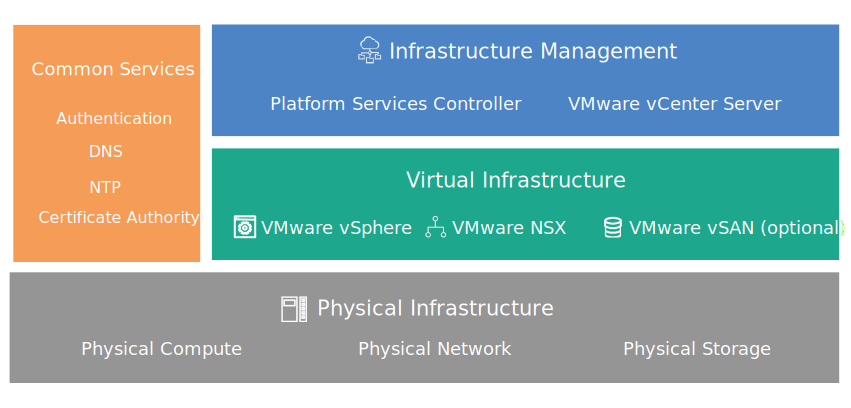

---

copyright:

  years:  2016, 2018

lastupdated: "2018-06-20"

---
# Design overview

{{site.data.keyword.vmwaresolutions_full}} provides automation to deploy VMware technology components into {{site.data.keyword.CloudDataCents}} across the globe.

The offerings in this solution's portfolio include the following VMware vSphere products within an automatically deployed and configured cluster:
* VMware Cloud Foundation: vSphere ESXi, Platform Services Controller (PSC), VMwarevCenter Server Appliance, SDDC Manager, VMware NSX, and VMware vSAN.
* VMware vCenter Server: vSphere ESXi, Platform Services Controller (PSC), vCenter Server Appliance, NSX, and optionally vSAN.

In this design, an instance is deployed in a single pod of an {{site.data.keyword.CloudDataCent_notm}} at the initial order. Post initial deployment, you can extend your virtual environment into other pods within the same data center or into other data centers.

The design also allows for automated expansion and contraction of virtual capacity within a Cloud Foundation or vCenter Server instance.

Figure 1. Components of VMware on {{site.data.keyword.cloud}}

