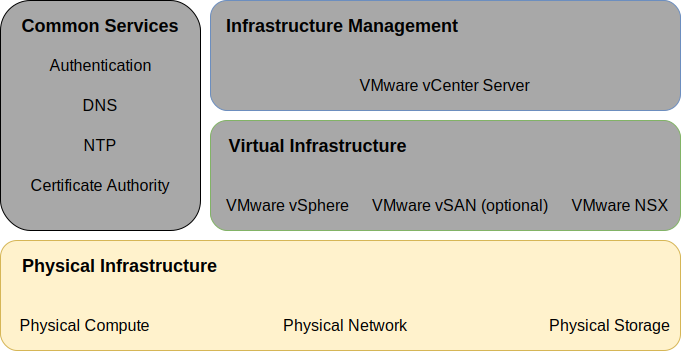
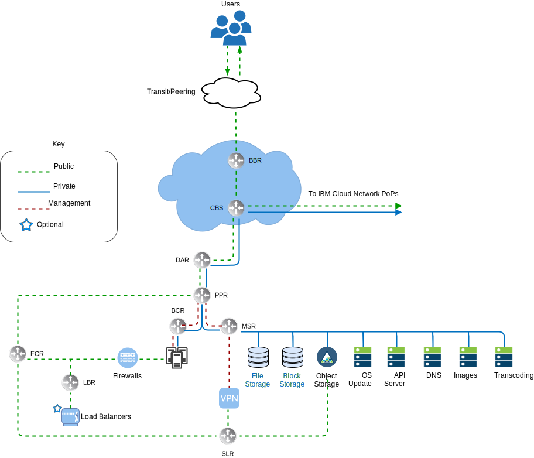
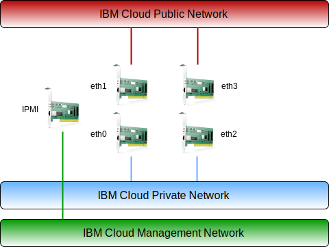
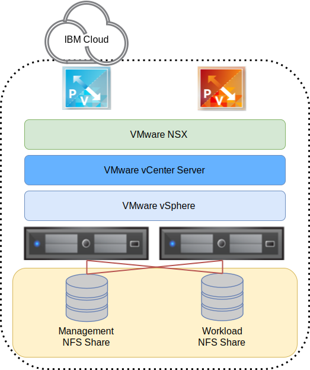

---

copyright:

  years:  2016, 2024

lastupdated: "2024-04-17"

subcollection: vmwaresolutions

---

{{site.data.keyword.attribute-definition-list}}

# Physical infrastructure design
{: #design_physicalinfrastructure}

The physical infrastructure consists of the following components:
* **Physical compute** - The physical compute provides the physical processing and memory that is used by the virtualization infrastructure. For this design, the compute components are provided by {{site.data.keyword.cloud}} bare metal servers and are listed in the [VMware Hardware Compatibility Guide (HCG)](https://www.vmware.com/resources/compatibility/search.php).
* **Physical storage** - The physical storage provides the raw storage capacity that is used by the virtualization infrastructure. Storage components are provided either by {{site.data.keyword.cloud_notm}} bare metal servers or by shared Network Attached Storage (NAS) array that uses NFS v3.
* **Physical network** - The physical network provides the network connectivity into the environment that is then used by the network virtualization. The network is provided by the {{site.data.keyword.cloud_notm}} services network and it includes extra services such as DNS and NTP.

For more information about the physical components, see [{{site.data.keyword.vcf-auto-short}} BOM](/docs/vmwaresolutions?topic=vmwaresolutions-vc_bom).

For more information about storage, see [Shared storage architecture](/docs/vmwaresolutions?topic=vmwaresolutions-storage-benefits#storage-benefits).

{: caption="Figure 1. Physical infrastructure" caption-side="bottom"}

## Physical compute design
{: #design_physicalinfrastructure-host-design}

The server configurations available in the solution meet or exceed the minimum requirements to install, configure, and manage vSphere ESXi™. Various configurations are available to satisfy different requirements. For the detailed listing of specifications used for the VMware® on {{site.data.keyword.cloud_notm}} solution, see the [{{site.data.keyword.vcf-auto-short}} BOM](/docs/vmwaresolutions?topic=vmwaresolutions-vc_bom).

The {{site.data.keyword.cloud_notm}} bare metal servers reside in the {{site.data.keyword.cloud_notm}}.
{: note}

Each {{site.data.keyword.vcf-auto}} instance begins with a 3- or 4-host deployment, depending on the choice of storage solution.

The {{site.data.keyword.cloud_notm}} bare metal server has the following specifications:
* CPU - Dual or Quad Intel® Xeon, varying core and speed configuration
* Memory - Varying configuration, 64 GB or larger
* Private network - 2 x 10 Gbps or 2 x 25 Gbps
* Public network (optional) - 2 x 10 Gbps or 2 x 25 Gbps
* Number of drives - two or more

## Physical network design
{: #design_physicalinfrastructure-net-design}

Physical networking is handled by {{site.data.keyword.cloud_notm}}. Review the following descriptions of the physical network that is provided by the {{site.data.keyword.cloud_notm}} and physical host connections (VLANs, MTU) associated with the physical hosts.

### {{site.data.keyword.cloud_notm}} network overview
{: #design_physicalinfrastructure-ibm-cloud-network}

The physical network of {{site.data.keyword.cloud_notm}} is separated into two distinct networks: public and private. The private network also contains the management Intelligent Platform Management Interface (IPMI) traffic to the physical servers.

The following figure uses these acronyms:

* BBR - Backbone Router
* BCR - Backend Customer Router
* CBS - Core Backbone Switch
* DAR - Distribution Aggregation Router
* FCR - Frontend Customer Router
* LBR - Load Balancer Router
* MSR - Master Service Router
* POPs - Points of Presence
* PPR - Pod to Pod Router
* SLR - Service Layer Router

{: caption="Figure 2. {{site.data.keyword.cloud_notm}} high–level network" caption-side="bottom"}

#### Public network
{: #design_physicalinfrastructure-public-net}

{{site.data.keyword.cloud_notm}} data centers and network points of presence (PoPs) have multiple 1 Gbps or 10-Gbps connections to the top-tier transit and peering network carriers. Network traffic from anywhere in the world connects to the closest network PoP, and travels directly across the network to its data center, minimizing the number of network hops and handoffs between providers.

Inside the data center, {{site.data.keyword.cloud_notm}} provides 1 Gbps, 10 Gbps, or 25 Gbps of network bandwidth to individual servers through a pair of separate, peer-aggregated front-end customer switches (FCS). These aggregated switches are attached to a pair of separate routers, FCR, for L3 networking.

This multitier design allows the network to scale across racks, rows, and pods within an {{site.data.keyword.cloud_notm}} data center.

#### Private network
{: #design_physicalinfrastructure-private-net}

All {{site.data.keyword.cloud_notm}} data centers and PoPs are connected by the private network backbone. This private network is separate from the public network, and it enables connectivity to services in {{site.data.keyword.cloud_notm}} data centers around the world. Moving data between {{site.data.keyword.cloud_notm}} data centers is done through multiple 10 Gbps or 40 Gbps connections to the private network.

Similar to the public network, the private network is multitiered in that servers and other infrastructure components are connected to aggregated back-end customer switches (BCS). These aggregated switches are attached to a pair of separate back-end customer routers (BCR) for L3 networking. The private network also supports the ability to use jumbo frames (MTU 9000) for physical host connections.

#### Host management
{: #design_physicalinfrastructure-mgmt-net}

On the private network, each {{site.data.keyword.cloud_notm}} server is connected for management by using the private primary network subnet. This connection allows Intelligent Platform Management Interface (IPMI) access to the server independently of its CPU, firmware, and operating system, for maintenance and administration purposes.

#### Primary and portable IP blocks
{: #design_physicalinfrastructure-ip-blocks}

{{site.data.keyword.cloud_notm}} allocates two types of IP addresses to be used within the {{site.data.keyword.cloud_notm}} infrastructure:
* Primary IP addresses are assigned to devices, bare metal, and virtual servers that are provisioned by {{site.data.keyword.cloud_notm}}. Do not assign any IP addresses in these blocks.
* Portable IP addresses are provided for you to assign and manage as needed. vCenter Server provisions several portable IP ranges for its use. Use only the portable IP address ranges that are assigned to specific NSX®-T components and specified for customer use. For example, **Customer EDGE**.

Primary or portable IP addresses can be made routable to any VLAN within your account when the account is configured as a **Virtual Routing and Forwarding (VRF)** account.

#### Virtual Routing and Forwarding
{: #design_physicalinfrastructure-vrf}

The {{site.data.keyword.slportal}} account must be configured as a Virtual Routing and Forwarding (VRF) account to enable automatic global routing between subnet IP blocks. All accounts with Direct-Link connections must be converted to, or created as, a VRF account.

As various connectivity options along with network routing options require that the {{site.data.keyword.cloud_notm}} account is in a VRF mode, it is recommended that the account is in VRF mode before provisioning vCenter Server.

#### Physical host connections
{: #design_physicalinfrastructure-host-connect}

Each physical host in this design has two redundant pairs of 10 Gbps or 25 Gbps Ethernet connections into each {{site.data.keyword.cloud_notm}} Top of Rack (ToR) switch (public and private). The adapters are set up as individual connections (unbonded) for a total of 4 x 10 Gbps or 4 x 25 Gbps connections. This configuration allows networking interface card (NIC) connections to work independently from each other.

Removing physical network connectivity to the public or private network for the {{site.data.keyword.cloud_notm}} bare metal servers that are used within the Automated offering is not possible. Physical ports on the internal NIC of the bare metal can be disabled, but no support exists for unplugging the cables.

{: caption="Figure 3. Physical host connections" caption-side="bottom"}

#### VLANs and underlay to overlay routing
{: #design_physicalinfrastructure-vlans}

The {{site.data.keyword.vmwaresolutions_short}} offerings are designed with 3 VLANs, one public and two private, assigned upon deployment. As shown in the previous figure, the public VLAN is assigned to `eth1` and `eth3`, and the private VLANs are assigned to `eth0` and `eth2`.

The public and the first private VLAN created and assigned in this design are untagged by default within the {{site.data.keyword.cloud_notm}}. Then, the additional private VLAN is trunked on the physical switch ports and tagged within the VMware port groups that are using these subnets.

The private network consists of two VLANs within this design. Four subnets are allocated to the first of these VLANs (here designated Private VLAN A):
* The first subnet is a primary private IP subnet range that {{site.data.keyword.cloud_notm}} assigns to the physical hosts.
* The second subnet is used for management virtual machines (VMs), such as vCenter Server Appliance and Platform Services Controller.
* The third subnet is used for the encapsulated overlay network Tunnel Endpoints (VTEPs) assigned to each host and edge through the NSX Manager.
* The fourth subnet is used for egress from the encapsulated overlay network.

In addition to Private VLAN A, a second private VLAN (here designated Private VLAN B) exists to support VMware features such as vSAN™, vMotion, and NFS. As such, the VLAN is divided into two or more portable subnets:
* The first subnet is assigned to a kernel port group for vMotion traffic.
* The remaining subnet or subnets are used for storage traffic:
   * If you use vSAN, a subnet is assigned to kernel port groups that are used for vSAN traffic.
   * If you use NFS attached NAS, a subnet is assigned to a port group that is dedicated to NFS traffic.

All subnets that are configured as part of a vCenter Server automated deployment use {{site.data.keyword.cloud_notm}} managed ranges, which ensure that any IP address can be routed to any data center within the {{site.data.keyword.cloud_notm}} account when you need the connection.

Review the following table for a summary.

| VLAN | Type | Description |
|:---- |:---- |:----------- |
| Public| Primary | Assigned to physical hosts for public network access. The hosts are assigned a public IP address but this IP address is not configured on the hosts, so they are not directly accessible on the public network. Instead, the public VLAN is intended to provide public internet access for other components, such as NSX-T edges. |
| Private A | Primary | Single subnet assigned to physical hosts assigned by {{site.data.keyword.cloud_notm}}. Used by the management interface for vSphere management traffic and for IPMI interfaces. |
| Private A | Portable | Single subnet that is assigned to VMs that function as management components |
| Private A | Portable | Single subnet that is assigned to NSX-T™ VTEP |
| Private A | Portable | Single subnet that is assigned for NSX edge egress |
| Private B | Portable | Single subnet that is assigned for vSAN, if in use |
| Private B | Portable | Single subnet assigned for NAS, if in use |
| Private B | Portable | Single subnet assigned for vMotion |
{: caption="Table 1. VLAN and subnet summary" caption-side="bottom"}

In this design, all VLAN-backed hosts and VMs are configured to point to the {{site.data.keyword.cloud_notm}} back-end “private network” customer router (BCR) as the default route. While the Automated instances enable the use of Software-Defined Networking (SDN), network overlays created within a VMware instance that include routing to internal subnets are not known by the {{site.data.keyword.cloud_notm}} managed routers.

If you want to route between the overlay and underlay, you must deploy an IBM firewall device for the particular default private VLAN when the Automated instance is deployed. This device allows the insertion of static routes and dynamic routing protocol peering with the overlay networking devices to allow routing between the underlay and overlay.

The private network connections are configured to use a jumbo frame MTU size of 9000 to improve performance for large data transfers, such as storage and vMotion. This value is the maximum MTU that is allowed within VMware and by {{site.data.keyword.cloud_notm}}. The public network connections use a standard Ethernet MTU of 1500. This value must be maintained as any changes might cause packet fragmentation over the internet.

## Physical storage design
{: #design_physicalinfrastructure-storage-design}

Physical storage design consists of the configuration of the physical disks that are installed in the physical hosts and the configuration of the shared network-attached storage. This storage includes the operating system (vSphere ESXi) and the disks that are used for storage of the VMs. Storage for VMs can consist of local disks that are virtualized by VMware vSAN, shared file–level storage, or shared block-level storage.

### Operating system disks
{: #design_physicalinfrastructure-os-disks}

The vSphere ESXi hypervisor is installed in a persistent location. As a result, the physical hosts are consist of two disks in a RAID 1 configuration to support redundancy for the vSphere ESXi hypervisor.

### vSAN disks
{: #design_physicalinfrastructure-vsan-disks}

This design allows for the option of using either VMware vSAN or shared network-attached storage as the primary datastore for VMs. For VMware vSAN, it is configured by using an all–flash configuration. This design allows for several configuration options, including 2U and 4U chassis, various numbers of disks, and various disk sizes. All configurations use two vSAN disk groups, with one solid-state disk (SSD) for cache and one or more SSDs for capacity. All drives that are allocated for vSAN consumption are configured in single-disk RAID 0.

For more information about the supported configurations, see [{{site.data.keyword.vcf-auto-short}} BOM](/docs/vmwaresolutions?topic=vmwaresolutions-vc_bom).

### Shared File-level storage across hosts
{: #design_physicalinfrastructure-shared-storage}

If you use shared file-level storage, a 2 TB NFS share is attached to the hosts that comprise the initial VMware cluster. This share, which is known as the management share, is used for management components, such as vCenter Server, Platform Services Controller, and VMware NSX.

The storage is attached by using the NFS v3 protocol at a 4 IOPS/GB level from {{site.data.keyword.cloud_notm}}.

{: caption="Figure 4. NFS shares that are attached to VMware deployment" caption-side="bottom"}

You can allocate and mount more file shares across all hosts for your workloads at the time of purchase or later within the console. You can select from the available {{site.data.keyword.cloud_notm}} Endurance file storage capacity options and performance tiers in the corresponding {{site.data.keyword.cloud_notm}} data center. All shares are attached by using the NFS v3 protocol. {{site.data.keyword.cloud_notm}} Endurance file storage includes provider-managed encryption of data at rest (AES-256 encryption), and is backed up by all-flash storage.

The 10 IOPS/GB performance tier is limited to a maximum capacity of 4 TB.

For more information about the shared NAS used in this solution, see [Shared storage architecture](/docs/vmwaresolutions?topic=vmwaresolutions-storage-benefits#storage-benefits).

## Related links
{: #design_physicalinfrastructure-related}

* [{{site.data.keyword.vcf-auto-short}} BOM](/docs/vmwaresolutions?topic=vmwaresolutions-vc_bom)
* [Shared storage architecture](/docs/vmwaresolutions?topic=vmwaresolutions-storage-benefits#storage-benefits)
