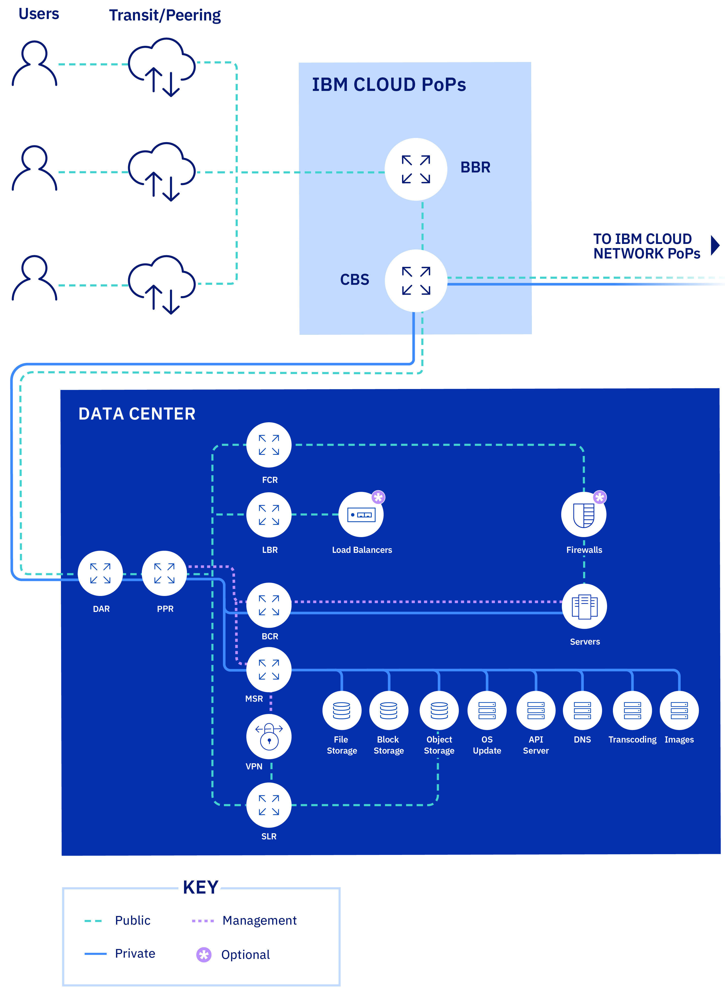
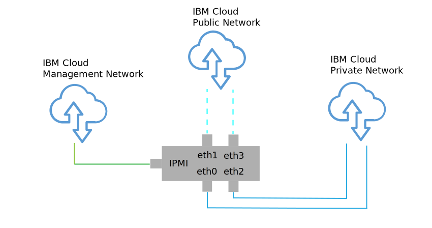

---

copyright:

  years:  2016, 2018

lastupdated: "2018-06-21"

---

# Physical infrastructure design

The physical infrastructure comprises the following components:

<dl class="dl">
  <dt class="dt dlterm">Physical compute</dt>
  <dd class="dd">The physical compute provides the physical processing and memory that is used by the virtualization infrastructure. For this design, the compute components are provided by {{site.data.keyword.baremetal_long}} and are listed on the [VMware Hardware Compatibility Guide (HCG)](https://www.vmware.com/resources/compatibility/search.php).</dd>
  <dt class="dt dlterm">Physical storage</dt>
  <dd class="dd">The physical storage provides the raw storage capacity consumed by the virtualization infrastructure. Storage components are provided either by {{site.data.keyword.baremetal_short}} or by shared Network Attached Storage (NAS) array using NFSv3.</dd>
  <dt class="dt dlterm">Physical network</dt>
  <dd class="dd">The physical network provides the network connectivity into the environment that is then consumed by the network virtualization. The network is provided by the IBM Cloud services network and includes additional services such as DNS and NTP.</dd>
</dl>

For the more information about the physical components, see the Bill of Materials for [Cloud Foundation instance](../../sddc/sd_bom.html) or [vCenter Server instance](../../vcenter/vc_bom.html).

For more information about storage, see [Shared storage architecture](https://www.ibm.com/cloud/garage/files/AttachedStorageSolutionArchitecture_v1.0.pdf).

## Physical host design

Physical host refers to the {{site.data.keyword.baremetal_short}} in the environment that serve compute resources. The {{site.data.keyword.baremetal_short}} applied in this solution are certified by VMware and listed on the [VMware HCG](http://www.vmware.com/resources/compatibility/search.php).

The server configurations available in the solution meet or exceed the minimum requirements to install, configure, and manage vSphere ESXi. Various configurations are available to satisfy different requirements. For the detailed listing of the exact specifications used for the VMware on IBM Cloud solution, see the Bill of Materials for [Cloud Foundation instance](../../sddc/sd_bom.html) or [vCenter Server instance](../../vcenter/vc_bom.html). Note that the  	{{site.data.keyword.baremetal_short}} reside in the {{site.data.keyword.cloud}}.

Each Cloud Foundation instance begins with a 4-host deployment, and each vCenter Server instance begins with a 3 or 4 host deployment depending on the choice of storage solution.

The physical host employs two locally-attached disks to allocate to the vSphere ESXi hypervisor. You can allocate additional disks by using vSAN as described in the _Physical storage design_ section in this topic or by using NetApp ONTAP as described in [NetApp ONTAP Select architecture](https://www.ibm.com/cloud/garage/files/IBM_Cloud_for_VMware_Solutions_NetApp_Architecture.pdf). Each
physical host has redundant 10 Gbps network connections for both public and private network access.

The technical specifications of the Bare Metal Server are the following:
* CPU: Dual Intel Xeon, varying core and speed configuration
* Memory: Varying configuration,  128 GB or larger
* Network: 4 × 10 Gbps
* Number of Drives: 2 or more

## Physical network design

This section describes the physical network that is provided by the {{site.data.keyword.cloud_notm}} and the physical host connections (VLANs, MTU) that are associated with the physical hosts.

As shown in the following figure, the physical network of {{site.data.keyword.cloud_notm}} is separated into three distinct networks: public, private, and management.

Figure 1. IBM Cloud high-level network

### Public network

{{site.data.keyword.CloudDataCents}} and network points of presence (PoPs) have multiple 1 Gbps or 10 Gbps connections to the top-tier transit and peering network carriers.

External network traffic from anywhere in the world will connect to the closest network PoP, and will travel directly across the network to its data center, minimizing the number of network hops and handoffs between providers.

* Inside the data center, {{site.data.keyword.cloud_notm}} provides 1Gbps or 10 Gbps of network bandwidth to individual servers via a pair of separate, peer-aggregated front-end customer switches (FCS). These aggregated switches are attached to a pair of separate front-end customer routers (FCR) for L3 networking.

This multi-tier design allows the network to scale across racks, rows, and pods within an {{site.data.keyword.CloudDataCent_notm}}.

### Private network

All {{site.data.keyword.CloudDataCents_notm}} and PoPs are connected by a private network backbone. The private network is separate from the public network, and it enables connectivity to services in {{site.data.keyword.CloudDataCents_notm}} around the world. Moving data between {{site.data.keyword.CloudDataCents_notm}} is done via multiple 10 Gbps or 40 Gbps connections to the private network.

Similar to the public network, the private network is multi-tiered in that servers and other infrastructure components are connected to aggregated back-end customer switches (BCS). These aggregated switches are attached to a pair of separate back-end customer routers (BCR) for L3 networking. The private network also supports the ability to utilize jumbo frames (MTU 9000) for physical host connections.

### Management network

In addition to the public and private networks, each {{site.data.keyword.cloud_notm}} server is connected to an out-of-band management network. This management network, accessible via VPN, allows Intelligent Platform Management Interface (IPMI) access to the server independently of its CPU, firmware, and operating system for maintenance and administration purposes.

### Primary and portable IP blocks

{{site.data.keyword.cloud_notm}} allocates two types of IP addresses to be used within the {{site.data.keyword.cloud_notm}} infrastructure:
* Primary IP addresses are assigned to devices, Bare Metal and virtual servers that are provisioned by {{site.data.keyword.cloud_notm}}. You should not assign any IP addresses in these blocks.
* Portable IP addresses are provided for you to assign and manage as needed.

Primary or portable IP addresses can be made routable to any VLAN within the customer account when **VLAN spanning** is enabled within the {{site.data.keyword.slportal}} or the account is configured as a **Virtual Routing and Forwarding (VRF)** account.

### VLAN spanning

**VLAN Spanning** is an {{site.data.keyword.slportal}} account setting that allows primary and portable subnet IP block of all VLANs within the account to be routable to each other. When the **VLAN Spanning** setting is disabled, IP blocks can still route to {{site.data.keyword.cloud_notm}} services, but not to each other.

To allow transparent connection across various subnets where the solution components reside, you need to enable **VLAN Spanning** in the {{site.data.keyword.slportal}} account where the Cloud Foundation and vCenter Server instances are deployed.

### Virtual Routing and Forwarding (VRF)

You can also configure the {{site.data.keyword.slportal}} account as a VRF account to provide similar functionality to VLAN spanning, enabling automatic routing between subnet IP blocks. All accounts with Direct Link connections must be converted to, or created as, a VRF account.

The {{site.data.keyword.vmwaresolutions_short}} console cannot detect whether VRF is enabled in the {{site.data.keyword.slportal}}. You will receive a warning that reminds you to ensure that you enabled either **VLAN spanning** or VRF in your {{site.data.keyword.slportal}} account.

### Physical host connections

Each physical host in the design has two redundant pairs of 10Gbps Ethernet connections into each {{site.data.keyword.cloud_notm}} Top of Rack (ToR) switch (public and private). The adapters are set up as individual connections (unbonded) for a total of 4 × 10Gbps connections. This allows networking interface card (NIC) connections to work independently from each other.

Figure 2. Physical host NIC connections

### VLANs

The {{site.data.keyword.vmwaresolutions_short}} offerings are designed with 3 VLANs, one public and two private, assigned upon deployment. As shown in Figure 2, the public VLAN is assigned to eth1 and eth3, and the private VLANs are assigned to eth0 and eth2.

The public and the first private VLAN created and assigned in this design are untagged by default within the {{site.data.keyword.cloud_notm}}. The additional private VLAN is trunked on the physical switch ports and tagged within the VMware port groups that are using these subnets.

The private network consists of two VLANs within this design. Three subnets are allocated to the first of these VLANs (here designated Private VLAN A):
* The first subnet is a primary private IP subnet range that {{site.data.keyword.cloud_notm}} assigns to the physical hosts.
* The second subnet is used for management virtual machines such as vCenter Server Appliance and Platform Services Controller
* The third subnet is used for the VXLAN Tunnel Endpoints (VTEPs) assigned to each host via VMware NSX Manager.

In addition to Private VLAN A, a second private VLAN (here designated Private VLAN B) exists to support VMware features such as vSAN and vMotion, and for connectivity to network attached storage (NAS). As such, the VLAN is divided into two or three portable subnets.

* The first subnet is assigned to a kernel port group for vMotion traffic.
* The remaining subnets are used for storage traffic:
   * When using vSAN, a subnet is assigned to kernel port groups that are used for vSAN traffic.
   * When using NAS, a subnet is assigned to a port group that is dedicated to NFS traffic.

All subnets configured as part of a vCenter Server or Cloud Foundation automated deployment use {{site.data.keyword.cloud_notm}} managed ranges. This is to ensure that any IP address can be routed to any data center within the {{site.data.keyword.cloud_notm}} account when you need the connection now or in the future.

This is all summarized in [Table 1](#table_vlan_subnet_summary).

Table 1. VLAN and subnet summary 

| VLAN  | Type | Description  |
|-----------|----------|----------------------------------------------------------------------------------------------------------------------------------|
| Public| Primary  | Assigned to physical hosts for public network access. Not utilized upon initial deployment.  |
| Private A | Primary  | Single subnet assigned to physical hosts assigned by {{site.data.keyword.cloud_notm}}. Used by the management interface for vSphere management traffic. |
| Private A | Portable | Single subnet assigned to virtual machines functioning as management components. |
| Private A | Portable | Single subnet assigned to NSX VTEP   |
| Private B | Portable | Single subnet assigned for vSAN, if in use   |
| Private B | Portable | Single subnet assigned for NAS, if in use|
| Private B | Portable | Single subnet assigned for vMotion   |

In this design, all VLAN-backed hosts and virtual machines are configured to point to the {{site.data.keyword.cloud_notm}} back-end “private network” customer router as the default route. Although the vCenter Server and Cloud Foundation instances enable the use of Software-Defined Networking (SDN), network overlays created within a VMware instance that include routing to internal subnets are not known by the {{site.data.keyword.cloud_notm}} managed routers. Therefore, you may need to create static routes within the VMware instance on some or all management components.

The private network connections are configured to use a jumbo frame MTU size of 9000 to improve performance for large data transfers, such as storage and vMotion. This is the maximum MTU that is allowed within VMware and by {{site.data.keyword.cloud_notm}}. The public network connections use a standard Ethernet MTU of 1500. This must be maintained as any changes might cause packet fragmentation over the internet.

## Physical storage design

Physical storage design consists of the configuration of the physical disks that are installed in the physical hosts and the configuration of the shared file-level storage. This includes the operating system disks of the vSphere ESXi hypervisor and those used for storage of the virtual machines (VMs). Storage for VMs can be comprised of local disks that are virtualized by VMware vSAN, or of shared file-level storage.

### Operating system disks

The vSphere ESXi hypervisor is designed to be installed in a persistent location. As a result, the physical hosts contain two 1TB SATA disks in RAID-1 configuration to support redundancy for the vSphere ESXi hypervisor.

### Virtual machine storage

This design allows for the option of using either VMware vSAN or shared file-level storage as the primary datastore for VMs.

### vSAN disks

When used, VMware vSAN is configured using an all-flash configuration. This design allows for several configuration options, including 2U and 4U chassis, a variety of numbers of disks, and a variety of disk sizes. All configurations use two vSAN disk groups, with one solid state disk (SSD) for cache and one or more SSDs for capacity. All drives allocated for vSAN consumption are configured in single-disk RAID-0.

For information on the supported configurations, see the Bill of Materials for [Cloud Foundation instance](../../sddc/sd_bom.html) or [vCenter Server instance](../../vcenter/vc_bom.html).

### Shared File-level storage across hosts

When using shared file-level storage, a 2TB NFS share is attached to the hosts that comprise the initial VMware cluster. This share, known as the management share, is used for management components such as the VMware vCenter Server, Platform Services Controller, and VMware NSX. The storage is attached via the NFSv3 protocol and can support up to 4000 IOPS.

Figure 3. NFS shares attached to VMware deployment

You can allocate and mount additional file shares for your workloads at the time of purchase or later within the console. You can select from the available {{site.data.keyword.cloud_notm}} Endurance file storage capacity options and performance tiers in the corresponding {{site.data.keyword.CloudDataCent}}. All shares are attached using the NFSv3 protocol. Additionally, it is possible to attach NFSv3 file shares by applying the NetApp ONTAP Select offering.

{{site.data.keyword.CloudDataCents}} that offer the 10 IOPS/GB performance tier also include provider-managed encryption of data at rest (AES-256 encryption), and are backed by all-flash storage. The 10 IOPS/GB performance tier is limited to a maximum capacity of 4 TB. For more information about the shared NAS used in this solution, see the [Shared storage architecture](https://www.ibm.com/cloud/garage/files/AttachedStorageSolutionArchitecture_v1.0.pdf).

## Related links

* [Cloud Foundation Bill of Materials](../../sddc/sd_bom.html)
* [vCenter Server Bill of Materials](../../vcenter/vc_bom.html)
* [Shared storage architecture](https://www.ibm.com/cloud/garage/files/AttachedStorageSolutionArchitecture_v1.0.pdf)
* [NetApp ONTAP Select architecture](https://www.ibm.com/cloud/garage/files/IBM_Cloud_for_VMware_Solutions_NetApp_Architecture.pdf)
