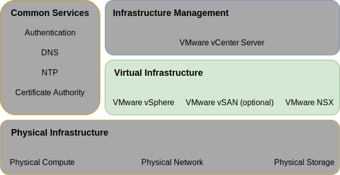
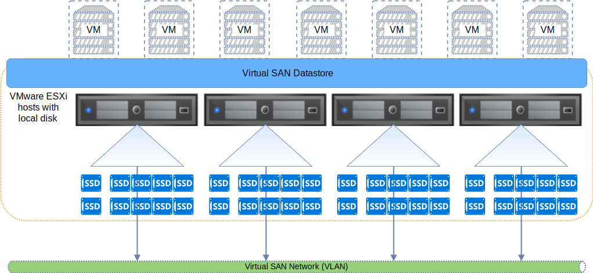
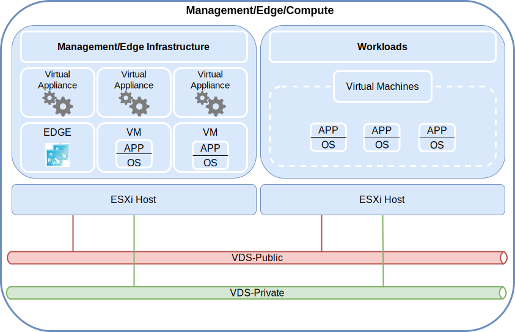

---

copyright:

  years:  2016, 2019

lastupdated: "2019-03-19"

subcollection: vmware-solutions

---

{:tip: .tip}
{:note: .note}
{:important: .important}

# Virtual infrastructure design
{: #design_virtualinfrastructure}

The virtual infrastructure layer includes the VMware software components that virtualize the compute, storage, and network resources provided in the physical infrastructure layer: VMware vSphere ESXi, VMware NSX-V or NSX-T, and optionally VMware vSAN.

Figure 1. Virtual infrastructure 

## VMware vSphere design
{: #design_virtualinfrastructure-vsphere-design}

The vSphere ESXi configuration consists of the following aspects:
* Boot configuration
* Time synchronization
* Host access
* User access
* DNS configuration

The following table outlines the specifications for each aspect. After the configuration and installation of ESXi, the host is added to a VMware vCenter Server and is managed from there.

With this design, you can access the virtual hosts through Direct Console User Interface (DCUI), ESXi Shell, and Secure Shell (SSH).

By default, the only users who can log in directly are the _root_ and _ibmvmadmin_ users for the physical machine of the host. The administrator can add users from the Microsoft Active Directory (MSAD) domain to enable user access to the host. All hosts in the vCenter Server solution design are configured to synchronize with a central NTP server.

Table 1. vSphere ESXi configuration

| Attribute              | Configuration parameter |
|:---------------------- |:----------------------- |
| ESXi boot location     | Uses local disks that are configured in RAID-1 |
| Time synchronization   | Uses {{site.data.keyword.cloud}} NTP server |
| Host access            | Supports DCUI, ESXi Shell, or SSH, if enabled |
| User access            | Local authentication and MSAD |
| Domain name resolution | Uses DNS as described in [Common services design](/docs/services/vmwaresolutions/archiref/solution?topic=vmware-solutions-design_commonservice). |
| EVC Mode | Skylake (only for “greenfield” vSphere 6.7 deployments) |

The vSphere cluster houses the virtual machines (VMs) that manage the vCenter Server instance as well as compute resources for user workloads.

* When a vCenter Server instance uses vSAN, the minimum number of ESXi hosts at initial deployment is 4.
* When a vCenter Server instance uses shared file–level or block-level storage, the minimum number of ESXi hosts at initial deployment is 3.

You can scale up to a maximum of 59 ESXi hosts during or post initial deployment.

To support more user workloads, you can scale the environment by:  
* Deploying more compute hosts of existing clusters
* Deploying more clusters that are managed by the same vCenter Server Appliance
* Deploying new vCenter Server instances with their own vCenter Server Appliance

For more information about clusters, see [{{site.data.keyword.cloud_notm}} running VMware clusters solution architecture](https://www.ibm.com/cloud/garage/files/IBM-Cloud-for-VMware-Solutions-Multicluster-Architecture.pdf).

## VMware vSAN design
{: #design_virtualinfrastructure-vsan-design}

In this design, VMware vSAN storage is employed in vCenter Server instances to provide shared storage for the vSphere hosts.

As shown in the following figure, vSAN aggregates the local storage across multiple ESXi hosts within a vSphere cluster and manages the aggregated storage as a single VM datastore. Within this design, the compute nodes contain local disk drives for the ESXi Operating System (OS) and the vSAN datastore. Regardless of which cluster a node belongs to, two OS drives are included in each node to house the ESXi installation.

Figure 2. vSAN concept

vSAN employs the following components:
* Two-disk group vSAN design; each disk group with two or more disks. One SSD or NVMe drive of the smallest size in the group serves as the cache tier and the remaining SSDs serve as the capacity tier.
* The onboard RAID controller is configured for each drive except for the two OS drives, which are configured in a RAID–0 array per drive.
* A single vSAN datastore is created from all storage.

The available vSAN features depend on the license edition that you select when you order the instance. For more information, see [VMware vSAN edition comparison](/docs/services/vmwaresolutions/archiref/solution?topic=vmware-solutions-solution-appendix#vmware-vsan-edition-comparison).

### Virtual network setup for vSAN
{: #design_virtualinfrastructure-net-setup}

For this design, the vSAN traffic traverses between ESXi hosts on a dedicated private VLAN. The two network adapters attached to the private network switch are configured within vSphere as a vSphere Distributed Switch (vDS) with both network adapters as uplinks. A dedicated vSAN kernel port group that is configured for the vSAN VLAN resides within the vDS. Jumbo frames (MTU 9000) are enabled for the private vDS.

vSAN does not load balance traffic across uplinks. As a result, one adapter is active while the other is in standby to support high availability (HA). The network failover policy for vSAN is configured as **Explicit Failover** between physical network ports.

For more information about physical NIC connections, see [Physical host NIC connections](/docs/services/vmwaresolutions/services?topic=vmware-solutions-design_physicalinfrastructure#design_physicalinfrastructure-host-connect).

### vSAN policy design
{: #design_virtualinfrastructure-storage-policy}

When vSAN is enabled and configured, storage policies are configured to define the VM storage characteristics. Storage characteristics specify different levels of service for different VMs.

The default storage policy in this design tolerates a single failure. The default policy is configured with erasure coding, with **Failure tolerance method** set to **RAID-5/6 (Erasure Coding) - Capacity** and **Primary level of failures** set to 1. The RAID 5 configuration requires a minimum of four hosts.

Alternatively, you can choose the RAID 6 configuration with **Failure tolerance method** set to **RAID-5/6 (Erasure Coding) - Capacity** and **Primary level of failures** set to 2. The RAID 6 configuration requires a minimum of six hosts. **Duplication** and **compression** are also enabled in the default storage policy.

An instance uses the default policy unless otherwise specified from the vSphere console. When a custom policy is configured, vSAN will guarantee it when possible. However, if the policy can't be guaranteed, it's not possible to provision a VM that uses the policy unless it is enabled to force provisioning.

Storage policies must be reapplied after addition of new ESXi hosts or patching of the ESXi hosts.

### vSAN settings
{: #design_virtualinfrastructure-vsan-sett}

vSAN settings are configured based on best practices for deploying VMware solutions within {{site.data.keyword.cloud_notm}}. The vSAN settings include SIOC settings, explicit failover settings port group, and disk cache settings.
* SSD cache policy settings: No **Read Ahead**, **Write Through**, **Direct** (NRWTD)
* Network I/O control settings
   * Management - 20 shares
   * Virtual machine - 30 shares
   * vMotion - 50 shares
   * vSAN - 100 shares
* vSAN kernel ports: **Explicit Failover**

## iSCSI attached storage
{: #design_virtualinfrastructure-iscsi-storage}

Unlike NFS v3 attached storage, iSCSI attached storage supports active–active paths across all configured NIC card ports and target ports. Because of this, higher throughput can be achieved and is thus a desirable alternative to NFS attaching storage. This does come at the cost of greater complexity.

{{site.data.keyword.cloud_notm}} Endurance block storage supports only a maximum of eight hosts attachment per LUN. This is meant to document the capability that will be added to vCenter Server upon change to {{site.data.keyword.cloud_notm}} Endurance storage due Q1 to allow for attachment for up to 64 hosts, or iSCSI initiators, as each ESXi host will have a minimum of two initiators.

One 2-TB iSCSI LUN is attached to vCenter Server for the use of the management components and a minimum of one more iSCSI LUN is configured for customer workload use. This storage is formatted as VMFS 6.x file system per each LUN.

### Virtual network setup for iSCSI
{: #design_virtualinfrastructure-setup-iscsi}

For this design, iSCSI traffic is allowed to use both private attached NIC card ports in an active, active configuration. Because vSphere allows only one NIC card port to be active on a particular port group within a vDS at a time, two port groups must be created (A and B) on the storage VLAN.

An ESXi kernel port is created with a unique IP address on individual subnets to allow for scalability. Each kernel port is assigned to its own iSCSI port group. Both kernel ports are assigned to an ESXi virtual ISCSI host bus adapter (HBA). For each kernel port, the default GW override switch is employed to use the default gateway for the local subnet for that kernel port. See the following table.

Table 2. iSCSi port groups

vDS Portgroup | Kernel port subnet | VMHBA
--|:---|:--
**SDDC-Dprotgroup-iSCSI-A** |Subnet-A |  vmhba64
**SDDC-Dprotgroup-iSCSI-B** | Subnet-B | vmhba64

#### Storage I/O control - SIOC
{: #design_virtualinfrastructure-sioc}

iSCSI LUNS is provisioned and formatted to a single file VMFS file system per LUN. The default recommended SIOC setting is 90% of peak throughput.

## VMware NSX-V design
{: #design_virtualinfrastructure-nsx-design}

Network virtualization provides a network overlay that exists within the virtual layer. Network virtualization provides the architecture with features such as rapid provisioning, deployment, reconfiguration, and destruction of on-demand virtual networks. This design uses the vDS and VMware NSX for vSphere to implement virtual networking.

In this design, the NSX Manager is deployed in the initial cluster. The NSX Manager is assigned a VLAN-backed IP address from the private portable address block, which is designated for management components and configured with the DNS and NTP servers that are presented in [Common services design](/docs/services/vmwaresolutions/archiref/solution?topic=vmware-solutions-design_commonservice).

The following figure shows the placement of the NSX Manager in relation to other components in the architecture.

Figure 3. NSX Manager network overview

After initial deployment, the {{site.data.keyword.cloud_notm}} automation deploys three NSX controllers within the initial cluster. Each of the controllers is assigned a VLAN-backed IP address from the **Private A** portable subnet that is designated for management components. Additionally, the design creates VM-VM anti-affinity rules to separate the controllers among the hosts in the cluster. The initial cluster must contain a minimum of three nodes to ensure high availability for the controllers.

In addition to the controllers, the {{site.data.keyword.cloud_notm}} automation prepares the deployed vSphere hosts with NSX VIBS to enable the use of a virtualized network through VXLAN Tunnel Endpoints (VTEPs). The VTEPs are assigned a VLAN-backed IP address from the **Private A** portable IP address range that is specified for VTEPs as listed in [VLANs](/docs/services/vmwaresolutions/services?topic=vmware-solutions-design_physicalinfrastructure#design_physicalinfrastructure-vlans). The VXLAN traffic resides on the untagged VLAN and is assigned to the private vDS.

Then, a segment ID pool is assigned and the hosts in the cluster are added to the transport zone. Only unicast is used in the transport zone because Internet Group Management Protocol (IGMP) snooping is not configured within the {{site.data.keyword.cloud_notm}}. Two vTEP kernel ports are configured per host on the same VTEP dedicated subnet per VMW best practice.

After that, NSX Edge Services Gateway pairs are deployed. In all cases, one gateway pair is used for outbound traffic from automation components that reside in the private network. A second gateway that is known as the customer-managed edge, is deployed and configured with an uplink to the public network and an interface that is assigned to the private network. For more information about the NSX Edge Services Gateways that are deployed as part of the solution, see [NSX Edge Services Gateway solution architecture](/docs/services/vmwaresolutions/services?topic=vmware-solutions-nsx_overview#nsx_overview).

Cloud administrators can configure any required NSX components, such as Distributed Logical Router (DLR), logical switches, and firewalls. The available NSX features depend on the NSX license edition that you choose when you order the instance. For more information, see [VMware NSX edition comparison](/docs/services/vmwaresolutions/archiref/solution?topic=vmware-solutions-solution-appendix#vmware-nsx-edition-comparison).

The NSX Manager is installed with the specifications that are listed in the following table.

Table 3. NSX Manager requirements

| Attribute       | Specification |
|:--------------- |:------------- |
| NSX Manager     | Virtual appliance |
| Number of vCPUs | 4 |
| Memory          | 16 GB |
| Disk            | 60 GB on the management NFS share |
| Disk type       | Thin-provisioned |
| Network         | **Private A** portable designated for management components |

### Distributed switch design
{: #design_virtualinfrastructure-distr-switch}

The design uses a minimum number of vDS Switches. The hosts in the cluster are connected to the public and private networks. The hosts are configured with two distributed virtual switches. The use of two switches follows the practice of {{site.data.keyword.cloud_notm}} network that separates the public and private networks. The following diagram shows the vDS design.

Figure 4. Distributed switch design

As shown in the previous figure, one vDS is configured for public network connectivity (SDDC-Dswitch-Public) and the other vDS is configured for private network connectivity (SDDC-Dswitch-Private). Separating different types of traffic is required to reduce contention and latency and increase security.

VLANs are used to segment physical network functions. This design uses three VLANs: two for private network traffic and one for public network traffic. The following table shows the traffic separation.

Table 4. VLAN mapping to traffic types

| VLAN  | Designation | Traffic type |
|:----- |:----------- |:------------ |
| VLAN1 | Public      | Available for internet access |
| VLAN2 | Private A   | ESXi management, management, VXLAN (VTEP) |
| VLAN3 | Private B   | vSAN, NFS, vMotion, iSCSI |

Traffic from workloads will travel on VXLAN­-backed logical switches.

The vSphere cluster uses two vSphere Distributed Switches that are configured as in the following tables. 

Table 5. Converged cluster distributed switches

| vSphere Distributed Switch Name | Function | Network I/O Control | Load Balancing Mode | Physical NIC Ports | MTU |
|:------------- |:------------- |:------------- |:------------- |:------------- |:------------- |
| SDDC-Dswitch-Private | ESXi management, vSAN, vSphere vMotion, VXLAN tunnel endpoint, NFS (VTEP) | Enabled | Route based on explicit failover (vSAN, vMotion) originating virtual port (all else) | 2 | 9,000 (Jumbo frames) |
| SDDC-Dswitch-Public | External management traffic (north-south) | Enabled | Route based on originating virtual port | 2 | 1,500 (default) |

The names, number, and ordering of the host NICs might vary depending on the {{site.data.keyword.CloudDataCent_notm}} and your host hardware selection.
{:note}

Table 6. Converged cluster distributed switch port group configuration settings

| Parameter          | Setting       |
|:------------------ |:------------- |
| Load balancing     | Route based on the originating virtual port \* |
| Failover detection | Link status only |
| Notify switches    | Enabled |
| Failback           | No |
| Failover order     | Active uplinks: Uplink1, Uplink2 \* |

\* The vSAN port group uses explicit failover with active or standby because it does not support load balancing of vSAN storage traffic. iSCSI port groups have only one active uplink at a time (iSCSI A - Uplink1, iSCSI B - Uplink 2).
{:note}

Table 7. Converged cluster virtual switch port groups and VLANs, Distributed switch **SDDC-Dswitch-Private**

Port Group|Teaming|Uplinks|VLAN ID
---|---|---|--
SDDC-DPortGroup-Mgmt|Originating virtual port|Active: 0, 1|VLAN 1
SDDC-DPortGroup-vMotion|Originating virtual port|Active: 0, 1|VLAN 2
SDDC-DPortGroup-VSAN|Explicit failover|Active: 0, Standby: 1|VLAN 2
SDDC-DPortGroup-NFS|Originating virtual port|Active: 0, 1|VLAN 2
NSX generated|Originating virtual port|Active: 0,1|VLAN 1
SDDC-DPortGroup-External|Originating virtual port|Active: 0, 1|VLAN 3
SDDC-DPortGroup-iSCSI-A|Originating virtual port|Active: 0|VLAN 2
SDDC-DPortGroup-iSCSI-B|Originating virtual port|Active: 0|VLAN 2

Table 8. Converged cluster VMkernel adapters, Distributed switch **SDDC-Dswitch-Private**

Purpose|Connected port group|Enabled services|MTU
--|---|---|---|--
Management|SDDC-DPortGroup-Mgmt|Management Traffic|1500 (default)
vMotion|SDDC-DPortGroup-vMotion|vMotion Traffic|9000
VTEP|NSX generated|-|9000
VSAN|SDDC-DPortGroup-VSAN|VSAN|9000
NAS|SDDC-DPortGroup-NFS|NAS|9000
iSCSI|SDDC-DPortGroup-iSCSI-A|iSCSI|9000
iSCSI|SDDC-DPortGroup-iSCSI-B|iSCSI|9000

### NSX configuration
{: #design_virtualinfrastructure-nsx-config}

This design specifies the configuration of NSX components but does not apply any network overlay component configuration. You can design the network overlay based on your needs.

The following aspects are preconfigured:
* Management servers and controllers are installed and integrated into the vCenter web UI
* ESXi agents are installed and VTEP IP addresses are configured per ESXi host
* VTEP configuration, controller configuration, and VXLAN configuration (transport zone)
* NSX Edge Services Gateway appliances for use by management components
* NSX Edge Services Gateway appliances for customer use
* NSX VXLAN work customer workloads attached to a distributed local router (DLR) with a transit VXLAN between the DLR and the customer ESG.
* RFC 1918 address space for the VXLANs and IBM Cloud private and public portable IP space for use as egress network on the customer ESG.

The following aspects are not configured:
* Micro segmentation
* Linked NSX Management to other VMware instances

Figure 5. Deployed example customer NSX topology

## Related links
{: #design_virtualinfrastructure-related}

* [{{site.data.keyword.cloud_notm}} running VMware clusters solution architecture](https://www.ibm.com/cloud/garage/files/IBM-Cloud-for-VMware-Solutions-Multicluster-Architecture.pdf)
* [NSX Edge Services Gateway solution architecture](/docs/services/vmwaresolutions/services?topic=vmware-solutions-nsx_overview#nsx_overview)
