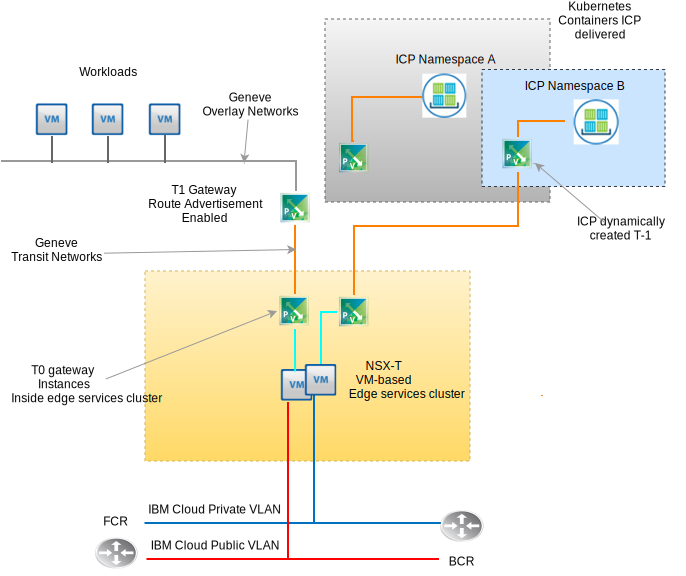

---

copyright:

  years:  2016, 2019

lastupdated: "2019-05-07"

subcollection: vmware-solutions

---

# VMware NSX-T design
{: #nsx-t-design}

Unlike NSX-V (NSX on vSphere), VMware NSX-T is designed to address application frameworks and architectures that have heterogeneous endpoints and technology stacks. In addition to vSphere, these
environments can include other hypervisors, KVM, containers, and bare metal. NSX is designed to span a software defined network and security infrastructure across platforms other than just vSphere alone. While it is possible to deploy NSX-T components without needing vSphere, this design focuses on NSX-T and its integration primarily within a vCenter Server vSphere automated deployment.

There are many advanced features within NSX-T such as firewall policies, inclusion of guest introspection within firewall policies, and advanced net flow tracking. Describing these features is beyond the scope of this document. See the VMware documentation for NSX-T. In this design, the NSX-T Management Infrastructure is deployed during the initial vCenter Server cluster deployment in place of NSX-V.

## NSX-T vs NSX-V
{: #nsx-t-design-nsx-t-nsx-v}

For vSphere native NSX (NSX-V), review the following more well-known NSX-T objects with similar function to their NSX-V counterparts. Limitations and differences within a vSphere environment are also be discussed. Here is a table of typically used functions between T and V that correspond.

Table 1. NSX-V to NSX-T terminology

NSX-V or vSphere native | NSX-T
--|:---|:--
**Virtual Distributed Switch** | Network Virtual Distributed Switch (N-VDS)
**NSX Transport zone** | Transport zone (overlay or VLAN backed)
**Port group (vDS)** | Logical Switch
**VXLAN (L2 encapsulation)** | GENEVE (L2 encapsulation)
**Edge Gateway** | T0 Gateway (changed as of v2.4)
**Distributed Logical Router** | T1 Gateway (changed as of v2.4)
**ESXi Server (vTEP)** | Transport Node (ESXi, KVM, Bare metal T0 Gateway)

There are key NSX-T concepts that do not correspond to NSX-V function that need to be understood for this design’s implementation of NSX-T.

As follows:
- An edge cluster is one or more VMs or physical machines that participate in an NSX-T virtual fabric. They are endpoints for the overlay network transport zones and VLAN backed transport zones. An edge cluster can support multiple T-0 gateway instances.
- A T-0 gateway is a virtual router instance, but not a VM. Multiple T-0 gateway instances can run within an edge cluster each with its own routing table and functions. This means that an edge cluster must exist before you can create a T-0 router instance.
- A transport zone can span endpoints across different platforms and multiple vSphere vCenter instances. No cross vCenter linked NSX is required. Transport zones can be excluded from specific endpoints. An N-VDS is directly correlated to a transport zone and is created when the transport zone is created.
- Uplink failover order is created independent of a particular logical switch as they are created in profiles as “Uplink Profiles” and are applied to a particular logical switch based on VLAN. Because it is possible to have the need for differing failover order or load balancing of physical uplinks for the same VLAN, the uplink profile for a particular VLAN can contain multiple entries for “Teaming” with different failover order and load balancing. When you assign the uplink profile to a logical switch, the specific teaming profile is then chosen.

- As of NSX-T 2.4, the manager VM and the controller VM function are combined. This results in three controller manager VMs being deployed. If on the same subnet, they use and internal network load balancer. If across different subnets, an external load balancer is required.

## Resource requirements
{: #nsx-t-design-resource-req}

In this design, the NSX-T Manager-controller VMs are deployed on the initial cluster. Additionally, each controller manager is assigned a VLAN–backed IP address from the private portable address block that is designated for management components and configured with the DNS and NTP servers that are discussed in section 0. A summary of the NSX Manager installation is shown in following table.

Table 2. NSX-T Manager - controller specifications

Attribute | Specification
--|--
**NSX Manager / Controller** | 3 Virtual appliances
**Number of vCPUs** | 4
**Memory** |  16 GB
**Disk** | 60 GB
**Disk type** | Thin provisioned
**NetworkPrivate A** | Private A

The following figure shows the placement of the NSX Manager-controllers in relation to the other components in this architecture.

{: caption="Figure 1. NSX-T Manager network overview" caption-side="bottom"}

## Deployment considerations
{: #nsx-t-design-deployment}

With NSX-T on vSphere, the N-VDS must be assigned the physical adapters within the hosts. As an N-VDS can only be configured within NSX-T Manager, this implies that if redundancy is to be maintained, no physical adapters are available for native local switch or vDS assignment in a cluster that houses both the NSX-T components and the associated overlay network components.

For this reason, during the installation of NSX-T and its configuration, one physical NIC port on one adapter must remain assigned to a local vSphere vSwitch or a virtual distributed switch (vDS). Post NSX-T deployment, any ESX kernel ports need to be migrated to an N-VDS and off any local vSwitch or VDS. After the kernel ports are removed, the remaining physical NIC ports can be assigned as an N-VDS uplink achieving redundancy the N-VDS.

After initial deployment, the {{site.data.keyword.cloud_notm}} automation deploys three NSX-T Manager/Controller virtual appliances within the initial cluster. The controllers are assigned a VLAN–backed IP address from the Private A portable subnet that is designated for management components. Additionally, VM–VM anti–affinity rules are created such that controllers are separated among the hosts in the cluster.

You must deploy the initial cluster with a minimum of three nodes to ensure high availability for the Manager / Controllers. In addition to the manager / controllers, the {{site.data.keyword.cloud_notm}} automation prepares the deployed vSphere hosts as NSX-T transport nodes. The ESXi transport nodes are assigned a VLAN–backed IP address from the Private A portable IP address range that is specified by an NSX IP pool ranged derived from the VLAN and Subnet Summary. Transport node traffic resides on the untagged VLAN and is assigned to the private NSX-T virtual distributed switch (N-VDS).

Depending on the customer chosen NSX-T topology to be deployed, an NSX-T Edge Cluster is either deployed as a pair of VM or as software deployed on bare metal cluster nodes. Regardless of if the cluster pair is virtual or physical, uplinks are configured to N-VDS switches for both {{site.data.keyword.cloud_notm}} public and private networks.

The following table summarizes the requirements for a medium size environment.

Table 3. NSX-T component specification

 Resources | Manager controller x3 | Edge cluster x2 | Bare Metal Edge
-----------|:---------|:-------|:---------
**Medium size** | Virtual appliance | Virtual appliance | Physical Server
**Number of vCPUs** | 4 | 4 | 8
**Memory** | 16 GB | 8 GB | 32 GB
**Disk** | 120 GB VSAN/management NFS | 120 GB VSAN/management NFS | 200 GB
**Disk type** | Thin provisioned | Thin provisioned | Physical
**Network** | Private A | Private A | Private A

## Transport zones and N-VDS
{: #nsx-t-design-transport-zones}

Transport zones dictate which hosts and which VMs can participate in the use of a particular network. A transport zone does this by limiting the hosts that can "see" a logical switch—and, therefore, which VMs can be attached to the logical switch. A transport zone can span one or more host clusters. This design calls for transport zones to be created as follows:

Table 4. NSX-T transport zones and N-VDS

Transport zone name | VLAN/VXLAN | N-VDS name | Uplink teaming policy
--|:-------|:------|:-----
**Private-Overlay** | VXLAN | SDDC-Overlay | Default
**Public-VLAN** | VLAN | SDDC-Public | Default
**Private-VLAN** | VLAN | SDDC-Private | NFS,vSAN,iSCSI-A&B Default

## Transport nodes
{: #nsx-t-design-transport-nodes}

Transport nodes define the physical server objects or VMs that participate in the virtual network fabric. Review the following table to understand the design.

Table 5. NSX-T Transport Nodes

Transport node type | N-VDS | Uplink profile | IP assignment | Physical NICs
--|:--------|:--------|:---
**ESXi** | SDDC-Private | SDDC-Private-uplink | IP Pool | vmnic0, vmnic2
**Edge Cluster** | SDDC-Overlay | SDDC-Overlay-uplink | IP Pool | N/A
**Physical Edge** | SDDC-Private | SDDC-Private-uplink | IP Pool | eth0, eth2

## Uplink profiles
{: #nsx-t-design-uplink-profiles}

An uplink profile defines policies for the links from hypervisor hosts to NSX-T logical switches or from NSX Edge nodes to top-of-rack switches.

Table 6. NSX-T uplink profiles

Uplink profile Name | VLAN | Included teamings | MTU
--|:-----|:---|:---
**SDDC-Private-Uplink** | default | Default, Management | 9000
**SDDC-Public-Uplink** | default| Default | 1500
**SDDC-Storage-Uplink** | Storage VLAN | vSAN, iSCSI-A&B,NFS | 9000

## Teaming
{: #nsx-t-design-teaming}

Table 7. NSX-T NIC port teaming specification

Teaming name | Failover or Loadbalance | Active NIC | Standby NIC
--|:----|:---|:---
**Default** | Load balance source | Uplink 1, 2 | N/A
**Management** | Failover| Uplink 1 | Uplink 2
**TEP** | Failover| Uplink 1 | Uplink 1
**vSAN** | Failover| Uplink 2 | Uplink 1
**iSCSI-A** | Failover| Uplink 1 | N/A
**iSCSI-B** | Failover| Uplink 2 | N/A
**NFS** | Load balance source | Uplink 1, 2 | Uplink 1
**vMotion** | Failover| Uplink 2 | Uplink 1

## VNI pools
{: #nsx-t-design-vni-pools}

Virtual Network Identifiers (VNIs) are similar to VLANs to a physical network. They are automatically created when a logical switch is created from a pool or range of IDs. This design uses the default VNI pool that is deployed with NSX-T.

## Logical switches
{: #nsx-t-design-logical-switches}

An NSX-T logical switch reproduces switching functions, broadcast, unknown unicast, multicast (BUM) traffic, in a virtual environment that is completely decoupled from underlying hardware.

Table 8. NSX-T logical switches

Logical switch name | VLAN |Transport zone | Uplink teaming policy
--|:---|:----|:---
**SDDC-LS-Mgmt** | default | Private-VLAN | Management
**SDDC-LS-NFS** | default | Private-VLAN | NFS
**SDDC-LS-vMotion** | default | Private-VLAN | vMotion
**SDDC-LS-VSAN** | Tagged storage vlan | Private-VLAN | vSAN
**SDDC-LS-iSCSI-A** | Tagged storage vlan | Private-VLAN| iSCSI-A
**SDDC-LS-iSCSi-B** | Tagged storage vlan | Private-VLAN| iSCSi-B
**SDDC-LS-TEP** | default | Private-VLAN| TEP
**SDDC-LS-External** | Default | Public-VLAN | Default

### Edge cluster
{: #nsx-t-design-edge-cluster}

Within this design, a single virtual edge cluster is provisioned for use by management and customer workloads. The virtual edge cluster can house multiple instances of T0 Gateways. As described earlier, multiple T0 edge gateway instances can be instantiated on a single edge cluster, each with its own routing tables. See the following figure which diagrams the functional components of an NSX-T edge cluster.

{: caption="Figure 2. NSX-T Edge cluster example of T0 to T1 scale" caption-side="bottom"}

{: caption="Figure 3. Management T0 gateway" caption-side="bottom"}

#### Tier 0 logical gateway
{: #nsx-t-design-tier-0}

An NSX-T Tier-0 logical router provides an on and off gateway service between the logical and physical network. For this design, multiple T-0 gateways are deployed for the needs of management, add on products and optionally for customer chosen topologies.

#### Tier 1 logical gateway
{: #nsx-t-design-tier-1}

An NSX-T Tier-1 logical gateway has downlink ports to connect to NSX-T Data Center logical switches and uplink ports to connect to NSX-T Data Center tier-0 logical routers only. They run in the kernel level of the hypervisor they are configured for and not as a virtual or physical machine. For this design, one or more T-1 logical gateways are created for the needs of customer chosen topologies.

#### Tier 1 to Tier 0 route advertisement
{: #nsx-t-design-tier-1-tier-0}

To provide Layer three connectivity between VMs connected to logical switches that are attached to different tier-1 logical gateways, it is necessary to enable tier-1 route advertisement towards tier-0. No need to configure a routing protocol or static routes between tier-1 and tier-0 logical routers. NSX-T creates static routes automatically when you enable route advertisement. For this design, route advertisement is always enabled for any IC4V automation created T-1 gateways.

### Preconfigured topologies
{: #nsx-t-design-preconfig-topo}

Workload to T1 to T0 gateway – virtual edge cluster

{: caption="Figure 4. NSX-T deployed topology virtual T0 Edge Gateway" caption-side="bottom"}

IC4V deployed Topology 1 is basically the same topology that is deployed with NSX-V DLR and Edge gateways. With NSX-T, no dynamic routing protocol configuration between T1 and T0. RFC-1891 IP address space is used for the workload overlay network and transit overlay network. A customer private and public portable IP space is assigned for customer use. A customer designated {{site.data.keyword.cloud_notm}} private and public portable IP space is assigned to the T0 for customer use.

As of this design, you have the option not to delete these IP ranges if the vCenter Server instance is decommissioned and deleted.

Workload to T1 to T0 gateway – physical edge cluster:

{: caption="Figure 5. NSX-T deployed topology physical T0 Edge Gateway" caption-side="bottom"}

The deployed Topology 2 is similar to the exception replacing the VM-based edge cluster with a pair of bare metal servers that run Red Hat Server. A customer designated {{site.data.keyword.cloud_notm}} private and public portable IP space is assigned to the T0 for customer use. As of this design, you have the option not to delete these IP ranges if the vCenter Server instance is decommissioned and deleted.

See a separate document or link for bill of materials on the hardware and OS specifications.

Workload with ICP to T0 gateway – virtual edge cluster:

{: caption="Figure 6. NSX-T deployed topology with ICP NSX-T integration and virtual T0 Edge Gateway" caption-side="bottom"}

The deployed Topology 3 contains Topology 1 with the addition of an ICP deployment that features the NSX-T integration in place of Calico, which is the default networking stack within an ICP deployment. The customer can provision additional container name spaces within ICP, which automates the creation of logical switches, IP subnetting, and T1 Gateway instances per each namespace.

For a complete understanding of how ICP functions on vCenter Server, see the ICP on vCenter Server architecture documentation. A customer designated {{site.data.keyword.cloud_notm}} private and public portable IP space is assigned to each T0 for customer use.

As of this design, you have the option not to delete these IP ranges if the vCenter Server instance is decommissioned and deleted.

## Related links
{: #nsx-t-design-related}

* [vCenter Server on {{site.data.keyword.cloud_notm}} with Hybridity Bundle overview](/docs/services/vmwaresolutions/archiref/vcs?topic=vmware-solutions-vcs-hybridity-intro)
