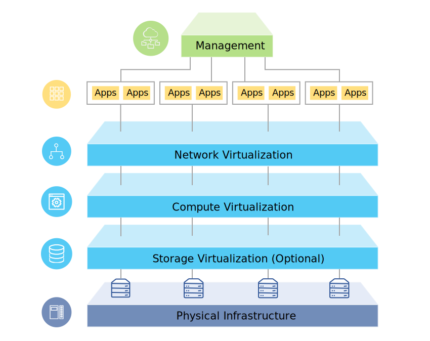

---

copyright:

  years:  2016, 2019

lastupdated: "2019-01-23"

---

# Solution overview

The {{site.data.keyword.vmwaresolutions_full}} offerings enable you to extend your existing VMware virtualized datacenter into the {{site.data.keyword.cloud_notm}} or to house cloud native applications.

The solution supports use cases such as capacity expansion into the cloud (and contraction when not needed), migration to the cloud, disaster recovery to the cloud, and backup into the cloud. With the solution, you can create a dedicated cloud environment for development, testing, training, lab, or production.

Review this information for the design of the {{site.data.keyword.vmwaresolutions_short}} offerings, including VMware Cloud Foundation and VMware vCenter Server, whose target workloads require high levels of availability and scalability.

This design serves as a baseline architecture that provides the foundation for other internal or vendor specific components to be added for specific use cases.

## VMware on IBM Cloud overview

Figure 1. Overview of VMware on {{site.data.keyword.cloud_notm}}

## Key benefits

VMware Cloud Foundation and vCenter Server on {{site.data.keyword.cloud_notm}} provide the fundamental building blocks, which includes VMware vSphere, vCenter Server, NSX, and shared storage options including vSAN. These components are needed to flexibly architect a VMware software-defined data center solution that best fits your workloads.

By applying advanced automation and single-tenant bare metal infrastructure, you can quickly deploy the entire VMware environment to the {{site.data.keyword.cloud_notm}} in hours. Then you can access and manage the IBM­-hosted environment via the native VMware clients, Command Line Interface (CLI), existing scripts, or other familiar vSphere API-compatible tools.

Post deployment, you can add ESXi host nodes and manage the backup and patching for some management components. {{site.data.keyword.cloud_notm}} professional and managed services are also available to help accelerate your journey to the cloud with offerings such as migration, implementation, and on-boarding services.

The VMware on {{site.data.keyword.cloud_notm}} offerings bring the following benefits:

* **Accelerating delivery** of IT projects for developers and lines of business by reducing the time it takes for procurement, architecture, implementation, and deployment of resources from weeks or even months, to hours.
* **Enhancing security** with dedicated bare metal servers in a hosted private cloud, including the encryption of data at rest.
* **Enabling consistent management and governance** of the deployed hybrid cloud by providing full administrative access to virtualization management, thus preserving your existing VMware tooling, scripts, and investments in training.
* **Leverage VMware expertise at global scale** with IBM Professional and Managed Services spanning 30+ {{site.data.keyword.CloudDataCents_notm}} worldwide.

### Related links

* [Design overview](/docs/services/vmwaresolutions/archiref/solution/design_overview.html)
* [Scaling capacity](/docs/services/vmwaresolutions/archiref/solution/solution_scaling.html)
* [Backing up components](/docs/services/vmwaresolutions/archiref/solution/solution_backingup.html)
