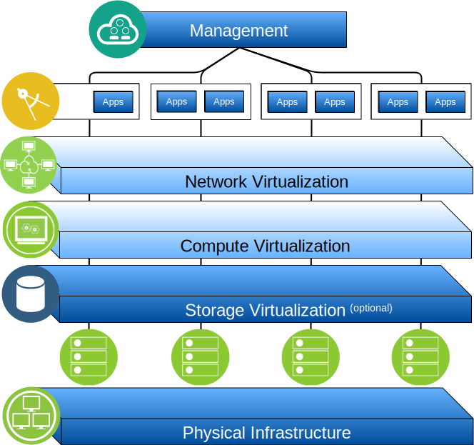

---

copyright:

  years:  2016, 2019

lastupdated: "2019-03-15"

subcollection: vmwaresolutions

---

# Overview of IBM Cloud for VMware Solutions
{: #solution_overview}

The {{site.data.keyword.vmwaresolutions_full}} offerings enable you to extend your existing VMware virtualized datacenter into the {{site.data.keyword.cloud_notm}} or to house cloud native applications.

The solution supports use cases such as capacity expansion into the cloud (and contraction when not needed), migration to the cloud, disaster recovery to the cloud, and backup into the cloud. With the solution, you can create a dedicated cloud environment for development, testing, training, lab, or production.

Review this information for the design of the {{site.data.keyword.vmwaresolutions_short}} vCenter Server, whose target workloads require high levels of availability and scalability.

This design serves as a baseline architecture that provides the foundation for other internal or vendor specific components to be added for specific use cases.

Figure 1. Overview of VMware on {{site.data.keyword.cloud_notm}}

## Key benefits of IBM Cloud for VMware Solutions
{: #solution_overview-benefits}

VMware vCenter Server on {{site.data.keyword.cloud_notm}} provides the fundamental building blocks, which include VMware vSphere, vCenter Server, NSX, and shared storage options, such as vSAN. These components are needed to flexibly design a VMware software-defined data center solution that best fits your workloads.

By applying advanced automation and single-tenant bare metal infrastructure, you can quickly deploy the entire VMware environment to the {{site.data.keyword.cloud_notm}} in hours. Then you can access and manage the IBM­-hosted environment via the native VMware clients, Command Line Interface (CLI), existing scripts, or other familiar vSphere API-compatible tools.

Post deployment, you can add to (and remove from) ESXi servers for an instance, add and remove clusters, join additional vCenter Server instances to an existing instance, and add products and services by using the {{site.data.keyword.vmwaresolutions_short}} console. It is your responsibility to monitor and manage the vCenter Server instances.

Your responsibility includes backups, patching, configuration, and monitoring of the VMware software and the underlying hypervisor hardware. {{site.data.keyword.vmwaresolutions_short}} offers automated solutions to help with the ongoing management and monitoring of the vCenter Server instance.

In addition, {{site.data.keyword.cloud_notm}} Professional Services and Managed Services are also available to help accelerate your journey to the cloud with offerings like migration, implementation, and onboarding services.

Unlike a managed service offering, vCenter Server gives you full and complete access to all components that allows for a greater flexibility than what a managed service might offer. However, there are certain constraints that apply to allow the IBM Cloud for VMware Solutions automation to function, post vCenter Server deployment.

The VMware on {{site.data.keyword.cloud_notm}} offerings bring the following benefits:

* **Accelerating delivery** of IT projects for developers and lines of business by reducing the time it takes for procurement, architecture, implementation, and deployment of resources from weeks or even months, to hours.
* **Enhancing security** with dedicated Bare Metal Servers in a hosted private cloud, including the encryption of data at rest. For vSAN storage, encryption of data at rest is optional using either vSAN or vSphere encryption. For shared file–level or block storage, service–provider–managed encryption at rest is available by default in select data centers or it is optional using vSphere encryption. You must manage the necessary encryption keys.
* **Enabling consistent management and governance** of the deployed hybrid cloud by providing full administrative access to virtualization management, thus preserving your existing VMware tools, scripts, and investments in training.
* **Using VMware expertise at global scale** with IBM Professional and Managed Services spanning 30+ {{site.data.keyword.CloudDataCents_notm}} worldwide.

## Related links
{: #solution_overview-related}

* [Design overview](/docs/services/vmwaresolutions/archiref/solution?topic=vmware-solutions-design_overview)
* [Scaling capacity](/docs/services/vmwaresolutions/archiref/solution?topic=vmware-solutions-solution_scaling)
* [Backing up components](/docs/services/vmwaresolutions/archiref/solution?topic=vmware-solutions-solution_backingup)
