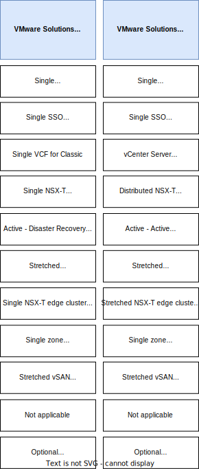

---

copyright:

  years:  2022, 2025

lastupdated: "2025-10-24"

subcollection: vmwaresolutions

---

{{site.data.keyword.attribute-definition-list}}

# Target platforms in {{site.data.keyword.cloud_notm}}
{: #v2t-targets}

{{site.data.content.vms-deprecated-note}}

{{site.data.keyword.vmwaresolutions_full}} has a number of offerings, deployment patterns, and options that can be used to create your target VMware NSX-T™ environment:

* Automated offerings - available from the [VMware Solutions](/vmware){: external} console.
* Regulated Workloads - available from the [VMware Solutions](/vmware){: external} console, the **Regulated Workloads** card. They are suitable for clients that require a prescriptive reference architecture that matches the {{site.data.keyword.framework-fs_full}}.
* Automated offerings with manual customization tasks - based on the offerings available from the [VMware Solutions](/vmware){: external} console. They require a number of post-deployment manual tasks to achieve the architectural pattern needed.

Based on the assessment of your source NSX-V environment, you can identify the requirements for your target platform. After the analysis, do the following steps:

1. Select the target platform that supports all your requirements from the information about the features that are shown in the following diagrams.
2. Review [Getting started with VMware Solutions](/docs/vmwaresolutions?topic=vmwaresolutions-getting-started) to learn more about the offerings, deployment patterns, and services.

A summary and key capabilities of the target VMware Solutions offerings in {{site.data.keyword.cloud_notm}} is provided with architectural guidance to ease up the selection process.

## Automated offerings
{: #v2t-targets-automated}

The offerings are described in detail in the following documents:

* [{{site.data.keyword.vcf-auto-short}} as a single site deployment](/docs/vmwaresolutions?topic=vmwaresolutions-vc_vcenterserveroverview) - This offering deploys a VMware® based platform in a single {{site.data.keyword.cloud_notm}} data center automatically.
* [{{site.data.keyword.vcf-auto-short}} as a multisite deployment](/docs/vmwaresolutions?topic=vmwaresolutions-vc_multisite) - This offering deploys a secondary VMware {{site.data.keyword.vcf-auto-short}}® instance in a single {{site.data.keyword.cloud_notm}} data center automatically. It is linked to a primary [{{site.data.keyword.vcf-auto-short}} single site](/docs/vmwaresolutions?topic=vmwaresolutions-vc_vcenterserveroverview) previously deployed. Multiple secondary instances can be created.
* {{site.data.keyword.vcf-auto-short}} dual-site - This deployment pattern is based on two [{{site.data.keyword.vcf-auto-short}} single site](/docs/vmwaresolutions?topic=vmwaresolutions-vc_vcenterserveroverview) deployments but not in a primary-secondary relationship as in the [{{site.data.keyword.vcf-auto-short}} multisite](/docs/vmwaresolutions?topic=vmwaresolutions-vc_multisite) pattern. This is typically used in a production-disaster recovery pattern by using Zerto or Veeam® replication between the two sites.

In the {{site.data.keyword.vcf-auto-short}} deployments, each site, and each instance has its own NSX-T Manager cluster. In the multisite deployments, the vCenter, NSX-T managers, and domain controller components are deployed per site. Each instance on each site has [a default NSX-T overlay topology](/docs/vmwaresolutions?topic=vmwaresolutions-v2t-example-overlays#v2t-example-overlays-single-site-st) and no networking integrations nor dependencies exist between the sites.
{: note}

The following diagram can be used to compare and contrast the features that are offered by these offerings:

{: caption="Automated offerings" caption-side="bottom"}

In the previous diagram, the following terms require some additional comments:

* Single SSO and root domain - A single instance of Active Directory™ and Domain Name Services is automatically deployed with replication if more than one domain controller is selected for automatic deployment. For more information, see [Multisite deployment components](/docs/vmwaresolutions?topic=vmwaresolutions-vc_multisite#vc_multisite-deployment-components).
* Two SSO and root domains - A single instance of Active Directory and Domain Name Services is deployed, one for each instance. No replication occurs between the two sites.
* Single vCenter - The automation deploys a single vCenter appliance.
* Dual vCenters with ELM - Enhanced Link Mode (ELM) offers a single window of glass across multiple {{site.data.keyword.vcf-auto-short}} instances that are in the same vSphere Single-Sing-On (SSO) domain. This allows the management of multiple sites from one vCenter. For more information, see [vCenter Enhanced Linked Mode](https://techdocs.broadcom.com/us/en/vmware-cis/vsphere/vsphere/7-0/vcenter-server-installation-and-setup-7-0/introduction-to-vsphere-installation-and-setup/creating-vcenter-server-linked-mode-groups.html){: external}. The automation deploys and configures the vCenter appliances.
* Dual vCenters - Each site has a vCenter deployed automatically. However, they are not linked.
* Single NSX-T Manager cluster - The automation deploys three NSX-T Manager appliances in a cluster with a Virtual IP address.
* Dual NSX-T Manager clusters - Each site has its own NSX-T Manager cluster that is deployed automatically, which is independent of each other. In NSX-T, it doesn't exist a concept equivalent to Cross-vCenter NSX-V.
* Active NSX-T data plane - All site ingress and egress traffic traverses through the single edge cluster that is deployed in that site automatically.
* No stretched L2 capability - The stretching of layer 2 NSX-T overlay segments across sites cannot be done.
* Single edge gateway - Each virtual data center uses an active-standby edge gateway for external access to the public network or the services network. This gateway includes features such as NAT, IPsec VPN, and load balancing.
* Single edge cluster Tier-0 gateway for workloads - The automation deploys a single NSX-T edge cluster, consisting of a pair of edge appliances, hosting an active/standby Tier-0 gateway for use by the workload VMs. These VMs provide connection between the overlay and underlay networks. For more information, see [Single-site - single-tenant](/docs/vmwaresolutions?topic=vmwaresolutions-v2t-example-overlays#v2t-example-overlays-single-site-st) and [Single-site - multitenant](/docs/vmwaresolutions?topic=vmwaresolutions-v2t-example-overlays#v2t-example-overlays-single-site-mt ).
* Single-zone NFS storage - vSphere data stores that use {{site.data.keyword.filestorage_full_notm}} of different IOPS ratings are available and deployed automatically. {{site.data.keyword.filestorage_full_notm}} can be accessed only from hosts in the same site as the vSphere hosts. For more information, see [Shared File-level storage across hosts](/docs/vmwaresolutions?topic=vmwaresolutions-design_physicalinfrastructure#design_physicalinfrastructure-shared-storage).
* Single-zone vSAN™ - The {{site.data.keyword.vcf-auto-short}} instance can be ordered with VMware vSAN and it uses disks in the vSphere hosts as a consolidated data store.

The vCenter dual site topology is a candidate for [NSX Federation](https://techdocs.broadcom.com/us/en/vmware-cis/nsx/nsxt-dc/3-2/administration-guide/managing-nsx-t-in-multiple-locations/nsx-t-federation.html){: external}. NSX-T Federation is a relatively new NSX-T feature and architecture. Before you plan to use it, you must know what [features are supported](https://techdocs.broadcom.com/us/en/vmware-cis/nsx/nsxt-dc/3-2/administration-guide/distributed-load-balancer/supported-features.html){: external}, and how NSX Federation works for your use case. NSX-T Federation is not validated by {{site.data.keyword.cloud_notm}} fully, but it is a solution and architecture that is supported by VMware.
{: note}

## Regulated Workloads offering
{: #v2t-targets-automated-rw}

The Regulated Workloads offering is suitable for clients that require a prescriptive reference architecture that matches the {{site.data.keyword.framework-fs_notm}}. For more information, see [VMware Regulated Workloads as a single site deployment](/docs/vmwaresolutions?topic=vmwaresolutions-vrw-overview).

The following diagram can be used to compare and contrast the features that are offered by these offerings.

{: caption="Regulated workload offerings" caption-side="bottom"}

In the previous diagram, the following terms require some additional comments:

* Single SSO and root domain - A single instance of Active Directory and Domain Name Services is deployed with replication between the dual domain controllers automatically.
* Single vCenter - The automation deploys a single vCenter appliance.
* vCenter HA - vCenter high availability (HA) protects vCenter against failures by using an active-passive architecture that uses a three-node cluster with active, passive, and witness nodes. For more information about the VMware architecture, see [vCenter high availability](https://techdocs.broadcom.com/us/en/vmware-cis/vsphere/vsphere/7-0/vsphere-availability/vcenter-server-high-availability.html){: external}.
* Single NSX-T Manager cluster - The automation deploys three NSX-T Manager appliances in a cluster with a Virtual IP address.
* Distributed NSX-T Manager cluster - In the regulated workloads multizone architecture, an NSX-T Manager appliance is deployed automatically into each of the three sites along with an {{site.data.keyword.cloud_notm}} private load balancer.
* Active NSX-T data plane - All site ingress and egress traverses through the single edge cluster that is deployed in that site automatically.
* Active-Active NSX-T data plane - The architecture supports a manually deployed active-active data plane, which enables a dynamic failover due to a failure in one of the sites.
* No stretched L2 capability - The stretching of layer 2 NSX-T overlay segments across sites is not possible.
* Stretched L2 capable - The stretching of layer 2 NSX-T overlay segments across sites is possible by using manual configuration.
* Single edge cluster Tier-0 gateway for workloads - The automation deploys a single NSX-T edge cluster, consisting of a pair of edge appliances, hosting an active standby Tier-0 gateway for use by the workload VMs. These VMs provide connection between the overlay and underlay networks.
* Stretched edge cluster Tier-0 gateways for workloads per site - To enable an active-active data plane, a stretched edge NSX-T cluster is created manually by deploying an edge appliance in each site. This action enables access to the stretched L2 NSX-T overlay segments, which host the workload VMs if a failure occurs in one of the sites.
* Single-zone vSAN - Regulated workloads automatically deploys management and resource clusters with stretched vSAN storage. For more information, see [Storage](/docs/vmwaresolutions?topic=vmwaresolutions-vrw-storage).
* Mandated-regulated workload services - Regulated workloads must include add-on services, such as Veeam, Caveonix RiskForesight™, Entrust CloudControl™, Juniper® vSRX, and VMware Aria® Operations™ and VMware Aria Operations™ for Logs. Service prerequisites are also required, such as Hyper Protect Crypto Services, KMIP™ for VMware and Direct Link Dedicated.

## Automated offerings with manual customization tasks
{: #v2t-targets-automated-manual}

These automated offerings use a [{{site.data.keyword.vcf-auto-short}} single site](/docs/vmwaresolutions?topic=vmwaresolutions-vc_vcenterserveroverview) with the [Adding clusters to {{site.data.keyword.vcf-auto-short}} instances](/docs/vmwaresolutions?topic=vmwaresolutions-vc_addingclusters). Also, they use a number of manual tasks to create a target platform suitable for the following NSX-T patterns:

* NSX-T multisite centralized - Management plane components centralized in one data center.
* NSX-T multisite distributed - Management plane components distributed across multiple data centers.

The automated offerings with manual tasks patterns are not validated by {{site.data.keyword.cloud_notm}}. After the initial deployment, the Day 2 automation can be used to deploy vSphere clusters in different data centers by following the {{site.data.keyword.cloud_notm}} documentation. A number of manual tasks can be initiated to create the required configuration. These VMware related tasks, such as redeploying NSX Managers are documented by VMware in their user guides, but are not specific to {{site.data.keyword.cloud_notm}}. Therefore, extra considerations might apply when following these guides.
{: note}

The following diagram can be used to compare and contrast the features that are offered by these offerings.

{: caption="Automated offerings with manual customization tasks" caption-side="bottom"}

In the previous diagram, the following terms require some additional comments:

* Single SSO and root domain - A single instance of Active Directory and Domain Name Services is deployed automatically. Additional Microsoft® domain controllers must be deployed manually at the other site and replication must be configured to enable this pattern.
* Single vCenter - vCenter is deployed automatically. A manual deployment of a backup server must be done to enable backups of this server to be made available at the other site to enable recovery. During failure of vCenter, some management functions are not available. However, workload VMs are still accessible.
* vCenter HA - vCenter HA protects vCenter against failures by using an active-passive architecture that uses a three-node cluster with active, passive, and witness nodes. For more information about the VMware architecture pattern that must be manually deployed, see [vCenter high availability](https://techdocs.broadcom.com/us/en/vmware-cis/vsphere/vsphere/7-0/vsphere-availability/vcenter-server-high-availability.html){: external}.
* Single NSX-T Manager cluster - The automation deploys three NSX-T Manager appliances in a cluster with a Virtual IP address.
* Distributed NSX-T Manager cluster - The initial single NSX-T Manager cluster that is deployed automatically must be modified.
* Active-DR NSX-T data plane - This pattern is suitable for where the network latency between data centers is more than 10 ms but less than 150 ms, such as across regions. For more information, see [NSX-T Data Center Multisite](https://techdocs.broadcom.com/us/en/vmware-cis/nsx/nsxt-dc/3-2/administration-guide/managing-nsx-t-in-multiple-locations/nsx-t-multisite.html){: external} and also [NSX-T Multi Location Design Guide](https://community.broadcom.com/blogs/dimitri-desmidt/2024/05/20/nsx-t-multi-location-design-guide){: external}.
* Active-Active NSX-T data plane - This pattern is suitable for where the network latency between data centers is less than 10 ms, such as between availability zones in the same region. For more information, see [NSX-T Data Center Multisite](https://techdocs.broadcom.com/us/en/vmware-cis/nsx/nsxt-dc/3-2/administration-guide/managing-nsx-t-in-multiple-locations/nsx-t-multisite.html){: external} and also [NSX-T Multi Location Design Guide](https://community.broadcom.com/blogs/dimitri-desmidt/2024/05/20/nsx-t-multi-location-design-guide){: external}.
* Stretched L2 capable - It is possible to do the stretching of layer 2 NSX-T overlay segments across virtual data centers.
* Single edge cluster Tier-0 gateway for workloads - The automation deploys a single NSX-T edge cluster, consisting of a pair of edge appliances, hosting an active standby Tier-0 gateway for use by the workload VMs. These VMs provide connection between the overlay and underlay networks. For more information, see [Single-site - single-tenant](/docs/vmwaresolutions?topic=vmwaresolutions-v2t-example-overlays#v2t-example-overlays-single-site-st) and [Single-site - multitenant](/docs/vmwaresolutions?topic=vmwaresolutions-v2t-example-overlays#v2t-example-overlays-single-site-mt).
* Stretched edge cluster Tier-0 gateways for workloads per site - To enable an active-active data plane, a stretched edge NSX-T cluster is created manually by deploying an edge appliance in each site. This action enables access to the stretched L2 NSX-T overlay segments, which host the workload VMs if a failure occurs in one of the sites. For more information, see [Multisite - single-tenant](/docs/vmwaresolutions?topic=vmwaresolutions-v2t-example-overlays#v2t-example-overlays-multi-site-st) and [Multisite - multitenant](/docs/vmwaresolutions?topic=vmwaresolutions-v2t-example-overlays#v2t-example-overlays-multi-site-mt).
* Single-zone NFS storage - vSphere data stores that use {{site.data.keyword.filestorage_full_notm}} of different IOPS ratings are available. {{site.data.keyword.filestorage_full_notm}} can be accessed only from hosts in the same site as the vSphere hosts. For more information, see [Shared File-level storage across hosts](/docs/vmwaresolutions?topic=vmwaresolutions-design_physicalinfrastructure#design_physicalinfrastructure-shared-storage).
* Stretch vSAN storage capable - By using the automation, stretched vSAN clusters cannot be deployed. If stretched vSAN is required, vSphere hosts must be deployed manually and a stretched vSAN cluster must be created.
* Optional add-on services - For more information, see [Available services for {{site.data.keyword.vcf-auto-short}} instances](/docs/vmwaresolutions?topic=vmwaresolutions-vc_addingservices#vc_addingservices-available-services).

## Related links
{: #v2t-targets-links}

* [{{site.data.keyword.vcf-auto-short}} single site](/docs/vmwaresolutions?topic=vmwaresolutions-vc_vcenterserveroverview)
* [{{site.data.keyword.vcf-auto-short}} multisite](/docs/vmwaresolutions?topic=vmwaresolutions-vc_multisite)
* [Regulated workloads - single site](/docs/vmwaresolutions?topic=vmwaresolutions-vrw-overview)
