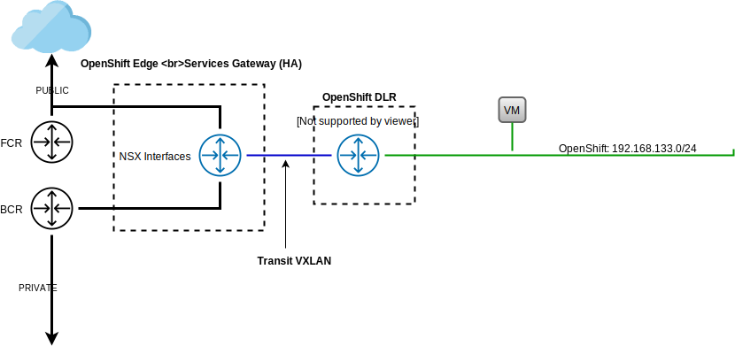

---

copyright:

  years:  2019

lastupdated: "2019-10-18"

subcollection: vmware-solutions

---

{:external: target="_blank" .external}
{:tip: .tip}
{:note: .note}
{:important: .important}

# IBM Cloud for VMware Solutions SDDC architecture
{: #vcs-openshift-arch}

## Common services components
{: #vcs-openshift-arch-common-services}

Common services provide the services that are used by other services in the cloud management platform. Common services include identity and access services, domain name services, and NTP services.

{: caption="Figure 1. Common services" caption-side="bottom"}

### Identity and access services
{: #vcs-openshift-arch-identity}

As part of the VMware vCenter Server automation, a Microsoft Active Directory (AD) is employed for Identity Management. A single AD virtual server instance (VSI) is deployed. The vCenter is configured to use AD authentication and you can configure Red Hat OpenShift for LDAP authentication.

### Domain Name Services
{: #vcs-openshift-arch-dns}

The vCenter Server deployment uses the deployed AD VSIs as DNS servers for the instance. All deployed components, such as, vCenter, PSC, NSX, and ESXi hosts, are configured to point to AD as their default DNS.

### NTP services
{: #vcs-openshift-arch-ntp}

The vCenter Server deployment uses the {{site.data.keyword.cloud}} infrastructure NTP servers. All deployed components are configured to use these NTP servers. Having all components within the design that uses the same NTP servers is critical for certificates and AD authentication to function correctly.

## Networking
{: #vcs-openshift-arch-networking}

### NSX-V networking
{: #vcs-openshift-arch-nsx-v}

NSX-V is designed so that a single NSX-V manager platform is tied to a single vCenter Server instance. It provides networking services to applications that run within a vSphere environment.

The NSX-V networking included in the vCenter Server deployment is used to deploy Red Hat OpenShift into a VXLAN overlay network. The deployment uses NSX functions to provide load balancing, Network Address Translation, and DHCP services.

Red Hat OpenShift is deployed with the default Calico networking stack for Kubernetes, which provides network isolation within your cluster.

{: caption="Figure 2. OpenShift with NSX networking" caption-side="bottom"}

For more information, see [vCenter Server networking introduction](/docs/services/vmwaresolutions/archiref/vcsnsxt?topic=vmware-solutions-vcsnsxt-intro).

**Next topic:** [IBM Cloud networking and infrastructure](/docs/services/vmwaresolutions?topic=vmware-solutions-vcs-openshift-sddc-infra)

## Related links
{: #vcs-openshift-arch-related}

* [VMware vCenter Server and Red Hat OpenShift architecture overview](/docs/services/vmwaresolutions?topic=vmware-solutions-vcs-openshift-intro)
* [System context for vCenter Server and Red Hat OpenShift architecture](/docs/services/vmwaresolutions?topic=vmware-solutions-vcs-openshift-syscontext)
* [Red Hat OpenShift architecture](/docs/services/vmwaresolutions?topic=vmware-solutions-vcs-openshift-redhat-arch)
* [Storage options on {{site.data.keyword.cloud_notm}} and Red Hat OpenShift](/docs/services/vmwaresolutions?topic=vmware-solutions-vcs-openshift-storage)
