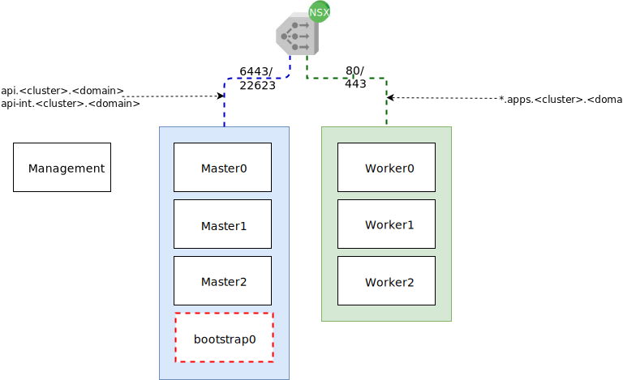

---

copyright:

  years:  2019, 2021

lastupdated: "2021-04-11"

subcollection: vmwaresolutions

---

{:external: target="_blank" .external}
{:tip: .tip}
{:note: .note}
{:important: .important}

# Red Hat OpenShift architecture
{: #vcs-openshift-redhat-arch}

The {{site.data.keyword.vmwaresolutions_full}} offerings provide automation to deploy VMware technology components in
{{site.data.keyword.cloud_notm}} data centers across the globe. The architecture consists of a single cloud region. It supports the ability to extend into more cloud regions that are located in another geography or into another {{site.data.keyword.cloud_notm}} pod within the same data center.

{: caption="Figure 1. OpenShift architecture" caption-side="bottom"}

## Bastion hosts
{: #vcs-openshift-redhat-arch-bastion-host}

The Management host is a Red Hat Enterprise Linux 7.6 virtual machine (VM). This VM hosts services to install and configure the OpenShift instance and provides utilities to manage the Red Hat OpenShift environment. This host is normally deployed in the VXLAN Subnet.

## Bootstrap hosts
{: #vcs-openshift-redhat-arch-bootstrap-host}

The bootstrap node is a Red Hat Enterprise Linux CoreOS (RHCOS), a new container-oriented operating system designed for running containers. The node is a temporary node that is used to start the installation.

## Control Plane hosts
{: #vcs-openshift-redhat-arch-control-plane-host}

The control plane hosts are Red Hat Enterprise Linux CoreOS (RHCOS), a new container-oriented operating system designed for running containers. The control plane nodes are known as the control plane, where Kubernetes services such as API server, etcd, and controller manager are defined. An NSX load balancer is configured to spread load across these VMs for ports 6443 and 22623, exposing the `api` and `api-int` functions.

## Worker hosts
{: #vcs-openshift-redhat-arch-worker-host}

The worker hosts are Red Hat Enterprise Linux CoreOS (RHCOS), a new container-oriented operating system designed for running containers. The worker nodes are known as the data-plane, where the actual Kubernetes workloads are deployed. An NSX load balancer is configured to spread load across these VMs for ports 80 and 443, exposing the wildcard DNS and *.apps.

## Common services
{: #vcs-openshift-redhat-arch-common-svc}

The Red Hat OpenShift deployment uses the following components of the {{site.data.keyword.vmwaresolutions_short}} SDDC architecture to help with the execution and installation:

- Time services
- Domain name resolution
- NSX load balancers
- NSX DHCP services
- NSX software defined networking

For more information, see [IBM Cloud for VMware Solutions SDDC architecture](/docs/vmwaresolutions?topic=vmwaresolutions-vcs-openshift-arch).

**Next topic:** [VMware Solutions SDDC architecture](/docs/vmwaresolutions?topic=vmwaresolutions-vcs-openshift-arch)

## Related links
{: #vcs-openshift-redhat-arch-related}

* [VMware vCenter Server and Red Hat OpenShift architecture overview](/docs/vmwaresolutions?topic=vmwaresolutions-vcs-openshift-intro)
* [System context for vCenter Server and Red Hat OpenShift architecture](/docs/vmwaresolutions?topic=vmwaresolutions-vcs-openshift-syscontext)
* [{{site.data.keyword.cloud_notm}} networking and infrastructure](/docs/vmwaresolutions?topic=vmwaresolutions-vcs-openshift-sddc-infra)
* [Storage options on {{site.data.keyword.cloud_notm}} and Red Hat OpenShift](/docs/vmwaresolutions?topic=vmwaresolutions-vcs-openshift-storage)
