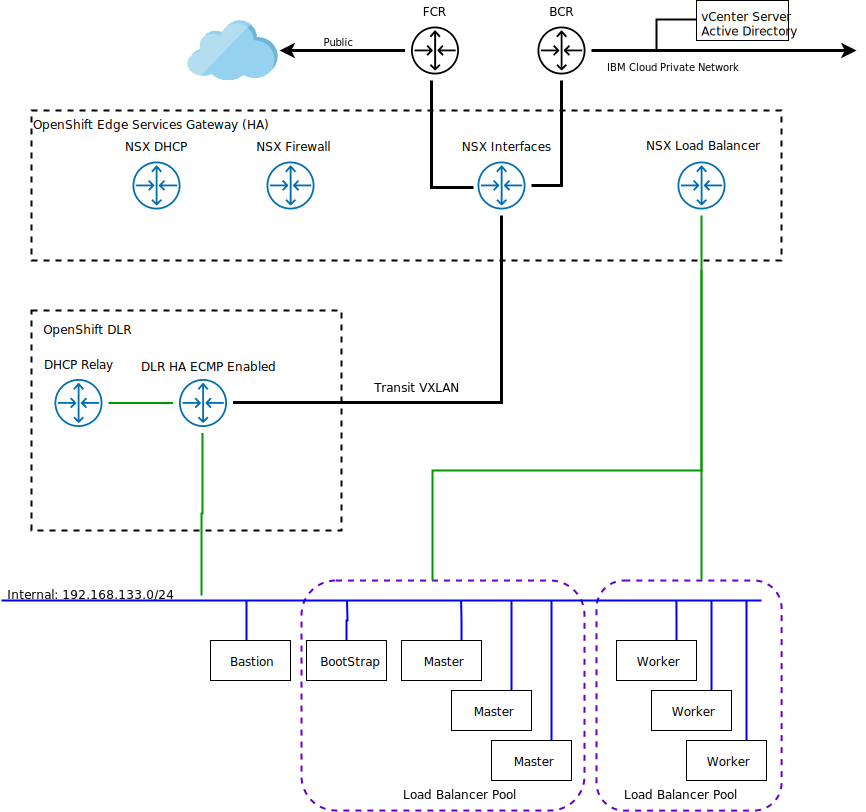

---

copyright:

  years:  2019

lastupdated: "2019-10-18"

subcollection: vmware-solutions

---

{:external: target="_blank" .external}
{:tip: .tip}
{:note: .note}
{:important: .important}

# IBM Cloud networking and infrastructure
{: #vcs-openshift-sddc-infra}

## Physical structure
{: #vcs-openshift-sddc-infra-phys-struct}

The physical infrastructure required to deploy an
Red Hat OpenShift production instance onto a VMware
vCenter Server cluster requires the
following minimum specification.

| Item | NFS deployment | vSAN deployment
--|----|----
Number of servers | 3 | 4
CPU | 28 Cores 2.2 GHz | 28 Cores 2.2 GHz
Memory | 384 GB | 384 GB
Storage|2000 GB 2 IOPS/GB Management, 2000 GB 4IOPS/GB Workload, 4000 GB 4 IOPS/GB | Min 960-GB SSD x2
{: caption="Table 1. vCenter Server specification for Red Hat OpenShift" caption-side="top"}

In addition to the Red Hat OpenShift hardware requirements, you must create persistent volumes in the Red Hat OpenShift environment to store images from the container register or customer workloads.

## Virtual structure
{: #vcs-openshift-sddc-infra-virtual-struct}

{: caption="Figure 1. Physical structure" caption-side="bottom"}

Within the vCenter Server instance, the Red Hat OpenShift instance is deployed with a dedicated NSX Edge Services Gateway (ESG) and Distributed Logical Router (DLR). The Red Hat OpenShift installation is loaded into the VXLAN subnet that is defined in the previous components.

The ESG is configured with a source NAT rule (SNAT) to allow outbound traffic, which enables internet connectivity to download the Red Hat OpenShift prerequisites and to connect to GitHub and Red Hat. Alternatively, you can use a web-proxy for internet connectivity. The ESG is also configured to provide access to DNS and NTP services within the {{site.data.keyword.cloud}} environment.

The ESG is also configured to use the load balancer capability, thus reducing the need for HAProxy nodes. The load balancers are configured for the apps wildcard DNS URL and the API / API-INT DNS Records. The apps DNS record load balancers to the worker nodes provisioned, while the api and api-int DNS records are load balanced against the control-plane nodes.

OpenShift 4.1 installation on the VMware platform requires a capability to download their ignition files to install and configure the RHCOS bootstrap / control-plane and worker nodes. The ESG is configured to provide DHCP and DHCP relay services for the OpenShift logical switch / VXLAN defined.

## NSX Edge specifications
{: #vcs-openshift-sddc-infra-nsx-edge-spec}

The first component that is configured within the vCenter Server with OpenShift is a pair of NSX Edge virtual machines. The NSX Edge virtual machines are
configured as an active-passive pair of X-Large NSX Edge devices.

The Quad-Large NSX Edge was chosen and as part of the configuration process, the NSX Edge is connected to the IBM Cloud public and private VLAN.

| Component | Configuration |
|:-----------:|:---------------:|
| CPU       | 6 vCPU        |
| RAM       | 8 GB          |
| Disk      | 4.5 GB VMDK resident on shared storage with 4 GB swap |
{: caption="Table 2. NSX Edge specifications" caption-side="top"}

Since the NSX Edges are configured as active/passive in either the internal or dedicated deployment, vSphere Distributed Resource Scheduler (DRS) anti-affinity rules must be created by the user to ensure that NSX Edges do not run on the same host as their respective peer appliance.

| Field     | Value         |
|:-----------:|:---------------:|
| Name      | NSX Edge OpenShift |
| Type      | Separate virtual machines |
| Members   | openshift-edge-0 |
|           | openshift-edge-1 |
{: caption="Table 3. vSphere Distributed Resource Scheduler rules" caption-side="top"}

## NSX Load Balancer specifications
{: #vcs-openshift-sddc-infra-nsx-load-spec}

Within the OpenShift environment, two load balancers for accessing the master nodes and the worker nodes are required. The NSX Edge is enabled to use load balancing and is configured with application profiles that use a certificate for inbound connection from the source. The NSX Edge is also configured with load-balancing pools to point to the OpenShift masters and OpenShift Workers. Additionally, a virtual server is created with a virtual IP address (vIP) on the private interface with rules that connect the pools with vIP.

| Description | Port number | Algorithm  | Monitor | Members | Protocol | IP subnet |
|:---|:----|:------|:---| :--- | :--- |:---|
| Application Load Balancer | 80 | ROUND-ROBIN | default_tcp_monitor | Worker Nodes | TCP | IBM Cloud 10.x |
| Application Load Balancer | 443 | ROUND-ROBIN | default_tcp_monitor | Worker Nodes | TCP | IBM Cloud 10.x |
| API & API-INT Load Balancer | 6443 | ROUND-ROBIN | default_tcp_monitor | Bootstrap and Master Nodes | TCP | IBM Cloud 10.x |
| API & API-INT Load Balancer | 22623 | ROUND-ROBIN | default_tcp_monitor | Bootstrap and Master Nodes | TCP | IBM Cloud 10.x |
{: caption="Table 4. NSX Load Balancer specifications" caption-side="top"}

## Red Hat OpenShift specifications
{: #vcs-openshift-sddc-infra-redhat-spec}

| Host description | vCPU  | Memory GB | Disk GB | OS |
|:-----------------|:-----------------|:-----------------|:-----------------| :---|
| Management0 | 2 | 8 | 50 | Red Hat Enterprise Linux 7.6 |
{: caption="Table 5. Management node specifications" caption-side="top"}

| Host description | vCPU  | Memory GB | Disk GB | OS | Host name |
|:-----------------|:-----------------|:-----------------|:-----------------| :---|
| Control-plane0 | 4 | 8 | 60 | Red Hat Enterprise Linux CoreOS |
| Control-plane1 | 4 | 8 | 60 | Red Hat Enterprise Linux CoreOS |
| Control-plane2 | 4 | 8 | 60 | Red Hat Enterprise Linux CoreOS |
{: caption="Table 6. Control Plane node specifications" caption-side="top"}

| Host description | vCPU  | Memory GB | Disk GB | OS | Host name |
|:-----------------|:-----------------|:-----------------|:-----------------| :---|
| Worker0 | 16 | 32 | 200 | Red Hat Enterprise Linux CoreOS |
| Worker1 | 16 | 32 | 200 | Red Hat Enterprise Linux CoreOS |
| Worker2 | 16 | 32 | 200 | Red Hat Enterprise Linux CoreOS |
{: caption="Table 7. Worker node specifications" caption-side="top"}

**Next topic:** [Storage options on IBM Cloud and Red Hat OpenShift](/docs/services/vmwaresolutions?topic=vmware-solutions-vcs-openshift-storage)

## Related links
{: #vcs-openshift-sddc-infra-related}

* [VMware vCenter Server and Red Hat OpenShift architecture overview](/docs/services/vmwaresolutions?topic=vmware-solutions-vcs-openshift-intro)
* [System context for vCenter Server and Red Hat OpenShift architecture](/docs/services/vmwaresolutions?topic=vmware-solutions-vcs-openshift-syscontext)
* [Red Hat OpenShift architecture](/docs/services/vmwaresolutions?topic=vmware-solutions-vcs-openshift-redhat-arch)
* [{{site.data.keyword.vmwaresolutions_short}} SDDC architecture](/docs/services/vmwaresolutions?topic=vmware-solutions-vcs-openshift-arch)
