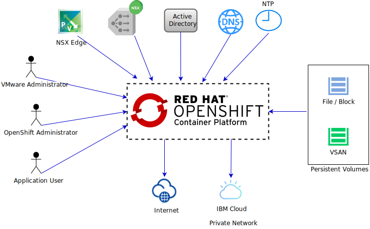

---

copyright:

  years:  2019, 2020

lastupdated: "2020-07-06"

subcollection: vmwaresolutions

---

{:external: target="_blank" .external}
{:tip: .tip}
{:note: .note}
{:important: .important}

# System context for vCenter Server and Red Hat OpenShift architecture
{: #vcs-openshift-syscontext}

The following diagram shows the system context for this reference architecture. A system context diagram is a high-level diagram
that provides an initial view of the system. It defines the key elements of a system, the boundary of the system, and the entities that interact with it, along with the interaction.

{: caption="Figure 1. {{site.data.keyword.vmwaresolutions_full}} and OpenShift system context" caption-side="bottom"}

## Actors
{: #vcs-openshift-syscontext-actors}

The system context diagram identifies the following actors:

* **VMware administrator** - The administrator is responsible for the ongoing deployment and maintenance of the VMware environment.
* **OpenShift administrator** - The administrator is responsible for the ongoing deployment and maintenance of the OpenShift environment.
* **Application user** - The users of the applications that are deployed in the VMware and OpenShift environment.

## Systems
{: #vcs-openshift-syscontext-systems}

The system context diagram identifies the following systems:

* **NSX Edge** - Virtual appliances that manage north-south traffic into and out of the vCenter Server instance.
* **NSX load balancer** - Used by OpenShift for access to control plane and worker hosts. Load balancing is a function within the NSX Edge, providing an L4/7 application load balancer.  
* **{{site.data.keyword.vmwaresolutions_short}} Active Directory** - Used for vCenter and NSX Manager authentication and can be extended to be used by OpenShift.
* **{{site.data.keyword.vmwaresolutions_short}} DNS** - Used by the VMware and OpenShift environment to provide FQDN registration and resolution. DNS is configured to forward lookups to shared IBM DNS servers, allowing the resolution of public endpoints.
* **{{site.data.keyword.cloud_notm}} shared NTP** - Used to maintain time synchronization within the environment.
* Persistent volumes:
  * **VSAN** - vSphere provider and storage class configured in Red Hat OpenShift environment that allows ReadWriteOnce persistent volumes to be stored as virtual machine disks. The {{site.data.keyword.cloud_notm}} OpenShift environment allows ReadWriteMany persistent volumes.
  * **Block** - {{site.data.keyword.cloud_notm}} provider and storage class configured in Red Hat OpenShift environment that allows ReadWriteOnce persistent volumes.
* **Public internet** - Provide access to the VMware and OpenShift environment to communicate with the public internet.
* **{{site.data.keyword.cloud_notm}} private network** - Provide access to the VMware and OpenShift environment to communicate with the {{site.data.keyword.cloud_notm}} private network and services.

**Next topic:** [Red Hat OpenShift architecture](/docs/vmwaresolutions?topic=vmwaresolutions-vcs-openshift-redhat-arch)

## Related links
{: #vcs-openshift-syscontext-related}

* [VMware vCenter Server and Red Hat OpenShift architecture overview](/docs/vmwaresolutions?topic=vmwaresolutions-vcs-openshift-intro)
* [{{site.data.keyword.vmwaresolutions_short}} SDDC architecture](/docs/vmwaresolutions?topic=vmwaresolutions-vcs-openshift-arch)
* [{{site.data.keyword.cloud_notm}} networking and infrastructure](/docs/vmwaresolutions?topic=vmwaresolutions-vcs-openshift-sddc-infra)
* [Storage options on {{site.data.keyword.cloud_notm}} and Red Hat OpenShift](/docs/vmwaresolutions?topic=vmwaresolutions-vcs-openshift-storage)
