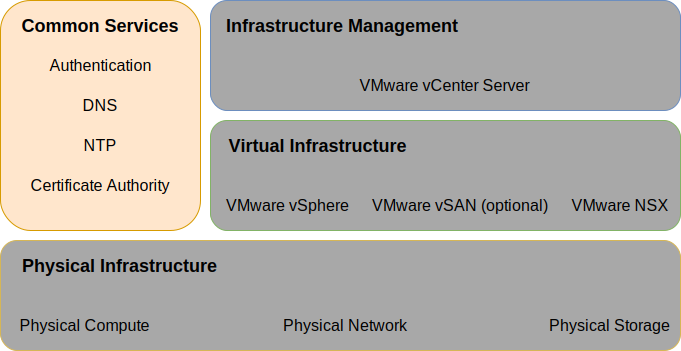
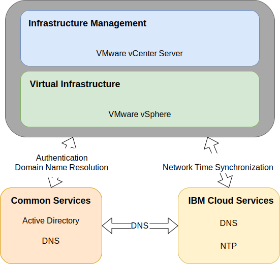

---

copyright:

  years:  2016, 2019

lastupdated: "2019-02-05"

---

# Common services

Common services provide the services that are used by other services in the cloud management platform. This includes identity and access services, domain name services, NTP services, SMTP services, and certificate authority Services.

Figure 1. Common services

## Identity and Access services

In this design, Microsoft Active Directory (AD) is employed for Identity  Management. A single Microsoft Active Directory virtual server instance (VSI) is deployed as part of the vCenter Server automation. vCenter is configured to use AD authentication.

### Microsoft Active Directory

A single AD VSI is deployed onto the {{site.data.keyword.cloud}} infrastructure. AD serves to authenticate users to the
management of the VMware instance only and is not meant to house users of the workloads deployed within VMware. The forest root of the AD equals the Domain Name System (DNS) name that is specified by the user. This domain name is specified only for the first vCenter Server instance if multiple instances are linked. For linked instances, each instance contains an AD server that is in the forest root replica ring. DNS zone files are also replicated.

#### vSphere Single Sign On domain

The vSphere Single Sign On (SSO) domain is used as the initial authentication mechanism both for a single or for multiple VMware instances that are linked. It also serves to connect a VMware instance or instances to AD. The following SSO
configuration is employed:
- The SSO domain of vsphere.local is always used.
- For VMware instances that are tied to an existing instance, the integrated PSC is joined to the existing instance’s SSO domain.
- The SSO site name equals the vCenter Server instance name.

## Domain Name Services

Domain Names Services (DNS) within this design are for the cloud management and infrastructure components only.

### Primary vCenter Server instance

The vCenter Server deployment uses the deployed AD VSIs as DNS servers for the instance. All deployed
components (vCenter, PSC, NSX, ESXi hosts) are configured to point to the AD as their default DNS. You can customize the DNS zone
configuration if it does not interfere with the configuration of the deployed components.
- This design integrates DNS services on the AD VSIs in the following configuration:
- The domain structure is specified by the user. The domain name can be any number of levels up to the maximum that all vCenter Server components handle, ensuring that the lowest level is the subdomain for the instance.
    - The DNS domain name that you provide is used as the vCenter Server deployed AD root forest domain name. For example, if the DNS domain name is cloud.ibm.com, then the AD domain forest root is cloud.ibm.com. The DNS domain and AD domain are the same across all federated instances of vCenter Server.
    - Select an extra name as the vCenter Server instance subdomain. This subdomain name must be unique across all linked vCenter Server instances.
- The AD DNS servers are configured to be authoritative for both the DNS domain and subdomain space.
- The AD DNS servers are configured to point to the {{site.data.keyword.cloud_notm}} DNS servers for all other zones.
- Any secondary cloud regions that are integrated to the first or target deployed cloud region must use the same DNS name structure above the subdomain.
- Optionally deploy redundant DNS servers within the vCenter Server cluster. Two AD/DNS servers are configured unlicensed. It is the user's responsibility to provide licenses for the Windows operating systems for these servers.
- If a single site is provisioned with only one AD/DNS server, then all configured vCenter Server components must have ONLY that single IP as a DNS entry.

#### Secondary vCenter Server instances

For cross instance redundancy; when the first secondary vCenter Server instance is added to an existing primary vCenter Server instance or current stand-alone vCenter Server instance, that primary instance AD DNS server IP address is used in the secondary vCenter Server instance and any subsequent secondary vCenter Server instance “secondary DNS” entry for all components that require a DNS server entry. For example, ESXi, vCenter, and NSX manager. This includes add on components, such as, HCX, Zerto, and Veeam. The primary site secondary DNS entry is then changed to the first secondary vCenter Server instances AD/DNS IP address.

## NTP services

This design uses the {{site.data.keyword.cloud_notm}} infrastructure NTP servers. All deployed components are configured to use these NTP servers.
Ensuring that all components within the design use the same NTP servers is critical for certificates and AD authentication to function
correctly.

Figure 2. NTP and DNS Services

## Certificate authority services

By default, VMware vSphere uses TLS certificates that are signed by VMware certificate authority (VMCA) that reside on the VMware Platform
Services Controller appliance. These certificates are not trusted by end¬–user devices or browsers. It is a security best practice to replace user–facing certificates with certificates that are signed by a third–party or enterprise CA. Certificates for machine–to–machine communication can remain as VMCA–signed certificates. However it is highly recommended that you follow best practices for your organization, which typically involves the use of an identified enterprise certificate authority (CA). You can use the AD servers within this design to create local instance signed certificates. You must configure certificate authority services, if needed.

## Related links

* [vCenter Server on {{site.data.keyword.cloud_notm}} with Hybridity Bundle overview](/docs/services/vmwaresolutions/archiref/vcs/vcs-hybridity-intro.html)
