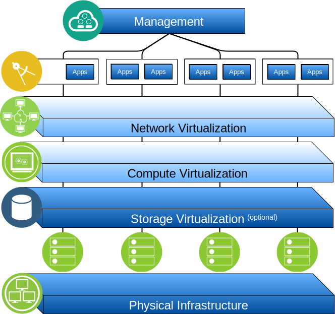
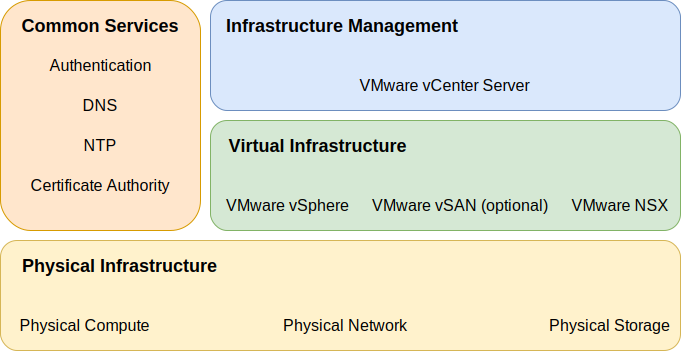

---

copyright:

  years:  2016, 2019

lastupdated: "2019-02-06"

---

# Overview of IBM Cloud for VMware Solutions with NSX-T

The {{site.data.keyword.vmwaresolutions_full}} offerings enable existing VMware
virtualized datacenter users to extend into the {{site.data.keyword.cloud_notm}} or to house
cloud native applications. This permits use cases like capacity
expansion into the cloud (and contraction when not needed), migration to
the cloud, disaster recovery to the cloud, backup into the cloud and the
ability to stand up a dedicated cloud environment for development,
testing, training, lab, or production.

This document details the design of the {{site.data.keyword.vmwaresolutions_short}}:
VMware vCenter Server, which is designed for virtualized workloads requiring high
levels of availability and scalability. This design serves as a baseline
architecture that provides the foundation for other internal or vendor-specific components to be added in as required by specific use cases.

Figure 1. {{site.data.keyword.vmwaresolutions_short}}

## Key benefits of IBM Cloud for VMware Solutions with NSX-T

VMware vCenter Server on {{site.data.keyword.cloud_notm}} provides the fundamental
building blocks that include VMware vSphere, vCenter Server, NSX, and
shared storage options that include vSAN, needed to flexibly design a
VMware software–defined data center (SDDC) solution that best fits your workloads. By using advanced automation and single–tenant bare
metal infrastructure, the entire VMware environment is rapidly deployed
to the {{site.data.keyword.cloud_notm}} and made available to you in a matter of hours.
At this point, you can access and manage the IBM hosted
environment through the native VMware clients, command line,
existing scripts, or other familiar vSphere API–compatible tools.

Post deployment, the customer can add and remove ESXi hosts to the
instance, add and remove clusters, join additional vCenter Server
instances to an existing instance and add products and services through the
{{site.data.keyword.vmwaresolutions_short}} console. It is your responsibility to
monitor and manage their vCenter Server instances. Your
responsibility includes backups, patching, configuration, and monitoring
of the VMware software and the underlying hypervisor hardware. {{site.data.keyword.vmwaresolutions_short}} (IC4V) offers automated solutions to help the
ongoing management and monitoring of the vCenter Server instance. In
addition, {{site.data.keyword.cloud_notm}} Professional Services and Managed Services are also
available to help accelerate your journey to the cloud with
offerings like migration, implementation, and onboarding services. Unlike
a managed service offering, vCenter Server gives you full and
complete access to all components that allows for far greater
flexibility than a managed service might offer. However, there are
certain constraints that apply to allow the IC4V automation to
function, post vCenter Server deployment.

In summary, the {{site.data.keyword.vmwaresolutions_short}} offerings:
- Accelerate delivery of IT projects to Developers and lines of business
by reducing the time that it takes for procurement, architecture,
implementation, and deployment of resources from weeks or even months,
to hours
- Enhance security with dedicated bare metal servers in a hosted private
cloud, including the encryption of data at rest. For vSAN
storage, encryption of data at rest is optional using either vSAN or
vSphere encryption. For shared file–level or block storage,
service–provider–managed encryption at rest is available by default in
select data centers or is optional using vSphere encryption. You must manage necessary encryption keys.
- Enable consistent management and governance of the deployed hybrid
cloud by providing full administrative access to virtualization
management, thus preserving your existing VMware tools, scripts, and
investments in training
- Use VMware expertise at global scale with IBM Professional and
Managed Services spanning 30+ {{site.data.keyword.CloudDataCents_notm}} worldwide

## IBM Cloud for VMware Solutions with NSX-T components

The {{site.data.keyword.vmwaresolutions_short}} provide automation to deploy VMware
technology components in {{site.data.keyword.CloudDataCents_notm}} across the globe. The
offerings in this solutions portfolio include the following VMware
vSphere products within an automated deployed and configured cluster:
vSphere ESXi, Platform Services Controller (PSC), vCenter Server
Appliance, NSX or NSX-T, and optionally vSAN.

The architecture consists of a single cloud region and supports the
ability to extend into more cloud regions that are located in
another geography and into another {{site.data.keyword.cloud_notm}} pod within the same
datacenter. A region is defined as a unique vCenter Server
instance. This design also allows for automated expansion and
contraction of virtual capacity within a vCenter Server instance.

Figure 2. Solution components of {{site.data.keyword.vmwaresolutions_short}}

## Related links

* [vCenter Server on {{site.data.keyword.cloud_notm}} with Hybridity Bundle overview](/docs/services/vmwaresolutions/archiref/vcs/vcs-hybridity-intro.html)
