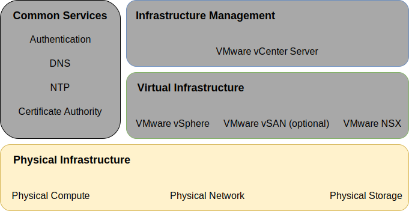
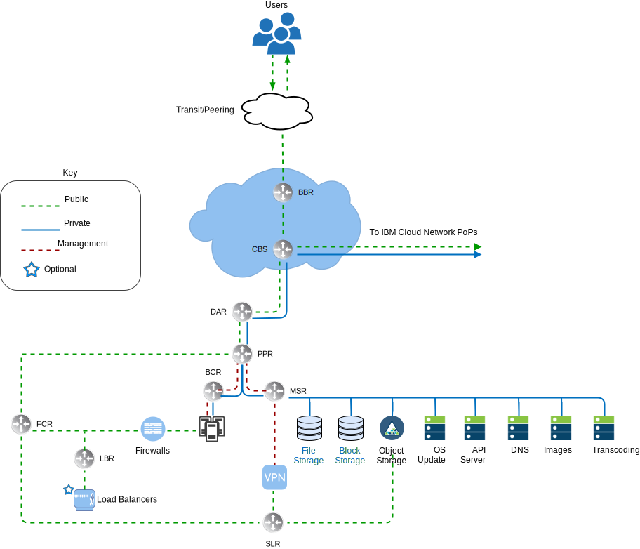
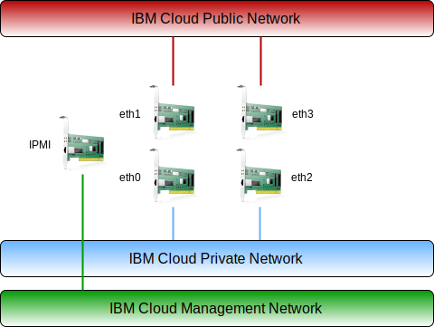

---

copyright:

  years:  2016, 2019

lastupdated: "2019-02-06"

---

{:tip: .tip}
{:note: .note}
{:important: .important}

# Physical infrastructure for IBM Cloud for VMware Solutions with NSX-T

The physical infrastructure consists of three main components that include physical compute, physical storage, and physical network. The physical compute provides the physical processing and memory that is used by the virtualization infrastructure. The physical storage provides the raw storage capacity that is consumed by the virtualization infrastructure.

The physical network provides the network connectivity into the environment that is then consumed by the network virtualization. For this design, the compute components are provided by {{site.data.keyword.baremetal_long}} and are listed on the VMware Hardware Compatibility Guide (HCG).

Storage components are provided either by {{site.data.keyword.cloud_notm}} {{site.data.keyword.baremetal_short}} or by shared network-attached storage (NAS) array that uses NFSv3 or iSCSI.

The network is provided by the {{site.data.keyword.cloud_notm}} services network and includes services such as DNS and NTP. For more information about the specific hardware used in this solution, see the VMware on {{site.data.keyword.cloud_notm}} Bill of Materials document.

For more information about the shared NAS used in this solution, see the shared storage reference architecture document.

Figure 1. Physical infrastructure

## Physical host design

Physical compute refers to the bare metal hosts in the environment. The bare metal hosts that are recommended in this solution are certified on the VMware Hardware Compatibility Guide and meet or exceed the minimum requirements necessary to install, configure, and manage vSphere ESXi. Various configurations are available to satisfy different requirements.

A detailed listing of the exact specifications that are used for the {{site.data.keyword.vmwaresolutions_short}} offerings is listed in another document that is known as the hardware bill of materials (BOM). These bare metal hosts reside within the {{site.data.keyword.cloud_notm}}. Each vCenter Server instance begins with a 3– or 4– host deployment (depending on the choice of the base storage solution). The physical host hardware BOM employs two locally attached disks that are allocated to the vSphere ESXi hypervisor.

More disks can be allocated for vSAN or NetApp ONTAP Select shared storage solutions. The vSAN architecture is detailed later in this document, and the NetApp ONTAP Select solution is discussed in a separate NetApp ONTAP Select architecture. The physical hosts all have redundant 10 Gbps network connections for both public and private network access.

Table 1. Physical host summary

CPU	| Memory |Network |Number of drives
----|:---|:---|:----
Dual Intel Xeon, varying core and speed configuration | Varying configuration, 64 GB and larger | 4 × 10 Gbps | 2 or more

## Physical network design

Physical networking is handled by {{site.data.keyword.cloud_notm}}. Review the following descriptions of the physical network that is provided by the {{site.data.keyword.cloud_notm}} and physical host connections (VLANs, MTU) associated with the physical hosts.

### IBM Cloud network overview

The physical network of {{site.data.keyword.cloud_notm}} is separated into two distinct networks: Public and Private. The private network contains the out of band management Intelligent Platform Management Interface (IPMI) traffic to the physical servers.

Figure 2. {{site.data.keyword.cloud_notm}} high–level network

#### Public network

{{site.data.keyword.CloudDataCents_notm}} and network points of presence (PoP) have multiple 1 Gbps or 10 Gbps connections to top–tier transit and peering network carriers. Network traffic from anywhere in the world connects to the closest network PoP and travels directly across the network to its data center, minimizing the number of network hops and handoffs between providers.

Inside the data center, 1 Gbps or 10 Gbps of network bandwidth is provided to individual servers through a pair of separate, peered aggregated front-end customer switches (FCS). These aggregated switches are attached to a pair of separate routers, FCR, for L3 networking. This multi–tier design allows the network to scale across racks, rows, and pods within an {{site.data.keyword.CloudDataCent_notm}}.

#### Private network

All {{site.data.keyword.CloudDataCents_notm}} and PoPs are connected by the private network backbone. This private network is separate from the public network, and it enables connectivity to services in {{site.data.keyword.CloudDataCents_notm}} around the world. Moving data between data centers is done through multiple 10 Gbps or 40 Gbps connections to the private network.

Similar to the public network, the private network is multi–tiered in that servers and other infrastructure are connected to an aggregated backend customer switch (BCS). These aggregated switches are attached to a pair of separate routers, backend customer routers, for L3 networking. The private network also supports the ability to use jumbo frames (MTU 9000) for physical host connections.

#### Management

In addition to the public and private networks, each {{site.data.keyword.cloud_notm}} server is connected for out–of–band management to the private primary network subnet. The connection allows the IPMI access to the server independently of its CPU, firmware, and operating system for maintenance and administration purposes.

#### Primary and portable IP blocks

{{site.data.keyword.cloud_notm}} allocates two types of IP addresses to be used within {{site.data.keyword.cloud_notm}} infrastructure:
- Primary IP addresses are assigned to devices, bare metal, and virtual servers provisioned by {{site.data.keyword.cloud_notm}}. Users do not assign any IP addresses in these blocks.
- Portable IP addresses are provided for the user to assign and manage as needed. vCenter Server provisions several portable IP ranges for its use.

Use only the portable ranges assigned to specific NSX (T or V) components specified for customer use. For example, “Customer EDGE”.

Primary or Portable IP addresses can be made routable to any VLAN within your account if either VLAN Spanning is enabled within the account or the account is configured as a virtual routing and forwarding (VRF) account.

#### VLAN spanning

VLAN Spanning is an {{site.data.keyword.cloud_notm}} global account setting that allows each Primary and Portable subnet IP block within all VLANs within the account to be routable to each other. With this setting disabled, IP blocks can still route to {{site.data.keyword.cloud_notm}} services, but not each other. This architecture requires VLAN Spanning to be enabled within the account where vCenter Server is deployed, in order that connections can be transparently made across the various subnets where the solution components reside.

#### Virtual Routing and Forwarding

{{site.data.keyword.cloud_notm}} accounts can also be configured as a Virtual Routing and Forwarding (VRF) account. The configuration provides similar functions to VLAN spanning, enabling automatic routing between subnet IP blocks. All accounts with Direct-Link connections must be converted to, or created as, a VRF account.

The {{site.data.keyword.cloud_notm}} user interface cannot detect that VRF is enabled, so it provides a warning that you must ensure either VLAN spanning or VRF is configured in your {{site.data.keyword.cloud_notm}} account.

As various connectivity options along with network routing options require the {{site.data.keyword.cloud_notm}} account to be in a VRF mode, it is the recommendation of this document that the account be put into VRF mode before provisioning vCenter Server.

#### Physical host connections

Each physical host within the design has two redundant pairs of 10 Gbps Ethernet connections into each {{site.data.keyword.cloud_notm}} Top of Rack (ToR) switch (public and private). The adapters are set up as individual connections (unbonded) for a total of 4 × 10 Gbps connections. This allows each networking interface card (NIC) connection to work independent of one another. Removing physical network connectivity to the public or private network for the bare metal servers that are used within the vCenter Server offering is not possible. Physical ports on the internal NIC of the bare metal can be disabled, but there is no support for “unplugging the cables”. See “Private only networking” later in this document.

Figure 3. Physical host connections

#### VLANs and Under to Overlay routing

The {{site.data.keyword.vmwaresolutions_short}} offerings are designed with 3 VLANs, one public and two private, assigned during deployment. The public VLAN is assigned to eth1 and eth3, while the private connections are assigned to eth0 and eth2. It is important to note that the public and the first private VLAN created and assigned to this design are untagged by default within the {{site.data.keyword.cloud_notm}}. Then, the additional private VLAN is trunked on the physical switch ports and tagged within the VMware port groups that are consuming these subnets.

As stated previously, the private network consists of two VLANs within this design. Three subnets are allocated to the first of these VLANs (here designated Private VLAN A): the first is a primary private IP subnet range {{site.data.keyword.cloud_notm}} assigns to the physical hosts. The second subnet is used for management virtual machines such as vCenter Server Appliance and Platform Services Controller.

The third is used for the encapsulated overlay network Tunnel Endpoints (VTEPs) assigned to each
host through the NSX Manager. In addition to Private VLAN A, a second private VLAN (here designated Private VLAN B) exists to support VMware features such as vSAN, vMotion, NFS, and iSCSI. As such, the VLAN is divided into two, three, or four portable subnets. The first subnet is assigned to a kernel port group for vMotion traffic.

The remaining subnet or subnets are used for storage traffic. For vSAN, one is assigned to kernel port groups used for vSAN traffic. For NFS attached NAS, one is assigned to a port group dedicated to NFS traffic. For iSCSI attachment, two port groups are created to allow multipathing active-active across both private NIC ports as only one NIC port can be active at a time per VMware’s iSCSI
documentation.

All subnets that are configured as part of a vCenter Server automated deployment use {{site.data.keyword.cloud_notm}} portable managed ranges.
{:note}

This is to ensure that any IP address can be routed to any data center within the {{site.data.keyword.cloud_notm}} account used if it is required currently or in the future.

Review the following table for a summary.

Table 2. VLAN and subnet summary

VLAN | Type | Description
--|---|--
**Public** | Primary | Assigned to physical hosts for public network access. Not used upon initial deployment.
**Private A** | Primary | Single subnet assigned to physical hosts assigned by {{site.data.keyword.cloud_notm}}. Used by the management interface for vSphere management traffic.
**Private A** | Portable| Single subnet that is assigned to virtual machines that function as management components.
**Private A** | Portable | Single subnet that is assigned to NSX (V or T) VTEP
**Private A** | Portable | Single subnet that is assigned for vSAN, if in use
**Private B** | Portable | Single subnet assigned for NAS, if in use
**Private** | Portable | Two subnets assigned for iSCSI NAS, if in use (one per physical NIC port)
**Private B** | Portable| Single subnet assigned for vMotion

This design is deployed with all VLAN–backed hosts and virtual machines that are configured to point to the {{site.data.keyword.cloud_notm}} BCR (backend “private network” customer router) as the default route. While vCenter Server instances enable the use of Software–Defined Networking (SDN), note any network overlays created within a VMware instance, which include routing to internal subnets are not known by the {{site.data.keyword.cloud_notm}} managed routers. If you want routing between the overlay and underlay, you must deploy an IBM firewall device for the particular default private VLAN when the vCenter Server instance is deployed. This device allows the insertion of static routes and dynamic routing protocol peering with the overlay networking devices to allow routing between the underlay and overlay.

The private network connections are configured to use jumbo frame MTU size of 9000, which improves performance for large data transfers such as storage and vMotion. This is the maximum MTU allowed within VMware and by {{site.data.keyword.cloud_notm}}. The public network connections use a standard Ethernet MTU of 1500. This must be maintained as any changes can cause packet fragmentation over the internet.

### Physical storage design

This section discusses the configuration of the physical disks that are installed in each physical host, and the configuration of shared file–level or block storage. This includes the OS (vSphere ESXi) disks and the disks used for storage of the virtual machines. Storage that is used for virtual machines can be comprised either of local disks that are virtualized by VMware vSAN, shared file–level storage, or shared block-level storage.

#### Operating system disks

The vSphere ESXi hypervisor is installed in a persistent location. As a result, the physical hosts are consist of two disks in a RAID–1 configuration to support redundancy for the vSphere ESXi hypervisor.

#### vSAN disks

This design allows for the option of using either VMware vSAN or shared file–level storage as the primary datastore for virtual machines. For VMware vSAN, it is configured by using an all–flash configuration.

This design allows for several configuration options, including 2U and 4U chassis, various numbers of disks, and various disk sizes. All configurations use two vSAN disk groups with one solid-state disk (SSD) for cache and one or more SSDs for capacity. All drives that are allocated for vSAN consumption are configured in single–disk RAID–0. For details on the supported configurations, see the {{site.data.keyword.vmwaresolutions_short}} BOM document.

#### Shared file–level storage across hosts

For shared file–level storage, one 2-TB NFS share is attached to the hosts that comprise the initial VMware cluster. This share, which is known as the management share, is used for management components such as the VMware vCenter Server, Platform Services Controller, and VMware NSX. The storage is attached through the NFSv3 protocol at a 2 IOPs per GB level from {{site.data.keyword.cloud_notm}}.

IBM normalizes the IOP level that is provisioned at a 16K block size such that larger block sizes see a lower limit and smaller block sizes a higher limit.
{:note}

Figure 4. NFS shares that are attached to VMware deployment

More file shares for user workloads can also be allocated and mounted across all hosts at the time of purchase or later within the console. The user can select from the available {{site.data.keyword.cloud_notm}} Endurance file storage capacity options and performance tiers in the corresponding {{site.data.keyword.CloudDataCent_notm}}. All shares are attached by using the NFSv3 protocol.

Additionally, it is possible to attach NFSv3 file shares from the NetApp ONTAP Select offering.

The availability of the 10 IOPS/GB depends on the {{site.data.keyword.CloudDataCent_notm}}. Data centers that offer the 10 IOPS/GB performance tier also include provider–managed encryption of data at rest (AES–256 encryption), and are backed by all–flash storage. The 10 IOPS/GB performance tier is limited to a maximum capacity of 4 TB.

For more information on the shared NAS used in this solution, see [Attached Storage for vCenter Server™ on IBM Cloud Solution Architecture](https://www.ibm.com/cloud/garage/files/AttachedStorageSolutionArchitecture_v1.0.pdf).

#### Shared iSCSI storage

Similar to NFS, for shared iSCSI storage, one 2-TB iSCSI LUN is attached to the hosts that comprise the initial VMware cluster. This iSCSI LUN is used for management components such as the VMware vCenter Server, Platform Services Controller, and VMware NSX. The storage is attached through the iSCSI protocol at a 2 IOPs per GB level from {{site.data.keyword.cloud_notm}}.

IBM normalizes the IOP level provisioned at a 16k block size such that larger block sizes see a lower limit and smaller block sizes a higher limit.
{:note}

Figure 5. iSCSI LUNs attached to VMware deployment

Additional iSCSI LUNs for workloads can also be allocated and mounted across all hosts at the time of purchase or later within the console. Select from the available {{site.data.keyword.cloud_notm}} Endurance block storage capacity options and performance tiers in the corresponding {{site.data.keyword.CloudDataCent_notm}}. All LUNs are attached by using the iSCSI protocol. Additionally, it is possible to attach iSCSI LUNs from the NetApp ONTAP Select offering.

The availability of the 10 IOPS/GB depends on the {{site.data.keyword.CloudDataCent_notm}}. Data centers that offer the 10 IOPS/GB performance tier also include provider–managed encryption of data at rest (AES–256 encryption), and are backed by all–flash storage. The 10 IOPS/GB performance tier is limited to a maximum capacity of 4 TB.

For more information about the shared NAS used in this solution, see [Attached Storage for vCenter Server™ on {{site.data.keyword.cloud_notm}} Solution Architecture.

## Related links

* [vCenter Server on {{site.data.keyword.cloud_notm}} with Hybridity Bundle overview](/docs/services/vmwaresolutions/archiref/vcs/vcs-hybridity-intro.html)
