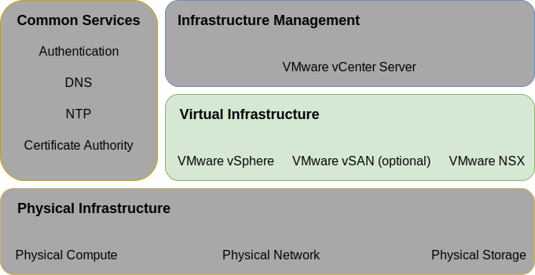
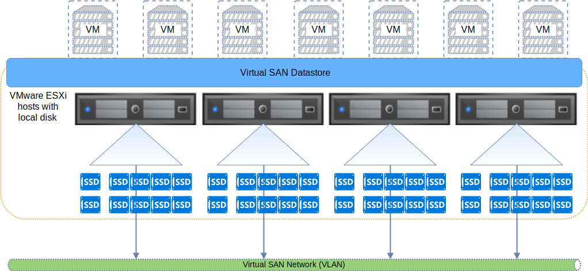
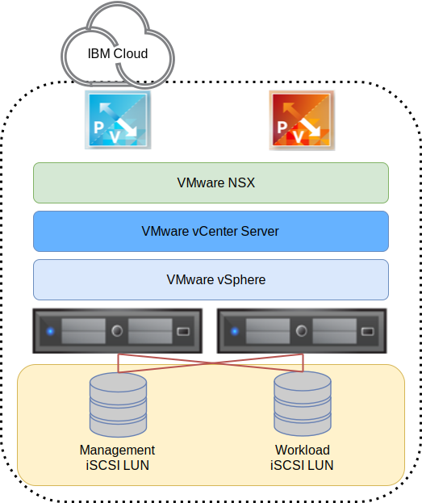
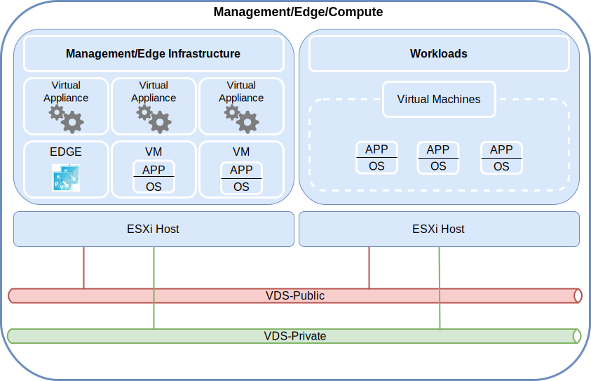
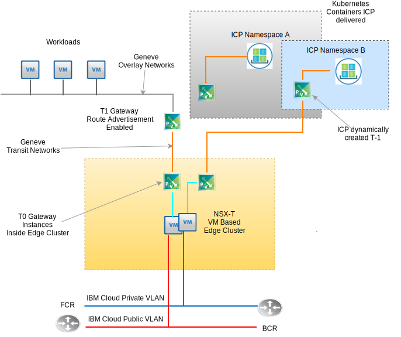

---

copyright:

  years:  2016, 2019

lastupdated: "2019-02-07"

---

# Virtual infrastructure

The virtual infrastructure design includes the VMware software components that make up the virtual infrastructure layer of {{site.data.keyword.vmwaresolutions_full}}. These components include the software products that provide compute, storage, and network virtualization. The VMware products in this layer include vSphere ESXi, VMware NSX (V or T), and optionally, VMware vSAN.

Figure 1. Virtual infrastructure

## VMware vSphere design

The vSphere ESXi configuration consists of five main elements: boot configuration, time synchronization, host access, user access, and configuration of DNS. Table 1 outlines the respective specifications for these. After configuration and installation of ESXi, the host is added to a VMware vCenter Server™ and is managed from there.

To gain direct access to the host, the design supports three methods: Direct Console User Interface (DCUI), ESXi Shell, and Secure Shell (SSH). The administrator can add users from the Active Directory domain to enable user access to the host. By default, the only users who can log in directly are the **customerroot** and **ibmvmadmin** users of the host’s physical machine. All hosts in vCenter Server solution design are configured to sync with a central NTP server.

Table 1. vSphere ESXi configuration

**Attribute** | **Configuration parameter**
--|--
**ESXi boot location** | Local disks configured in RAID–1
**Time sync** | {{site.data.keyword.cloud_notm}} NTP Server
**Host access** | Supports DCUI, ESXi Shell, or SSH (if enabled)
**User access** | Local Authentication and MS Active Directory
**Domain Name Resolution** | DNS referenced in “Common Services” section
**EVC Mode** | Skylake (only for “greenfield” vSphere 6.7 deployments)

When configured with vSAN storage, a VMware on {{site.data.keyword.cloud_notm}} instance is provisioned with a vSphere cluster of a minimum of 4 ESXi hosts up to a maximum of 51 for the management cluster and 59 for all subsequent clusters as of this writing. When a vCenter Server instance is configured only with shared file–level or block-level storage, it is provisioned with a minimum of 3 ESXi hosts. The vSphere cluster houses the virtual machines (VMs) that manage the vCenter Server instance as well as compute resources for user workloads. When the environment is scaled out to support more user workloads, the environment can scale out the converged cluster by deploying additional compute hosts, by deploying additional clusters managed by the same vCenter, or by deploying a new vCenter Server instance with its own vCenter Server Appliance.

For more details, see the {{site.data.keyword.cloud_notm}} running VMware Clusters solution architecture document.

## VMware vSAN design

For this design, VMware Virtual storage area network (vSAN) storage is employed within vCenter Server to provide shared storage for the vSphere hosts. vSAN aggregates the local storage across multiple ESXi hosts within a vSphere cluster that is represented as a single VM datastore. The compute nodes contain local disk drives for the ESXi OS and the vSAN datastore.

Two OS drives are excluded in each node regardless of which cluster it belongs to for housing the ESXi installation.

Figure 2. vSAN concept

### Virtual SAN design

vSAN employs the following components:
- Two–disk–group vSAN design, with each disk group consisting of two or more disks per disk group. One SSD or NVMe drive of the smallest size in the group serves as the cache tier and the remaining SSDs serve as the capacity tier.
- Currently, the Onboard raid controller is configured with each drive other than the two OS drives, which are configured in a RAID–0 array per drive.It is not recommended by VMware to run different raid level and the OS drives on the same controller as the vSAN drives. The recommendation will change soon for individual controllers for vSAN and OS drives.
- A single vSAN datastore is created by using all of the storage per cluster.

## Virtual network setup

For this design, the vSAN traffic traverses between ESXi hosts on a dedicated private VLAN. The two network adapters attached to the private network switch are configured within vSphere as a vSphere distributed switch (VDS) with both network adapters as uplinks.

A dedicated vSAN kernel port group that is configured for the vSAN VLAN resides within the VDS. Jumbo frames (MTU 9000) are enabled for the private VDS. vSAN does not load balance traffic across uplinks. As a result, one adapter is active while the other is in standby to support redundancy. The network failover policy for vSAN is configured as “Explicit Failover” between physical network ports. See “Physical Network Design” section.

### Virtual SAN policy design

After VMware Virtual SAN is enabled and configured, storage policies are configured that define the VM storage characteristics.

Storage characteristics specify different levels of service for different VMs. The default storage policy that is specified in this design tolerates a single failure. The default policy is configured with erasure coding, allowing for RAID–5 with a failures–to–tolerate (FTT) setting of 1. This configuration requires a minimum of four hosts.

Alternatively, you can choose a RAID–6 configuration that uses FTT=2, requiring a minimum of six hosts. Deduplication and compression are also enabled in the default storage policy. This design uses the default policy unless otherwise specified by the client.

If a custom policy is configured, vSAN guarantees it if possible. However, if the policy cannot be guaranteed, it's not possible to provision a VM that uses the policy unless it's enabled to force provisioning. Storage policies must be reapplied upon the addition of new ESXi hosts or patching of the ESXi hosts.

### vSAN settings

vSAN Settings are set based on experience in deploying VMware solutions within {{site.data.keyword.cloud_notm}}. This includes SIOC settings, explicit failover settings port group, and disk cache settings.
- SSD drives are configured as no read ahead, write through, direct (NRWTD)
- Network I/O control (NETIOC) settings
  - Management = 20 shares
  - Virtual machine = 30 shares
  - vMotion = 50 shares
  - vSAN = 100 shares
- Configure the vSAN kernel ports to explicit failover

## iSCSI attached storage

Unlike NFS v3 attached storage, iSCSI attached storage supports active–active paths across all configured NIC card ports and target ports. Because of this, higher throughput can be achieved and is thus a desirable alternative to NFS attaching storage. This does come at the cost of greater complexity.

{{site.data.keyword.cloud_notm}} Endurance block storage supports only a maximum of eight hosts attachment per LUN. This is meant to document the capability that will be added to vCenter Server upon change to {{site.data.keyword.cloud_notm}} Endurance storage due Q1 to allow for attachment for up to 64 hosts, or iSCSI initiators, as each ESXi host will have a minimum of two initiators.

One 2-TB iSCSI LUN is attached to vCenter Server for the use of the management components and a minimum of one more iSCSI LUN is configured for customer workload use. This storage is formatted as VMFS 6.x file system per each LUN.

Figure 3. iSCSI storage attachment

### Virtual network setup for iSCSI

For this design, iSCSI traffic is allowed to use both private attached NIC card ports in an active, active configuration. Because vSphere allows only one NIC card port to be active on a particular port group within a vDS at a time, two port groups must be created (A and B) on the storage VLAN.

An ESXi kernel port is created with a unique IP address on individual subnets to allow for scalability. Each kernel port is assigned to its own iSCSI port group. Both kernel ports are assigned to an ESXi virtual ISCSI host bus adapter (HBA). For each kernel port, the default GW override switch is employed to use the default gateway for the local subnet for that kernel port. See the following table.

Table. 2 iSCSi port groups

vDS Portgroup | Kernel port subnet | VMHBA
--|:---|:--
**SDDC-Dprotgroup-iSCSI-A** |Subnet-A |  vmhba64
**SDDC-Dprotgroup-iSCSI-B** | Subnet-B | vmhba64

#### Storage I/O control - SIOC

iSCSI LUNS is provisioned and formatted to a single file VMFS file system per LUN. The default recommended SIOC setting is 90% of peak throughput.

## VMware NSX-V design

Network virtualization provides a network overlay that exists within the virtual layer. This provides the architecture with features such as rapid provisioning, deployment, reconfiguration, and destruction of on–demand virtual networks.

This design uses the vSphere Distributed Switch (vDS) and VMware NSX for vSphere to implement virtual networking. In this design, the NSX Manager is deployed on the initial cluster.

Additionally, the NSX Manager is assigned a VLAN–backed IP address from the private portable address block that is designated for management components and configured with the DNS and NTP servers that are discussed in the “Common Services” section.

A summary of the NSX Manager installation is shown in the following diagram.

Figure 4. NSX Manager network overview

After initial deployment, the {{site.data.keyword.cloud_notm}} automation deploys three NSX Controllers within the initial cluster. The controllers are assigned a VLAN–backed IP address from the Private A portable subnet that is designated for management components.

Additionally, VM–VM anti–affinity rules are created such that controllers are separated among the hosts in the cluster. Tou must deploy the initial cluster with a minimum of three nodes to ensure high availability for the controllers.

In addition to the controllers, the {{site.data.keyword.cloud_notm}} automation prepares the deployed vSphere hosts with NSX VIBS that enable the use of a virtualized network (VXLANs) by using VXLAN Tunnel Endpoints (VTEPs).

The VTEPs are assigned a VLAN–backed IP address from the Private A portable IP address range that is specified for VTEPs listed in the VLAN and Subnet Summary. VXLAN traffic resides on the untagged VLAN and is assigned to the private virtual distributed switch (vDS).

Next, a segment ID pool is assigned and the hosts in the cluster are added to the transport zone. Only unicast is used in the transport zone since IGMP snooping is not configured within the {{site.data.keyword.cloud_notm}}. Two vTEP kernel ports are configured per host on the same VTEP dedicated subnet per VMW best practice.

NSX Edge Services Gateway (ESG) pairs are then deployed. In all cases, one gateway pair is used for outbound traffic from automation components that reside on the private network. A second gateway, which is known as the customer–managed edge, is deployed and configured with an uplink to the public network and an interface that is assigned to the private network.

Next, the administrator can configure any required NSX component such as, but not limited to, Distributed Logical Router (DLR), logical switches, and firewalls. For more information on the NSX Edges that are deployed as part of the solution, see NSX Edge on {{site.data.keyword.cloud_notm}} Solution Architecture.

Table 3. NSX Manager requirements

Attribute | Specification
--|---|--
**NSX Manager** | Virtual appliance
**Number of vCPUs** | 4
**Memory** | 16 GB
**Disk** | 60 GB on the management NFS share
**Disk type** | Thin provisioned
**Network** | Private A portable designated for management components

### Distributed switch design

The design uses a minimum number of distributed switches (vDS). The hosts in the cluster are connected to public and private networks. They are configured with two distributed virtual switches. The use of two switches follows the physical network separation of the public and private networks that are implemented within {{site.data.keyword.cloud_notm}}. The following diagram shows the VDS design:

Figure 5. Distributed switch design

A total of two distributed switches are configured: one for public network connectivity (SDDC-Dswitch-Public) and the other for private network connectivity (SDDC-Dswitch-Private). Separating different types of traffic is required to reduce contention and latency. Separate networks are also required for access security. VLANs are used to segment physical network functions. This design uses three VLANs: two for private network traffic and one for public network traffic. Traffic separation is detailed in the following section.

Table 4. VLAN mapping to traffic types

VLAN | Designation | Traffic type
--|---|--
VLAN 1 | Public | Available for internet access
VLAN 2 | Private A | ESXi Management, Management, VXLAN (VTEP)
VLAN 3 | Private B | vSAN, NFS, vMotion, iSCSI

Traffic from workloads travels on VXLAN¬–backed logical switches. The vSphere cluster uses two vSphere Distributed Switches (VDS) configured as follows:

Table 5. Converged cluster distributed switches

Distributed switch | Function| NIOC | LB mode | Physical ports | MTU
--|---|---|---|--|--
SDDC-Dswitch-Public | Ext mgmt | Enabled | Originating Virtual Port | 2 |1500

Table 6. Converged Cluster Distributed Switch Port Group Configuration Settings

Parameter | Setting
--|--
Load balancing | Route based on the originating virtual port *
Failover detection | Link status only
Notify switches | Enabled
Failback | No
Failover order | Active uplinks: Uplink1, Uplink2 *

The vSAN port group uses explicit failover with active and standby since it does not support load balancing of vSAN storage traffic. iSCSI port groups only have one active uplink at a time. (iSCSI A – uplink1, iSCSI-B, uplink 2)

Table 7. Converged cluster virtual switch port groups and VLANs - Distributed switch: SDDC-Dswitch-Private

Port Group|Teaming|Uplinks|VLAN ID
---|---|---|--
SDDC-DPortGroup-Mgmt|Originating virtual port|Active: 0, 1|VLAN 1
SDDC-DPortGroup-vMotion|Originating virtual port|Active: 0, 1|VLAN 2
SDDC-DPortGroup-VSAN|Explicit failover|Active: 0, Standby: 1|VLAN 2
SDDC-DPortGroup-NFS|Originating virtual port|Active: 0, 1|VLAN 2
NSX generated|Originating virtual port|Active: 0,1|VLAN 1
SDDC-DPortGroup-External|Originating virtual port|Active: 0, 1|VLAN 3
SDDC-DPortGroup-iSCSI-A|Originating virtual port|Active: 0|VLAN 2
SDDC-DPortGroup-iSCSI-B|Originating virtual port|Active: 0|VLAN 2

Table 8. Converged cluster VMkernel adapters - Distributed switch: SDDC-Dswitch-Private

Purpose|Connected port group|Enabled services|MTU
--|---|---|---|--
Management|SDDC-DPortGroup-Mgmt|Management Traffic|1500 (default)
vMotion|SDDC-DPortGroup-vMotion|vMotion Traffic|9000
VTEP|NSX generated|-|9000
VSAN|SDDC-DPortGroup-VSAN|VSAN|9000
NAS|SDDC-DPortGroup-NFS|NAS|9000
iSCSI|SDDC-DPortGroup-iSCSI-A|iSCSI|9000
iSCSI|SDDC-DPortGroup-iSCSI-B|iSCSI|9000

#### NSX configuration

This design specifies the configuration of NSX components and applies a basic topology with {{site.data.keyword.cloud_notm}} assigned IPs for egress into the NSX overlay IP space. The configuration consists of:
- Management servers and controllers are installed an integrated into the vCenter web UI
- ESXi agents are installed and VTEP IP addresses are configured per ESXi host
- VTEP configuration, controller configuration, VXLAN configuration (transport zone)
- NSX Edge Services Gateway (ESG) appliances for use by management components
- NSX Edge Services Gateway (ESG) appliances for customer use
- NSX VXLAN work customer workloads attached to a distributed local router (DLR) with a transit VXLAN between the DLR and the customer ESG.
- RFC 1918 address space for the VXLANs and {{site.data.keyword.cloud_notm}} private and public portable IP space for use as egress network on the customer ESG.

What is not configured:
- Micro segmentation
- Linked NSX Management to other VMware instances

Figure 6. Deployed example customer NSX topology

## VMware NSX-T design

Unlike NSX-V (NSX on vSphere), VMware NSX-T is designed to address application frameworks and architectures that have heterogeneous endpoints and technology stacks. In addition to vSphere, these
environments can include other hypervisors, KVM, containers, and bare metal. NSX is designed to span a software defined network and security infrastructure across platforms other than just vSphere alone. While it is possible to deploy NSX-T components without needing vSphere, this design focuses on NSX-T and its integration primarily within a vCenter Server vSphere automated deployment.

There are many advanced features within NSX-T such as firewall policies, inclusion of guest introspection within firewall policies, and advanced net flow tracking. Describing these features is beyond the scope of this document. See the VMware documentation for NSX-T. In this design, the NSX-T
Management Infrastructure is deployed during the initial vCenter Server cluster deployment in place of NSX-V.

### NSX-T vs NSX-V

For vSphere native NSX (NSX-V), review the following more well-known NSX-T objects with similar function to their NSX-V counterparts. Limitations and differences within a vSphere environment are also be discussed. Here is a table of typically used functions between T and V that correspond.

Table 9. NSX-V to NSX-T terminology

NSX-V or vSphere native | NSX-T
--|:---|:--
**Virtual Distributed Switch** | Network Virtual Distributed Switch (N-VDS)
**NSX Transport zone** | Transport zone (overlay or VLAN backed)
**Port group (vDS)** | Logical Switch
**VXLAN (L2 encapsulation)** | GENEVE (L2 encapsulation)
**Edge Gateway** | T0 Gateway (changed as of v2.4)
**Distributed Logical Router** | T1 Gateway (changed as of v2.4)
**ESXi Server (vTEP)** | Transport Node (ESXi, KVM, Bare metal T0 Gateway)

There are key NSX-T concepts that do not correspond to NSX-V function that need to be understood for this design’s implementation of NSX-T.

As follows:
- An edge cluster is one or more VMs or physical machines that participate in an NSX-T virtual fabric. They are endpoints for the overlay network transport zones and VLAN backed transport zones. An edge cluster can support multiple T-0 gateway instances.
- A T-0 gateway is a virtual router instance, but not a VM. Multiple T-0 gateway instances can run within an edge cluster each with its own routing table and functions. This means that an edge cluster must exist before you can create a T-0 router instance.
- A transport zone can span endpoints across different platforms and multiple vSphere vCenter instances. No cross vCenter linked NSX is required. Transport zones can be excluded from specific endpoints. An N-VDS is directly correlated to a transport zone and is created when the transport zone is created.
- Uplink failover order is created independent of a particular logical switch as they are created in profiles as “Uplink Profiles” and are applied to a particular logical switch based on VLAN. Because it is possible to have the need for differing failover order or load balancing of physical uplinks for the same VLAN, the uplink profile for a particular VLAN can contain multiple entries for “Teaming” with different failover order and load balancing. When you assign the uplink profile to a logical switch, the specific teaming profile is then chosen.

- As of NSX-T 2.4, the manager VM and the controller VM function are combined. This results in three controller manager VMs being deployed. If on the same subnet, they use and internal network load balancer. If across different subnets, an external load balancer is required.

### Resource requirements

In this design, the NSX-T Manager-controller VMs are deployed on the initial cluster. Additionally, each controller manager is assigned a VLAN–backed IP address from the private portable address block that is designated for management components and configured with the DNS and NTP servers that are discussed in section 0. A summary of the NSX Manager installation is shown in following table.

Table 10. NSX-T Manager - controller specifications

Attribute | Specification
--|--
**NSX Manager / Controller** | 3 Virtual appliances
**Number of vCPUs** | 4
**Memory** |  16 GB
**Disk** | 60 GB
**Disk type** | Thin provisioned
**NetworkPrivate A** | Private A

The following figure shows the placement of the NSX Manager-controllers in relation to the other components in this architecture.

Figure 7. NSX-T Manager network overview

### Deployment considerations

With NSX-T on vSphere, the N-VDS must be assigned the physical adapters within the hosts. As an N-VDS can only be configured within NSX-T Manager, this implies that if redundancy is to be maintained, no physical adapters are available for native local switch or vDS assignment in a cluster that houses both the NSX-T components and the associated overlay network components.

For this reason, during the installation of NSX-T and its configuration, one physical NIC port on one adapter must remain assigned to a local vSphere vSwitch or a virtual distributed switch (vDS). Post NSX-T deployment, any ESX kernel ports need to be migrated to an N-VDS and off any local vSwitch or VDS. After the kernel ports are removed, the remaining physical NIC ports can be assigned as an N-VDS uplink achieving redundancy the N-VDS.

After initial deployment, the {{site.data.keyword.cloud_notm}} automation deploys three NSX-T Manager/Controller virtual appliances within the initial cluster. The controllers are assigned a VLAN–backed IP address from the Private A portable subnet that is designated for management components. Additionally, VM–VM anti–affinity rules are created such that controllers are separated among the hosts in the cluster.

You must deploy the initial cluster with a minimum of three nodes to ensure high availability for the Manager / Controllers. In addition to the manager / controllers, the {{site.data.keyword.cloud_notm}} automation prepares the deployed vSphere hosts as NSX-T transport nodes. The ESXi transport nodes are assigned a VLAN–backed IP address from the Private A portable IP address range that is specified by an NSX IP pool ranged derived from the VLAN and Subnet Summary. Transport node traffic resides on the untagged VLAN and is assigned to the private NSX-T virtual distributed switch (N-VDS).

Depending on the customer chosen NSX-T topology to be deployed, an NSX-T Edge Cluster is either deployed as a pair of VM or as software deployed on bare metal cluster nodes. Regardless of if the cluster pair is virtual or physical, uplinks are configured to N-VDS switches for both {{site.data.keyword.cloud_notm}} public and private networks.

The following table summarizes the requirements for a medium size environment.

Table 11. NSX-T component specification

 Resources | Manager controller x3 | Edge cluster x2 | Bare Metal Edge
-----------|:---------|:-------|:---------
**Medium size** | Virtual appliance | Virtual appliance | Physical Server
**Number of vCPUs** | 4 | 4 | 8
**Memory** | 16 GB | 8 GB | 32 GB
**Disk** | 120 GB VSAN/management NFS | 120 GB VSAN/management NFS | 200 GB
**Disk type** | Thin provisioned | Thin provisioned | Physical
**Network** | Private A | Private A | Private A

### Transport zones and N-VDS

Transport zones dictate which hosts and which VMs can participate in the use of a particular network. A transport zone does this by limiting the hosts that can "see" a logical switch—and, therefore, which VMs can be attached to the logical switch. A transport zone can span one or more host clusters. This design calls for transport zones to be created as follows:

Table 12. NSX-T transport zones and N-VDS

Transport zone name | VLAN/VXLAN | N-VDS name | Uplink teaming policy
--|:-------|:------|:-----
**Private-Overlay** | VXLAN | SDDC-Overlay | Default
**Public-VLAN** | VLAN | SDDC-Public | Default
**Private-VLAN** | VLAN | SDDC-Private | NFS,vSAN,iSCSI-A&B Default

### Transport nodes

Transport nodes define the physical server objects or VMs that participate in the virtual network fabric. Review the following table to understand the design.

Table 13. NSX-T Transport Nodes

Transport node type | N-VDS | Uplink profile | IP assignment | Physical NICs
--|:--------|:--------|:---
**ESXi** | SDDC-Private | SDDC-Private-uplink | IP Pool | vmnic0, vmnic2
**Edge Cluster** | SDDC-Overlay | SDDC-Overlay-uplink | IP Pool | N/A
**Physical Edge** | SDDC-Private | SDDC-Private-uplink | IP Pool | eth0, eth2

### Uplink profiles

An uplink profile defines policies for the links from hypervisor hosts to NSX-T logical switches or from NSX Edge nodes to top-of-rack switches.

Table 14. NSX-T uplink profiles

Uplink profile Name | VLAN | Included teamings | MTU
--|:-----|:---|:---
**SDDC-Private-Uplink** | default | Default, Management | 9000
**SDDC-Public-Uplink** | default| Default | 1500
**SDDC-Storage-Uplink** | Storage VLAN | vSAN, iSCSI-A&B,NFS | 9000

### Teaming

Table 15. NSX-T NIC port teaming specification

Teaming name | Failover or Loadbalance | Active NIC | Standby NIC
--|:----|:---|:---
**Default** | Load balance source | Uplink 1, 2 | N/A
**Management** | Failover| Uplink 1 | Uplink 2
**TEP** | Failover| Uplink 1 | Uplink 1
**vSAN** | Failover| Uplink 2 | Uplink 1
**iSCSI-A** | Failover| Uplink 1 | N/A
**iSCSI-B** | Failover| Uplink 2 | N/A
**NFS** | Load balance source | Uplink 1, 2 | Uplink 1
**vMotion** | Failover| Uplink 2 | Uplink 1

### VNI pools

Virtual Network Identifiers (VNIs) are similar to VLANs to a physical network. They are automatically created when a logical switch is created from a pool or range of IDs. This design uses the default VNI pool that is deployed with NSX-T.

## Logical switches

An NSX-T logical switch reproduces switching functions, broadcast, unknown unicast, multicast (BUM) traffic, in a virtual environment that is completely decoupled from underlying hardware.

Table 16. NSX-T logical switches

Logical switch name | VLAN |Transport zone | Uplink teaming policy
--|:---|:----|:---
**SDDC-LS-Mgmt** | default | Private-VLAN | Management
**SDDC-LS-NFS** | default | Private-VLAN | NFS
**SDDC-LS-vMotion** | default | Private-VLAN | vMotion
**SDDC-LS-VSAN** | Tagged storage vlan | Private-VLAN | vSAN
**SDDC-LS-iSCSI-A** | Tagged storage vlan | Private-VLAN| iSCSI-A
**SDDC-LS-iSCSi-B** | Tagged storage vlan | Private-VLAN| iSCSi-B
**SDDC-LS-TEP** | default | Private-VLAN| TEP
**SDDC-LS-External** | Default | Public-VLAN | Default

### Edge cluster

Within this design, a single virtual edge cluster is provisioned for use by management and customer workloads. The virtual edge cluster can house multiple instances of T0 Gateways. As described earlier, multiple T0 edge gateway instances can be instantiated on a single edge cluster, each with its own routing tables. See the following figure which diagrams the functional components of an NSX-T edge cluster.

Figure 8. NSX-T Edge cluster example of T0 to T1 scale

Figure 9. Management T0 gateway

#### Tier 0 logical gateway

An NSX-T Tier-0 logical router provides an on and off gateway service between the logical and physical network. For this design, multiple T-0 gateways are deployed for the needs of management, add on products and optionally for customer chosen topologies.

#### Tier 1 logical gateway

An NSX-T Tier-1 logical gateway has downlink ports to connect to NSX-T Data Center logical switches and uplink ports to connect to NSX-T Data Center tier-0 logical routers only. They run in the kernel level of the hypervisor they are configured for and not as a virtual or physical machine. For this design, one or more T-1 logical gateways are created for the needs of customer chosen topologies.

#### Tier 1 to Tier 0 route advertisement

To provide Layer three connectivity between VMs connected to logical switches that are attached to different tier-1 logical gateways, it is necessary to enable tier-1 route advertisement towards tier-0. No need to configure a routing protocol or static routes between tier-1 and tier-0 logical routers. NSX-T creates static routes automatically when you enable route advertisement. For this design, route advertisement is always enabled for any IC4V automation created T-1 gateways.

### Preconfigured topologies

Workload to T1 to T0 gateway – virtual edge cluster

Figure 10. NSX-T deployed topology virtual T0 Edge Gateway

IC4V deployed Topology 1 is basically the same topology that is deployed with NSX-V DLR and Edge gateways. With NSX-T, no dynamic routing protocol configuration between T1 and T0. RFC-1891 IP address space is used for the workload overlay network and transit overlay network. A customer private and public portable IP space is assigned for customer use. A customer designated {{site.data.keyword.cloud_notm}} private and public portable IP space is assigned to the T0 for customer use.

As of this design, you have the option not to delete these IP ranges if the vCenter Server instance is decommissioned and deleted.

Workload to T1 to T0 gateway – physical edge cluster:

Figure 11. NSX-T deployed topology physical T0 Edge Gateway

The deployed Topology 2 is similar to the exception replacing the VM-based edge cluster with a pair of bare metal servers that run Red Hat Server. A customer designated {{site.data.keyword.cloud_notm}} private and public portable IP space is assigned to the T0 for customer use. As of this design, you have the option not to delete these IP ranges if the vCenter Server instance is decommissioned and deleted.

See a separate document or link for bill of materials on the hardware and OS specifications.

Workload with ICP to T0 gateway – virtual edge cluster:

Figure 12. NSX-T deployed topology with ICP NSX-T integration and virtual T0 Edge Gateway

The deployed Topology 3 contains Topology 1 with the addition of an ICP deployment that features the NSX-T integration in place of Calico, which is the default networking stack within an ICP deployment. The customer can provision additional container name spaces within ICP, which automates the creation of logical switches, IP subnetting, and T1 Gateway instances per each namespace.

For a complete understanding of how ICP functions on vCenter Server, see the ICP on vCenter Server architecture documentation. A customer designated {{site.data.keyword.cloud_notm}} private and public portable IP space is assigned to each T0 for customer use.

As of this design, you have the option not to delete these IP ranges if the vCenter Server instance is decommissioned and deleted.

## Related links

* [vCenter Server on {{site.data.keyword.cloud_notm}} with Hybridity Bundle overview](/docs/services/vmwaresolutions/archiref/vcs/vcs-hybridity-intro.html)
