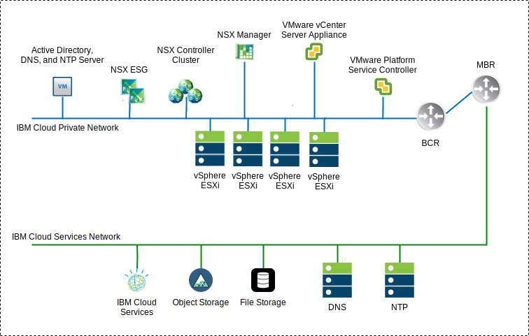
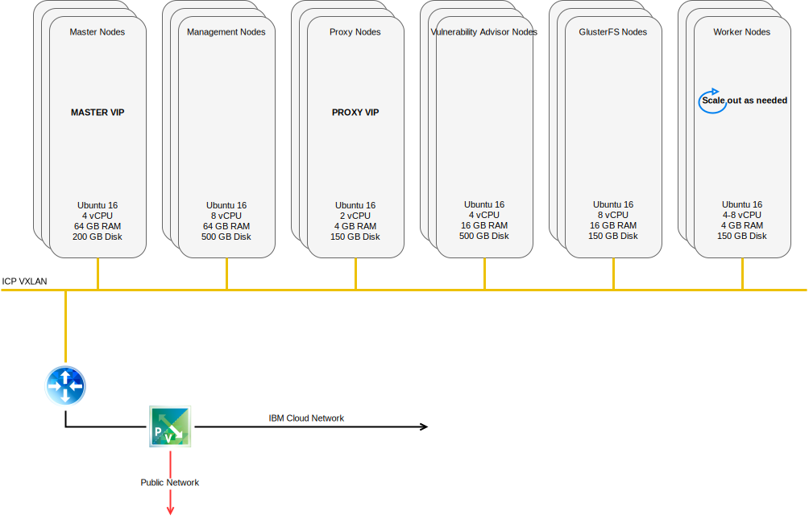

---

copyright:

  years:  2016, 2019

lastupdated: "2019-01-23"

---

# Solution components

## VMware vCenter Server on IBM Cloud components

Figure 1. vCenter Server environment diagram

### Platform Service Controller

The vCenter Server deployment uses a single, external platform services controller
installed on a portable subnet in the private VLAN associated with
management virtual machines (VMs). Its default gateway is set to the backend
customer router (BCR).

### vCenter Server

Like the platform services controller, the vCenter Server is deployed as
an appliance. Additionally, the vCenter Server is installed on a
portable subnet on the private VLAN associated with management virtual
machines. Its default gateway is set to the IP address assigned on the
BCR for that particular subnet.

### NSX Manager

The NSX Manager is deployed on the initial cluster. Additionally, the
NSX Manager is assigned a VLAN–backed IP address from the private
portable address block that is designated for management components and
configured with the DNS and NTP servers

### NSX Controllers

The {{site.data.keyword.cloud}} automation deploys three NSX Controllers within the
initial cluster. The controllers are assigned a VLAN–backed IP address
from the private portable subnet that is designated for management components.

### NSX Edge and Distributed Logical Router

NSX Edge Services Gateway (ESG) pairs are deployed. In all cases, one gateway pair is used for outbound traffic from automation components that reside on the private network. For vCenter Server and {{site.data.keyword.icpfull_notm}}, a second gateway that is known as the icp–managed edge, is deployed and configured with an uplink to the public network and an interface that is assigned to the private network. The administrator can configure any required NSX component such as Distributed Logical Router (DLR), logical switches, and firewalls.

For more information about the network design, see [vCenter Server Networking reference architecture](/docs/services/vmwaresolutions/archiref/vcsnsxt/vcsnsxt-intro.html).

The following table summarizes the {{site.data.keyword.icpfull_notm}} ESG and DLR specifications.

Table 1. {{site.data.keyword.icpfull_notm}} ESG specifications

Attribute | Specification
--|--
Edge Service Gateway | Virtual appliance
Edge size    Large | Number of vCPUs    2
Memory    | 1 GB
Disk    | 1000 GB on local datastore

Table 2. {{site.data.keyword.icpfull_notm}} DLR specifications

Attribute | Specification
--|--|
Distributed Logical Router |     Virtual appliance
Edge size    Compact | Number of vCPUs    1
Memory    | 512 MB
Disk    | 1000 GB on local datastore

## IBM Cloud Private components

{{site.data.keyword.icpfull_notm}} is an application platform for developing and managing
on-premises, containerized applications. {{site.data.keyword.icpfull_notm}} is an integrated environment
for managing containers that includes the container orchestrator
Kubernetes, a private image repository, a management console, and
monitoring frameworks.

Figure 2. Virtual {{site.data.keyword.icpfull_notm}} deployment with vCenter Server

### Boot node

A boot or bootstrap node (optional) is used for running installation,
configuration, node scaling, and cluster updates. Only one boot node is
required for any cluster. Use a single node for both master and
boot.

### Master node

A master node provides management services and controls the worker nodes
in a cluster. Master nodes host processes that are responsible for
resource allocation, state maintenance, scheduling, and monitoring.
Because a high availability (HA) environment has more than one master
node, if the leading master node fails, failover logic automatically
promotes a different node to the master role. Hosts that can act as the
master are called master candidates.

### Worker node

A worker node is a node that provides a containerized environment for
running tasks. As demands increase, more worker nodes can easily be
added to your cluster to improve performance and efficiency. A cluster
can have any number of worker nodes, but at least one worker node
is required.

### Proxy node

A proxy node is a node that transmits external request to the services
created inside your cluster. Because a high availability (HA)
environment has more than one proxy node, if the leading proxy node
fails, failover logic automatically promotes a different node to the
proxy role. While you can use a single node as both master and proxy, it's best to use dedicated proxy nodes to reduce the load on the master
node. A cluster must have at least one proxy node if load balancing
is required inside the cluster.

### Management node

A management node is an optional node that hosts management
services such as monitoring, metering, and logging. By configuring
dedicated management nodes, you can prevent the master node from
becoming overloaded. You can enable the management node only during {{site.data.keyword.icpfull_notm}} installation.

### Vulnerability Advisor node

A Vulnerability Advisor (VA) node is an optional node that is used for
running the Vulnerability Advisor services. Vulnerability Advisor
services are resource-intensive. If you use the Vulnerability Advisor
service, specify a dedicated VA node.

The following table provides the VM specifications that are required for a Highly Available {{site.data.keyword.icpfull_notm}}
instance.

Table 3. {{site.data.keyword.icpfull_notm}} VM specifications

Node |     Instances    | IP    | CPU    | RAM (GB)    | DISK (GB)
:-----|------------:|:----|----:|----------:|----------:|
Master|    3    | IP (x3) VIP (x1)    | 4    | 64    | 200
Management    |3    | IP (x3)    |8    |64    |500
Proxy    | 3    | IP (x3)VIP (x1)    |2    |4    |150
Vulnerability Advisor    |3    | IP (x3)    | 4    | 16    |500
GlusterFS    | 3    | IP (x3)    |8    |16    |150
Worker    | 3-6    | IP (x3)    |4-8    |4    |150

CAM requires worker nodes to have a higher vCPU and memory
configuration.

Table 4. {{site.data.keyword.icpfull_notm}} VM specifications

Node |     Instances    | IP    | CPU    | RAM (GB)    | DISK (GB)
:-----|------------:|:----|----:|----------:|----------:|
Worker  |  3 | IP (x3)  |  4-8 |16-20   |  150

## IBM Cloud Automation Manager components

{{site.data.keyword.cloud_notm}} Automation Manager (CAM) is a multi-cloud, self-service
management platform that runs on {{site.data.keyword.icpfull_notm}} that helps Developers and
administrators to meet business demands.

Figure 3. CAM component reference

### CAM proxy

Provides a nginx proxy access into CAM.

### CAM user interface

The CAM user interface components are split across more than one container: cloud
connections user interface, Library of Templates user interface and deployed instances user interface.

### CAM API

The CAM APIs are split across more than one container.

### Helm

A container with the required binary files to deploy helm charts into
Kubernetes clusters.

### Terraform

A container with the required binary files to deploy Terraform resources
across more than one cloud.

### Logs

The location for the container logs.

### Mongo database

The Core database for the CAM Application.

### Redis

The Redis database is used to store session caching and locks within
CAM.

### Template Designer

A graphical user interface to create Terraform templates, with a feature to drag Terraform modules.

### Maria database

The database for the template designer application.

## Related Links

* [vCenter Server on {{site.data.keyword.cloud_notm}} with Hybridity Bundle overview](/docs/services/vmwaresolutions/archiref/vcs/vcs-hybridity-intro.html)
