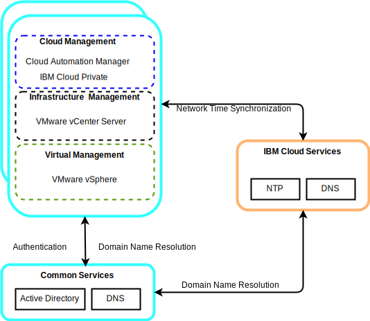

---

copyright:

  years:  2016, 2019

lastupdated: "2019-02-15"

---

# Common services components for VMware and Skate Advisor Concept Car
{: #vcscar-commonservices}

Common services provide the services that are used by other services in the cloud management platform. Common services include identity and access services, domain name services, and NTP services.

Figure 1. {{site.data.keyword.icpfull_notm}} common services

## Identity and access services
{: #vcscar-commonservices-identity}

As part of the VMware vCenter Server on {{site.data.keyword.cloud_notm}} automation, a Microsoft Active Directory (AD) is employed for Identity  Management. A single AD virtual server instance
(VSI) is deployed. The vCenter is configured to use AD authentication and you can configure {{site.data.keyword.icpfull_notm}} as well for LDAP authentication.

## Domain Name Services
{: #vcscar-commonservices-dns}

The deployment uses the deployed AD VSIs as Domain Name System (DNS) servers for the instance. All deployed components are configured to point to the AD as their default DNS. Deployed components examples include vCenter, PSC, NSX, and ESXi hosts.

## Network Time Protocol services
{: #vcscar-commonservices-ntp}

The vCenter Server deployment uses the {{site.data.keyword.cloud_notm}} infrastructure Network Time Protocol (NTP) servers. All deployed components are configured to use these NTP servers. Having all components that use the same NTP servers is critical for certificates and AD authentication to function correctly.

## Related links
{: #vcscar-commonservices-related}

* [vCenter Server on {{site.data.keyword.cloud_notm}} with Hybridity Bundle overview](/docs/services/vmwaresolutions/archiref/vcs/vcs-hybridity-intro.html)
