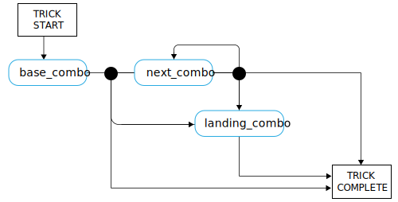

---

copyright:

  years:  2016, 2019

lastupdated: "2019-06-26"

subcollection: vmware-solutions


---

# Skateboarding language concepts
{: #vcscar-concepts}

## Skater language
{: #vcscar-concepts-skater}

A key aspect of the Skate Advisor is the conversations possible with the Watson driven chatbot. The following section details the conversational rules that define a human interaction with the Skate Advisor Chatbot.

The Skater Language is the core of the system and is used in the following manner:
* Trick recognition: Used by Watson Discovery to ingest material from online sources so it can recognize existing tricks and map to source material.
* Skate conversations: Used by the chatbot to have meaningful conversations with the system user.
* Trick classification: Store and classify a trick based on the textual description of the trick. Metadata, such as location and video references, can be attached to tricks that are classified.

## Language elements
{: #vcscar-concepts-lang-elem}

### Core elements
{: #vcscar-concepts-core-elem}

The following are the core language elements for constructing a Trick.

Table 1. Core language elements

Element Type | Language text
---|---|---
Direction | fakie<br>nollie<br>switch
Rotation | halfcab<br>cab<br>180<br>360<br>540
Base | kickflip<br>heelflip<br>hardflip<br>bigspin<br>shuvit<br>impossible
landing | manual (back two wheels)<br>nosemanual (front two wheels)<br>5-0 (grind)<br>nosegrind<br>tailslide<br>noseslide<br>crooked grind<br>smithgrind<br>boardslide<br>lipslide<br>

### Element modifiers
{: #vcscar-concepts-elem-modifiers}

Element modifiers are special language elements that give context to certain aspects of the language.

Table 2. Language modifiers

Element Type | Language Text |Notices
---|---|---
Turn Prefix | Frontside<br>backside | The Turn Prefix relates to the direction of a turn
Varial | Inward<br>outward |

## Language rules
{: #vcscar-concepts-lang-rules}

The following ruleset constructs the language. Tricks are divided into one or more combinations of elements that are referred to as a “Combo”. There's a difference between the first Combo and the following Combos in the sense that the direction is assumed to be the same as in the base Combo unless otherwise specified.

For the following rules, see the Core Elements and Element Modifiers as a reference as they're used to construct the language.

### Trick ruleset
{: #vcscar-concepts-trick-ruleset}

```
base_combo = 'direction \+ \[varial | turn_prefix\] \+ \[rotation\] \+ \[base_trick\]'
next_combo = ''\[varial | turn_prefix\] \+ \[rotation\] \+ \[base_trick\]'
landing_combo = ''\[varial | turn_prefix\] \+ landing'
trick = 'combo \+ \[“to” + combo\] \+ \[“to” \+ landing_combo\]'
```

### Trick rule engine
{: #vcscar-concepts-trick-rule-engine}

The following diagram is a visual summary of the rule engine.

{: caption="Figure 1. Skate language overview" caption-side="bottom"}

## Sample trick language
{: #vcscar-concepts-sample-trick}

The following example is a list of sample tricks:

```
fakie-kickflip
fakie-kickflip to fakie-5-0 to fronside-halfcab (out)
fakie-heeflip
fakie-heeflip to fakie-maual to fakie-hardflip
fakie-inward (varial) heeflip to fakie-backside tailslide to fakie
switch-heeflip to fakie-maual to fakie-hardflip
switch-hardflip to fakie-manual
fakie-hardflp to fakie-nosegrind
nollie-hardflip-to-tailslide
nollie-inward-heelflip to frontside noseslide
kickflip-frontside to crooked grind
halfcab-heelflip to crooked grind
frontside-shuvit to nosegrind to nollie-flip (out)
kickflip to nosegrind to nollie-impossilbe (out)
nollie-kickflip to noseslide to nollieflip
nollie-kickflip to frontside-lipslide
nollie-impossible to manual
nollie-impossible to 5-0
nollie-kickflip to crooked grind
nollie-kickflip to crooked grind to nollie-halfcab-kickflip (out)
frontside-nollie-halfcab-heelflip to fakie-nosegrind
backside-nollie-halfcab-kickflip to backside-tailslide to backside-180-out
frontside-nollie-cab-kicflip halfcab to backside-smithgrind
halfcab to backside-smithgrind to backside-180-bigspin (out)
kickflip-backside-tailslide to backside-180-kickflip
kickflip-backside-tailslide to backside-backside-bigspin
360-kicflip to nosemanual to nollie-360-kickflip
360-kicflip to frontside-lipslide
harflip to backside-lipslide
kicflip to frontside-boardslidev
nollie-heelflip to frontside-boardslide
```

## Relevance
{: #vcscar-concepts-relevance}

The Trick Language is the key construct that is used to train Watson to recognize and ingest skating documents and media and also forms the basis of conversations with the user.

## Related links
{: #vcscar-concepts-related}

* [vCenter Server on {{site.data.keyword.cloud}} with Hybridity Bundle overview](/docs/services/vmwaresolutions/archiref/vcs?topic=vmware-solutions-vcs-hybridity-intro)  
