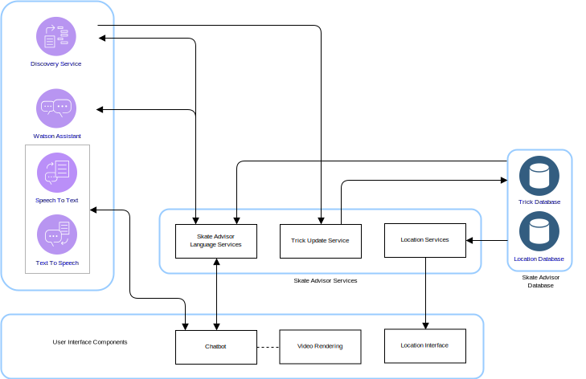
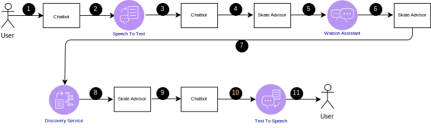
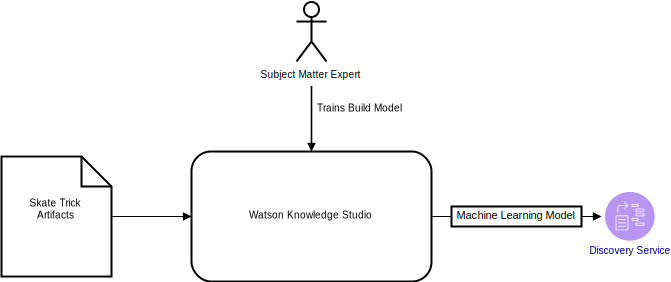

---

copyright:

  years:  2016, 2019

lastupdated: "2019-03-19"

subcollection: vmware-solutions

---

# Skate Advisor logical design
{: #vcscar-logical}

The following information details those application elements that form the logical design of the system.

## System components
{: #vcscar-logical-sys-comp}

Figure 1. Skate Advisor components

The Skate Advisor consists primarily of a chatbot that can either accept text or speech recognition to interact with the system in a structured manner.

## Tricks
{: #vcscar-logical-tricks}

The core data element of the Skate Advisor is the trick. The trick language uniquely defines a trick. This language can be used to accomplish the following tasks:
- Converse with the chatbot about tricks.
- Search for tricks via Watson Discovery.
- Identify and classify tricks when training Watson Discovery from source articles.
- Identify a trick for location and media display purposes.

### Trick definition
{: #vcscar-logical-trick-def}

A trick is uniquely defined by the language constructs that describe it. See the Trick Rule Engine for a complete definition.

### List of tricks
{: #vcscar-logical-list-tricks}

A list of tricks is returned by a query of the Base trick or Landing that is defined in language elements.

### Trick data
{: #vcscar-logical-trick-data}

After they're returned, tricks can have the following information:
- Trick description
- One or more media artifacts
- Location information

## Conversational streams
{: #vcscar-logical-conv-streams}

The chatbot has a pre-defined and limited number of possible conversations. The conversations are defined by the following information:
- Trick Finding: Find a set of valid tricks based on a query parameter that represents either the Base Trick or the Landing.
- Location Finding: Find a nearby location for a trick.
- Media Display: Display a media item, such as an online video from which a trick has been classified and found.

Table 1. Conversation

Conversation | Structure | Result
---|---|---
Trick Finding | Describe a trick |A list of tricks
Location Finding | Where should I perform this trick? | List of locations for a specific trick
Media Display | Display a trick video |A list of media results

## User interface components
{: #vcscar-logical-ui-comp}

### Chatbot
{: #vcscar-logical-chatbot}

The chatbot is a web component that converses with the user. The chatbot can either accept text or speech. Results such as lists are rendered in text with a possible accompanying speech to represent the results.

Chatbots interact with the system in the following manner:

Figure 2. Typical chatbot query 

Table 2. Chatbot interactions

Step | Description
---|---
1 | Initiate a valid conversation, see the section on Conversation Streams.
2 | Chatbot sends Speech to the Speech to Text service.
3 | Speech to Text service sends Text to the Chatbot.
4 | Chatbot sends Text Query to the Skate Advisor.
5 | The Skate Advisor evaluates the request and sends to Watson Assistant.
6 | Watson Assistant classifies the request and replies to the Skate Advisor with the action to take.
7 | Skate advisor requests a data set from the Discovery Service.
8 | Discovery Service evaluates the query and sends the response.
9 |Skate Advisor forms a response and sends to the Chatbot in text.
10 | Chatbot sends the text reply to the Text To Speech service.
11 | Result is sent to the user via the Chatbot.

### Video rendering
{: #vcscar-logical-video-render}

The video rendering component plays a video or displays a document. These artifacts represent the source artifact from which the trick was discovered.

The video rendering component is an embedded widget in the web interface that displays a video. The videos are displayed in the chatbot as the result of a query from the system user. The resulting video link, after selected, triggers the video rending.

### Location interface
{: #vcscar-logical-location-interface}

Skate Advisor includes an interface for system users to record the location of a specific trick. The web interface component has two main elements:
1. Accept a location from the system user as the best place to perform a specific trick.
2. Display one or more locations that are recommended for a specific trick.

## Watson components
{: #vcscar-logical-watson-comp}

The following Watson components are included in this architecture.
* Knowledge Studio - Watson Studio is a tool by which we can design the Skate Language for the system and use this language to recognize documents from the web that implement the Skate Language. Knowledge Studio provides a model for the Watson Discovery to use.
* Speech to Text - Transcribes Speech to Text. This component accepts audio from a device where the chatbot is running and converts it to text for Watson to process.
* Text to Speech - Synthesize text to speech. This component accepts text from the Skate Advisor application and converts it to speech for the device, where the chatbot is running, to play.
* Discovery Service - The Watson Discovery Service is used by the system to retrieve Skate-related content that matches the requested parameters. An example might be, “List all records for the Casper Trick”. Watson Discovery uses advanced machine learning techniques to surface the most relevant passages from the ingested content.
* Watson Assistant - Watson Assistant is a tool to design the interactions between users and the machine (chatbot). It must be trained with a domain-specific language, for example skateboarding, in the form of a series of grammars for which the Assistant recognizes and builds the appropriate responses.

## Skate Advisor services
{: #vcscar-logical-skate-advisor-services}

The Skate Advisor Service is an application component that provides a set of API services to render requests. The services that are exposed have a direct correlation to the conversational streams described previously. The
API exposed has the following general categories:
* get_tricks - Return a list of tricks based on a <query\> in natural language, which is presented to the Discovery Service.
* show_tricks - Return a list of media for a specific trick.
* find_trick - Return a specific trick.
* accept_command - Accept a textual command from the Chatbot and service the request.

## Discovery service training
{: #vcscar-logical-disc-service-training}

Watson Discovery must be trained via a machine learning model, which is created in an iterative fashion by a subject matter expert by using the Watson Knowledge Studio.

Figure 3. Discovery service training 

For Skate Advisor, the model consists of the relationship between entity types with a combination of rule-based training and dictionary-based training to create a model. This model allows the Discovery Service to recognize and classify tricks that are ingested from articles and video descriptions that are used as the training set.

After trained, the Discovery Service can respond to queries such as:
- Show me all tricks with base trick of heelflip.
- Show me all tricks.
- Show me all tricks with multiple combos.

## Related links
{: #vcscar-logical-related}

* [vCenter Server on {{site.data.keyword.cloud}} with Hybridity Bundle overview](/docs/services/vmwaresolutions/archiref/vcs?topic=vmware-solutions-vcs-hybridity-intro)
