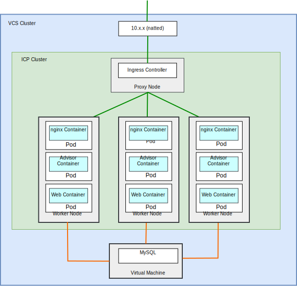
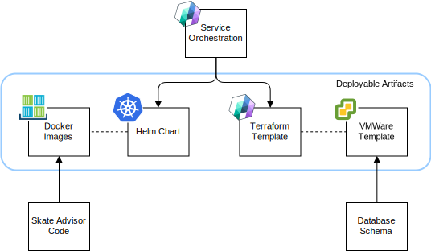
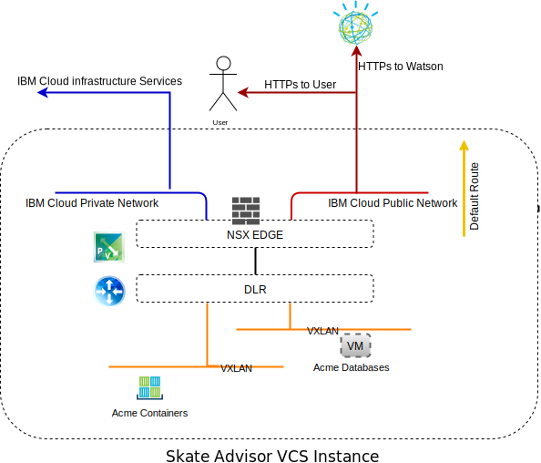
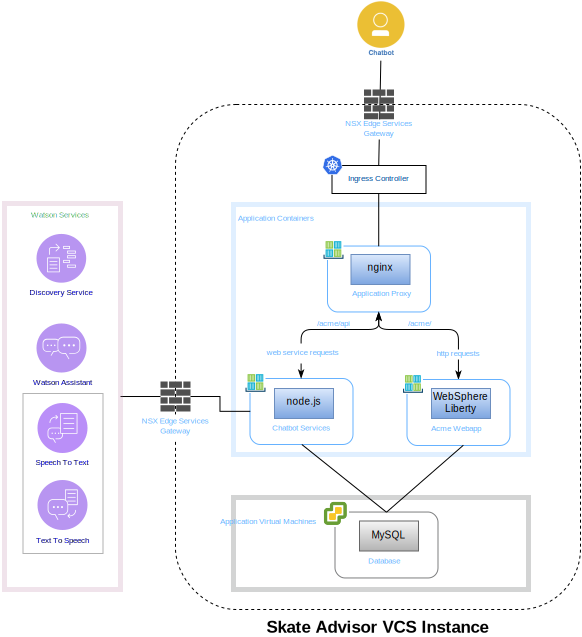
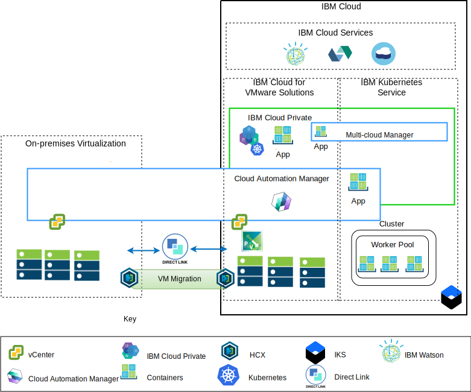

---

copyright:

  years:  2016, 2019

lastupdated: "2019-01-23"

---

# Skate Advisor components

{{site.data.keyword.vmwaresolutions_full}} provides automation to deploy VMware
technology components in {{site.data.keyword.CloudDataCents_notm}} across the globe. The
architecture consists of a single cloud region and supports the ability
to extend into more cloud regions that are located in one of the following options:

1. Another geography.
2. Another {{site.data.keyword.cloud_notm}} pod within the same data center.
3. Another geography and another {{site.data.keyword.cloud_notm}} pod within the same data center.

The {{site.data.keyword.icpfull_notm}} and Cloud Automation Manager (CAM) products
can be manually deployed into your on-premises virtualization platform,
enabling cloud management from on-premises locations. Alternatively, {{site.data.keyword.icpfull_notm}}
and CAM are offered as service extensions to an existing or new VMware
vCenter Server on {{site.data.keyword.cloud_notm}} deployment, via automation, enabling
cloud management from {{site.data.keyword.cloud_notm}}.

{{site.data.keyword.icpfull_notm}} is an application platform for developing and managing on-premises,
containerized applications. It's an integrated environment for managing
containers that includes the container orchestrator Kubernetes, a
private image repository, a management console, and monitoring
frameworks.

IBM Multi-cluster Manager provides user visibility, application-centric
management (policy, deployments, health, operations), and policy-based
compliance across clouds and clusters. With IBM Multi-Cluster Manager,
you have control of your Kubernetes clusters. You can ensure that your
clusters are secure, operating efficiently, and delivering the service
levels that applications expect.

{{site.data.keyword.cloud_notm}} Automation Manager is a multi-cloud, self-service management
platform that runs on {{site.data.keyword.cloud_notm}} Private that allows Developers and
administrators to meet business demands. Cloud Automation Manager
Service Composer enables you to expose hybrid cloud services in the {{site.data.keyword.icpfull_notm}} catalog.

## Skate Advisor physical components

The following diagram describes the reference implementation of the Acme Skate Advisor application in an application modernization infrastructure implementation.

Figure 1. Skate Advisor physical components

The Skate Advisor application extends the existing Acme web application
with a micro-services based component that interacts with Watson and an
nginx container to proxy requests to the web and micro-services
container.

The Skate Advisor application takes advantage of the application
modernization platform that provides the necessary hosting
infrastructure.

### Application packaging and deployment

The application is deployed as a CAM Orchestration which contains the following elements:
* Service Orchestration - A CAM service orchestration is a workflow resource that describes the Terraform templates and Helm charts to deploy as a facet of a service. A service can be published and is the controlling artifact from which the entire deployment is orchestrated.
* Helm Chart - The Helm chart resides in the local {{site.data.keyword.icpfull_notm}} Repository and deploys containers and other resources to {{site.data.keyword.icpfull_notm}}. A Helm chart is a description of Kubernetes resources that include:
  - Container deployments
  - Services
  - Ingress
  - Rules
  - Endpoints

* Docker Images - Docker images contain the operating system (ubuntu), the middleware (WebSphere Liberty, nginx), and the Skate Advisor and Skate Store code. Docker images are static objects that are deployed
into running containers.
* Terraform Template - A Terraform template is a file that describes cloud resources to be deployed. For Skate Advisor, a ubuntu template, which is preinstalled with mysql and the database schema is described.
* VMWare Template - The VMWare template is an Ubuntu template with mysql and the database schema preinstalled.

Figure 2. CAM orchestration

### Load balancing and proxying

Load balancing and proxying are implemented via the {{site.data.keyword.icpfull_notm}} Ingress
Controller component. This component handles the container scaling
and failover in a seamless manner.

Application proxying is provided by the nginx container which load
balances in the following manner.

Table 1. Skate Advisor reverse proxy rules

URL	|EndPoint
---|---
/acme	|Acme Web Container Service
/acme/api	|Skate Advisor Service
/acme/api/explorer	|Skate Advisor Service

Containers have unpredictable IP addresses that might scale in and out as
the system demands. To overcome this issue, the {{site.data.keyword.icpfull_notm}} services are used to
perform real-time IP address resolution within the system.

### Acme skate web application
The Acme Skate web application is a Java Platform, Enterprise Edition (Java Platform, Enterprise Edition) application based on the Spring
Framework. The application is deployed on a WebSphere Liberty container.

### Acme Skate Advisor application
The Acme Skate Advisor application is a micro-service based application that is deployed on a WebSphere Liberty container. An nginx web server provides
a front end to the micro-services.

### Acme Skate database
The Acme Skate database is a MySQL database that is deployed on a
vSphere managed virtual machine.

### Communications overview
The Skate Advisor requires the following communications:
-	From the web container to the system user.
-	From the Advisor and web container to Watson services.
-	Between the container and the virtual machine aspects of the
implementation.

The application modernization platform is designed with the
following components to achieve this goal.

Figure 3. Public network access

{{site.data.keyword.cloud_notm}} has two networks. The public network allows servers to be
reached from the internet and the private network allows servers to
communicate with each other over a high-speed backbone in all {{site.data.keyword.CloudDataCents_notm}}.

The Virtual Routing Appliance (VRA) allows customers to route private
and public network traffic by associating the VLANs with the appliance.
Both the vCenter Server NSX Edge and {{site.data.keyword.containerlong_notm}} infrastructure are configured
with a default route to the public network and with a standard
10.0.0.0/8 route to the private network.

A static route is required on the {{site.data.keyword.containerlong_notm}} infrastructure to the VRA
appliance for any NSX VXLANs defined. From the NSX Edge, we configure
BGP peering with the VRA over the private network, enabling route
advertisement and interjection of the NSX VXLANs. This peering allows the
NSX VXLAN overlay network to communicate with the {{site.data.keyword.cloud_notm}} backbone and
vice versa.

### Software Component Mapping

The Skate Advisor application uses the following software
components.

Figure 4. Skate Advisor software-mapping

The following software components are used:

* nginx	- Provides reverse proxy services to the application.
Micro-services and application requests are distributed to the correct
container endpoints.
* WebSphere Liberty - hosts the Acme application, which is a Spring-based
Java Platform, Enterprise Edition application.
* Node.js - Provides the micro-services framework to the chatbot. This
application uses services from Watson.
* mysql - The application database is provided by Oracle Mysql.
* JavaScript - The chatbot is a JavaScript based
application that is hosted in the client Browser. The chatbot
communicates with Watson via the Node.js based micro-services.

## Management overview

The Acme Skate Advisor resides on the {{site.data.keyword.cloud_notm}} and as such is a
critical aspect of the Architecture. The {{site.data.keyword.cloud_notm}} has the following
architecture.

Figure 5. Cloud management

This diagram represents {{site.data.keyword.icpfull_notm}} and CAM deployed on a vCenter
Server instance, with connections to the on-premises vCenter and the {{site.data.keyword.containerlong_notm}}
service. Using CAM, system administrators and Developers can
deploy virtual machines on-premises or into the vCenter Server instance
and containers to the {{site.data.keyword.icpfull_notm}} and {{site.data.keyword.containerlong_notm}} clusters.

In the diagram, CAM logically creates cloud connections to the vCenters,
cloud providers, and {{site.data.keyword.icpfull_notm}} and {{site.data.keyword.containerlong_notm}} environments. {{site.data.keyword.icpfull_notm}} Clusters are
deployed to each datacenter/cloud environment, with MCM providing the
mechanism to connect the {{site.data.keyword.icpfull_notm}} clusters into a single management view.

### Related links

* [vCenter Server on {{site.data.keyword.cloud_notm}} with Hybridity Bundle overview](/docs/services/vmwaresolutions/archiref/vcs/vcs-hybridity-intro.html)
