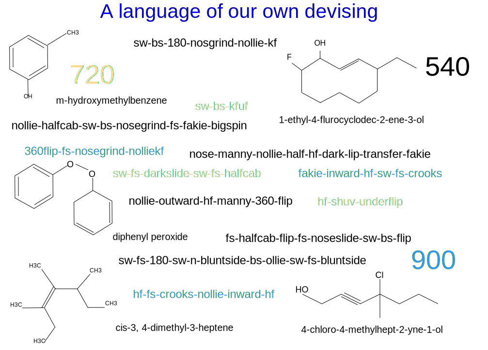

---

copyright:

  years:  2016, 2019

lastupdated: "2019-06-26"

subcollection: vmware-solutions

---

# Preface
{: #vcscar-preface}

{: caption="Figure 1. A language of our own devising" caption-side="bottom"}

## Intro to skateboarding language
{: #vcscar-preface-intro}

The way skate boarders combine movements and submovements into tricks imposes a kind of grammar or syntax that is based on the physics of what’s going on, the nomenclature of chemistry evolved for similar reasons. Today, a skater on one side of the planet can text the name of a trick to another skater on the other side, and its complex movements are understood.

The richness of the language is fed by the complexity of skateboarding itself. Movements of the board are intricate, giving rise to dozens of base tricks that can be done in multiple ways, iterated over several variables, to yield an enormous number of combinations.

A prefix-root-suffix structure to each component dictates how every element or movement catenates, corresponding to real momentum sets of
both the board and its rider. The physical orientation and mechanics of the forces determines what does and doesn’t fit-together, which is what imposes that syntax.

Tricks can be done off the tail of the board or the nose, *Ollie* or *Nollie*, corresponding to the riders’ front or back foot. The board flips, rolls, and tumbles in combinations that are iterated over three axes, in either direction, clockwise or counterclockwise. The rider then pairs movements with the movements of the board, which adds multiple dimensions to the iterations based on direction, rotation, “stance,” and whether turning with or against the flip of the board.

These last two variables deserve a little more explanation. First, *stance* is easily confused with linear directionality. Skaters all have a native stance, either left or right foot forward; thus, doing a trick *switch* (switch-stance) means it’s the mirror image of it, akin to a switch-hitter in baseball. The backward direction is incidental; the primary distinction is one of handedness or “footedness”. Thus, any trick done *switch* deserves far more credit not because it’s backwards, but because all the motor functions are reversed to your weaker side or “wrong” foot. To simply do a trick backwards or “fakie” is simply putting a minus-sign on direction and involves all the same motor functions, which are only marginally harder.

The second subtlety that is so important to higher-level skaters applies to an *inward* or *outward* flip, depending on how the board flips and rotates (2-axes), relative to the body itself. Flip-tricks roll off either side of the foot from either edge of the board: *kickflips* can roll clockwise off the toe-side, while *heelflips* do just the opposite, flipping either with or against the natural flow of the movement.

Thus, inward flips are so unnatural that they take on a well-deserved separate term, called *hard-flips*. Thus, a *nollie-inward-kickflip* is identical to *nollie-hardflip*, requiring more precision because they’re against the grain.

Therefore, each component of this prefix-root-suffix structure can be broken into three more binary elements of rotation, direction, and stance; some tricks require having to specify whether the flip is inward or outward. Skating would be child’s play were it not for the possibility of combining tricks, which snowballs the number of iterations. Multiple base tricks can be strung together into single clusters that are composed of couplets, triplets, or even more up to five or even six, for top pros.

So far, the number of practical iterations brings us well into the hundreds, which just sets the table for us; the real complexity is seen in *streetskating*, which explodes the number of combinations into the thousands.

Back in the early 90’s, skaters took early flat-ground tricks and projecting them onto the “organic” environment around them: stairs, ledges, handrails, banks, hips, flat-bars, picnic tables, planters; all of it opened up the dimensionality of what defined them. The endless ways that they can combine tricks and terrain into yin-yang couplings kept skaters busy for decades. This also applies to *vert-skating*, exemplified by Tony Hawk in ramps and pools.

While most base tricks have been established over the years, it’s the ability to combine and adapt them that often outshines the native
ability of pros, themselves. This is yet another reason why skating is more of an art than a sport. Individual expression always holds primacy over raw performance. It is also the undergirding engine fueling the artists who created Activision’s wildly successful video game franchise, *Tony Hawk Pro Skater*, which went on for nearly a decade, giving rise to rival games from *Electronic Arts*, as well.

By training Watson Assistant to mimic the thought process of high-level pros, we can provide a powerful tool to advance the creative thinking of any skater, especially at the elite levels. Although the rest of the board-sports are far less complex, it’s a testament to the disproportional influence skateboarding has, in that they adopt our conventions, as well. Thus the Watson Assistant has the potential to not only aid, if not transform, the creative expression of this newly adopted Olympic sport, but to influence other artistic endeavors, as well.

## Codification of the language
{: #vcscar-preface-codification}

As with any language, ours was developed over time, picking up new words and usage, rendering occasional redundancies and exceptions along the way. That said, this nomenclature is remarkably consistent, durable, and specific. It is this denotative rigor and consistency that converts the seemingly insurmountable problem of converting footage to text by machine learning. For skaters, every nuance of the complex movement is built into the nomenclature itself. In fact, this language is so robust that it was adopted by not only snow boarders, but surfers, too.

Yet for all this complexity and power, the language codification is straightforward and concise. Every *base trick* has a *directional* and *rotational* component, along with a *landing* one, which determines whether and how it catenates with the next base trick to form combinations, these are the four *core elements*. Two more *modifiers* are tacked-on: one *turn prefix* to orient rider rotation (clock- or counterclockwise), while the other *varial* component to specify how the board rotates, relative to the body (inward or outward). Using this codification, a concise ruleset can be applied recursively to allow for combinations of any length.

## Additional environmental variables
{: #vcscar-preface-env-var}

Today’s pros often spend as much effort looking for spots as they do practicing the tricks. Indeed, part of what distinguishes any skater is creative ability to adapt tricks to new and imaginative ways, which often take the skater all over the world. While there are skate applications that catalog spots, which are fed by the community, never has there been the idea or technology to create an application that has the capacity to aid any skater, especially pros, in this creative process.

This reference architecture demonstrates how Watson and the cloud use the enormous online presence of skaters on YouTube, Google Images, online magazines (Thrasher, Transworld), skater, and video game forums, and most importantly, the endless stream of tricks each day on social media of the newest tricks from around the world, especially on Instagram. Beyond that, there are no translational issues; this is an international language, akin to a computer language or mathematics, where the same names and conventions are used seamlessly, across the world.

The Watson Knowledge Studio updates the Discovery Service with trick descriptions, media artifacts, location (spot) information and more, based a specific skater’s queries. The chatbot has a finite number of conversations that stem from any trick, based on both creative and pragmatic lines of reasoning of seasoned pro skaters. Thus, the Assistant can reply with the nearest or best spot (location) to do a specific trick or reply with a broader range of terrain for not only that trick, but others that are done with the same root (that is, variations).

For example, a skater can ask Watson Assistant to list all possible variations of a *hardflip-to-backside-5-0*. This request is converted from speech to text into the Discovery Service, which replies with not only *hardflip-to-grind* variations, but a list of the various terrains that the variations capture, thus conducive to more, which can include a list of handrails to be clustered by local postal code, by size, or even availability, such as at a school yard or business. Systems are within existing application data that rate the risk of being caught for trespassing. Such assistance has enormous impact upon the cascading consequences of variables such as these, which help the creative lives of all pro skaters.

## The Cloud platform
{: #vcscar-preface-cloud-platform}

The creative layering of IT systems to generate new combinations speaks to the heart of skateboarding. It has the power to ripple into the lives of creatives to inspire innovation, across the globe, wherever we go. None of this would be achieved without the {{site.data.keyword.cloud}}.

## Related links
{: #vcscar-preface-related}

* [vCenter Server on {{site.data.keyword.cloud_notm}} with Hybridity Bundle overview](/docs/services/vmwaresolutions/archiref/vcs?topic=vmware-solutions-vcs-hybridity-intro)
