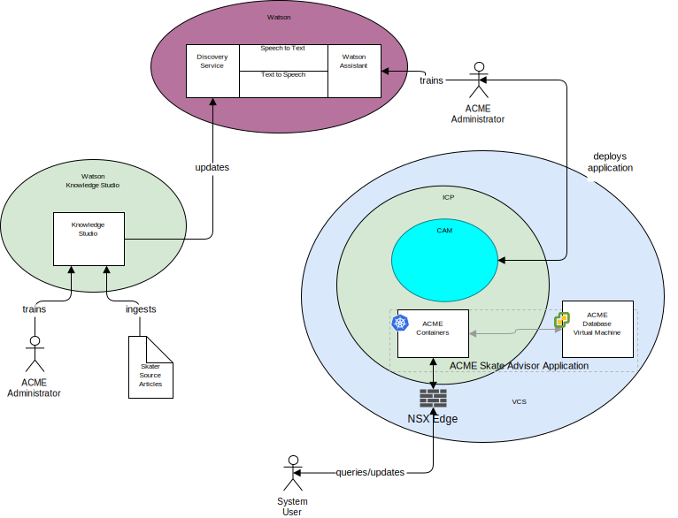

---

copyright:

  years:  2016, 2018

lastupdated: "2018-11-20"

---

## System context
The following diagram shows the system context for this reference
architecture. A system context diagram is a diagram that defines the key
elements of a system, the boundary of the system, the entities that
interact with it along with the interaction. It's a high-level diagram
that provides the reader with an initial view of the system.

Figure 1. System context

The following are the core components of system context:
-	vCenter Server – VMware vCenter Server on {{site.data.keyword.cloud_notm}} is an {{site.data.keyword.cloud_notm}} for VMware
Services instance that is the target for migrated virtual machines (VMs) from the
on-premises environment. Together with the on-premises Virtualization it
is a hybrid environment and allow VMs to move from one environment
to the other.
-	{{site.data.keyword.cloud_notm}} Private - ICP is an application platform for
developing and managing containerized applications. The ICP environment is an integrated
environment that includes the container orchestrator Kubernetes, a
private image repository, a management console, monitoring frameworks
and a graphical user interface, which provides a centralized location
from where you can deploy, manage, monitor, and scale applications.
-	{{site.data.keyword.cloud_notm}} Automation Manager – CAM is an enterprise-ready
infrastructure as code platform that provides a single pane of glass to
provision VM-based workloads alongside Kubernetes based workloads, the
automation of workloads provisioning, whether VM or containers and
their infrastructure prerequisites.
-	Watson – Watson is IBM’s artificial intelligence and cognitive solutions platform.
-	Watson Knowledge Studio - Watson Knowledge Studio provides a model for the
Watson Discovery to use.

### Actors
The system context diagram identifies the following actors:

* Acme administrator -The administrator is responsible for the
ongoing deployment and maintenance of the application, including the
following ongoing tasks:
 - Train the chatbot
 - Train the discovery service.
* System user - The system user is the user of the
system. The user communicates with the system via a browser of
browser capable device.

### Systems
The system context diagram identifies the following systems:
* Knowledge Studio - Watson Studio is a tool that is used to design the
skate language for the system and use this language to recognize
documents from the web which implement the skate language.
* Speech to Text - Transcribes speech to text. This component accepts
audio from a device where the chatbot is running and converts it to text
for Watson to process.
* Text to Speech - Synthesize text to speech. This component
accepts text from the Skate Advisor application and converts it to
speech for the device, where the chatbot is running, to play.
* Discovery Service - The Watson Discovery Service is used by the
system to retrieve Skate Records that match the requested parameters. An
example might be, “List all records for the Casper Trick”.\ Watson
Assistant - The Watson Discovery Service is used by the system to
retrieve skate-related content that matches the requested parameters. An
example might be, “List all records for the Casper Trick”. Watson
Discovery uses advanced machine learning techniques to surface the most
relevant passages from the ingested content.  
* Database - The Acme Skate Advisor database is hosted on a virtual
machine that is managed by vCenter Server.
* Application Containers - The applications that went through the application modernization journey and are now running as containers. For this reference architecture and in this example for Acme Skateboards, one of the containerized apps is a web server that is part of the online presence workload. The ACME containers host the Acme web application and the Acme Skate Advisor application.
* NSX Edge - NSX edges are virtual appliances that manage north-south traffic into and out of the vCenter Server instance.

## Related links

* [vCenter Server on {{site.data.keyword.cloud_notm}} with Hybridity Bundle overview](../vcs/vcs-hybridity-intro.html)
