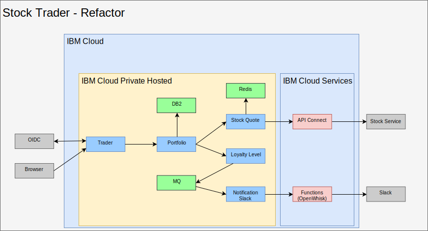
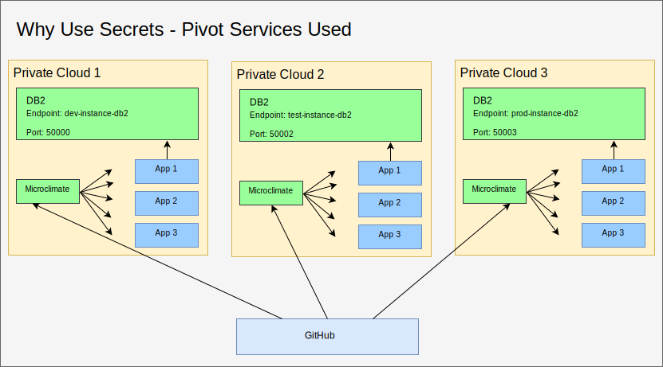
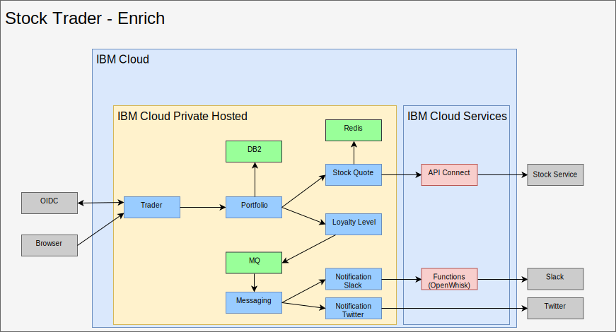

---

copyright:

  years:  2016, 2018

lastupdated: "2018-11-01"

---

# Refactor and add middleware into IBM Cloud Private

Now that Stock Trader is running in a container, and Jane is satisfied
with the current micro-services, she and Todd work on how to enhance the
application with extra capabilities. By refactoring Stock Trader
micro-services to handle increased activity and scalability, they both
see the need to add middleware into {{site.data.keyword.cloud}} Private. Some of the
middleware existed in their data center, so it becomes more of a
replatform exercise with some new middleware added.

Figure 1. Refactoring of Stock Trader

This refactoring of the solution brings a common platform to run the application
and the required services, thus bringing in a simpler management
plane.

## Content choices

{{site.data.keyword.cloud_notm}} Private has a broad selection of content, and both Todd and
Jane need to decide which will best suit their needs. As Todd sees in
the {{site.data.keyword.cloud_notm}} Private catalog, most of this is available for him to try
out, but some content requires purchase and download from
Passport Advantage.

* Toolchain & Runtimes
  -	UrbanCode Deploy
  -	Microclimate
  -	Jenkins (open source)
  -	IBM WebSphere Liberty (MicroProfile, web Profile, JEE Profile)
  -	Open Liberty (open source)
  -	Node.js runtime (open source)
  -	Swift runtime (open source)
  - nginx (open source)
  -	IBM WebSphere Application Server for ICP VM Quickstarter Community ed.

* Integration
  -	IBM Integration Bus
  -	IBM Integration Bus for Developers
  -	IBM DataPower Gateway Virtual Edition
  -	IBM DataPower Gateway for Developers
  -	IBM API Connect Professional
  -	IBM API Connect Enterprise
  -	IBM App Connect Enterprise Developer Edition
  -	IBM App Connect Enterprise 11.0.0

* Data Science and Business Analytics
  -	IBM Data Science Experience Local
  -	IBM Data Science Experience Developer Edition
  -	IBM Watson Explorer Deep Analytics Edition
  -	IBM PowerAI (ILAN Licensed, support offering available)
  - IBM PowerAI Vision

* Data Governance and Integration
  -	IBM InfoSphere Information Server for evaluation
  Mobile
  -	IBM Mobile Foundation

* Connectivity
  -	IBM Voice Gateway Developer Trial

* App Modernization Tooling
  -	IBM Transformation Advisor

* Messaging
  -	IBM MQ Advanced
  -	IBM MQ Advanced for Developers
  -	Rabbit MQ (open source)
  -	IBM Event Streams Tech Preview (Based on Apache Kafka)

* Digital Business Automation
  -	IBM Operational Decision Manager
  -	IBM Operational Decision Manager for Developers
  -	IBM FileNet Content Manager 5.5
  -	IBM Content Foundation 5.5

* Data Services
  -	IBM DB2 Direct Advanced Edition / AESE with Data Server Manager
  -	IBM Db2 Dev-C
  -	IBM Data Server Manager (for Db2 Dev-C)
  -	IBM Db2 Warehouse Enterprise
  - IBM Db2 Warehouse Dev-C
  -	IBM Cloudant Developer Edition
  -	MongoDB (open source)
  -	PostgreSQL (open source)
  -	MariaDB (open source)
  -	Galera clustering with MariaDB (open source)
  -	Redis (open source)

* HPC / HPDA
  -	IBM Spectrum LSF Community Edition
  -	IBM Spectrum Symphony Community Edition
  -	IBM Spectrum Conductor Tech Preview

* Multi-cloud Management
  -	{{site.data.keyword.cloud_notm}} Automation Manager

* Watson
  -	IBM Watson Compare & Comply: Element Classification
  -	Compliance Assist

* Management
  -	IBM Netcool - integration (Probe for ICP Services – Logging events and
Monitoring alerts)
  - {{site.data.keyword.cloud_notm}} App Management 2018.2.0
  -	IBM Netcool - integration (Probe to manage ICP Events. Sold with IBM
Netcool Insights product)
  - {{site.data.keyword.cloud_notm}} Event Management for IBM
Cloud Private (ILAN licensed for discovery and try from catalog)
  - IBM Operations Analytics Predictive Insights Mediation Pack (Manage
ICP monitoring metrics. ILAN Licensed for discovery and try from
catalog)  -	IBM Operations Analytics Predictive Insights Mediation Pack
(Sold with Predictive Insights product)

* Networking
  -	F5 BIGIP Controller (open source)
  -	Calico BGP-Peer (open source)
  -	strongSwan IPSec VPN (open source)

* Storage
  -	IBM PowerVC FlexVolume Driver (open source and supported by
PowerVC product)
  - GlusterFS storage cluster with Heketi lifecycle management (open
source)
  -	Container Storage Interface (CSI) sample NFS
  -	driver (open source)
  -	Rook Ceph Cluster (open source)

* Tooling
  -	Web Terminal (open source)
  -	Skydive – network analyzer (open source)

For Stock Trader, based on Jane’s solution architecture, he is going to start with [Db2](https://console.bluemix.net/catalog/services/db2-hosted), [MQ](https://console.bluemix.net/catalog/services/mq), and [Redis](https://console.bluemix.net/catalog/services/databases-for-redis).

## Add middleware

To add middleware into {{site.data.keyword.cloud_notm}} Private, find the [helm chart](https://github.com/IBM/charts/blob/master/stable/ibm-microclimate/README.md) in the catalog, read the readme file, then proceed to install.

For Stock Trader, Todd decided to add all of the middleware. The following information summarizes what Todd had to perform for each middleware he wanted Jane to use.

### 	Db2
Todd starts with Db2 because they are already using Db2 and can
dedicate a container-based Db2 for each solution.

Since Todd prepared ICP, he already has his pod security policy defined. Todd can focus on creating a docker image pull secret:

`kubectl create secret docker-registry db2dockerregistry
--docker-username=dockeruser
--docker-password=XXXXXXXX-XXXX-XXXX-XXXX-XXXXXXXXX
--docker-email=dockeruser@email.com --namespace=default`

Finally, since he decided to use NFS, he created NFS volumes based on
the readme file requirements:

Go to ICP dashboard and create Persistent Volume. How large? Look in the
readme file to find out:

`capacity=20Gi
RWO
type=NFS
server = nfs.server.ip.address
path = /shared/db2trader1`

In the catalog user interface, search for “Db2” and click ibm-db2oldp-dev
Review the readme file then click Configure.

In the Configure section, there is a Quick Start section and an All
Parameters section. Open the All Parameters since Todd needs to enter
additional configuration:

*	Release name = db2trader1
*	namespace = default
*	agree to license
*	database name = trader
*	secret name = db2dockerregistry
*	service name = db2trader1-ibm-db2oltp-dev
*	service type = NodePort
*	Port = 50000
*	db2 instance name = db2inst1
*	pw for db2 instance name = xxxxxx
*	Yes (check) Enable persistence for this deployment

Once Db2 is running, Todd (or Jane) needs to create the tables that the
Stock Trader solution uses.

### MQ

Todd and Jane need messaging software, and since they already use MQ,
this is a great option. Also, it can run in a small footprint, and
the dev version can be spun up for each developer, saving precious
Production traffic. Installing MQ is fairly simple. Todd creates the
storage just like he did with Db2, and then installs the helm chart:

ICP Dashboard > Catalog > start to type in MQ > select
ibm-mqadvanced-server-dev Review the readme file then click Configure
Provide or verify the following input values:

`release name = mqtrader1
target namespace = stock-trader
accept license
enable persistence
data PVC size = 2Gi
Service type = NodePort
Queue manager name = stocktrader
Admin pw = mq1pw
App password = LEAVE BLANK`

Note that initially Todd is selecting NodePort so he can get at the
middleware from the user interface, but eventually, he can use ClusterIP so only
pods inside the cluster can get to the middleware.

To configure MQ to use Stock Trader, Todd will open the MQ Managemnet
user interface, which is the exact same as the VM version.

### 	Redis

Even though Stock Trader is running on {{site.data.keyword.cloud_notm}} Private Hosted, they
are still worried about the stock quote service latency, when all they
really care about is the end of previous day stock for most of their
work. To help improve performance, they are going to add a Redis cache.

This deployment will use the ibm-redis-ha-dev chart from ibm-charts.

By default, this chart installs six pods: one master, two slaves and three sentinels. This is a great example of resilience in Kubernetes where
multiple pods can work together across many worker nodes, even when the
worker nodes are in multiple subnets.

The configuration is quite simple, so Todd enters which namespace to
install it into, and performs the installation.

## Refactor Stock Trader

This is an important step for Jane. While Todd was busy adding the
middleware into {{site.data.keyword.cloud_notm}} Private, Jane refactored her solution
to optimized it for Kubernetes and cloud behaviors.

For example, when Jane transformed Stock Trader, she took the .war
files and added each one into a Liberty container but used the WebSphere Application Server Network Deployment
configuration to point to the data source. It was a
good start and her application gets value out of Kubernetes scheduling and
orchestration immediately.

There are many
other benefits from optimizing her micro-services (recode
and build) for the Kubernetes world.

To optimize, Jane took the following steps:
-	Updated her code in her code repo (she used GitHub Enterprise)
-	Added a pipeline (she used Jenkins)
-	Built by using Maven

Here is an example of her [code
repository](https://github.com/IBMStockTrader/), along with the
Jenkins file, server.xml, and so on. With this in place, she can freely code
extra capabilities via secrets to access services like ODM and
Watson, along with more micro-services as individual repositories
in GitHub.

### Add Secrets

Now that Jane has refactored the Stock Trader micro-services, she
requires a way to abstract the service names, user IDs, and passwords, so
her application can pick up unique details about the service when it is deployed
without hardcoding specific names and rebuilding the application.

Using Kubernetes secrets, she configures a well-defined secret name
and parameters within each secret, so that when her micro-service is
deployed it will pick up the unique host name, user ID, password, or
any other sensitive credentials, making her application portable.

Jane wants a unified code base, even when Stock Trader might run on
multiple clouds. The secret DB2 in the following figure has different
routing details but in the same format. When her portfolio micro-service
is deployed, it looks for the DB2 secret endpoint parameter to connect
to the appropriate Db2 instance. The Stock Trader application doesn't really
care if is running in a VMware virtual machine, a containerized service
or as a Cloud-managed service.

Figure 2. Stock Trader - pivot services

## Result

As a result of Jane committing to refactoring her Stock Trader solution,
and Todd installing middleware into {{site.data.keyword.cloud_notm}} Private Hosted, all of the
core Stock Trader solution is running in a private cloud. She now can
add more micro-services such a Twitter notification service. Istio
routing rules enable dynamic loyalty level messaging via an internal
Slack channel or a public Twitter channel.

Figure 3. Enrichment of Stock Trader

### Related links

* [VCS Hybridity Bundle overview](../vcs/vcs-hybridity-intro.html)
