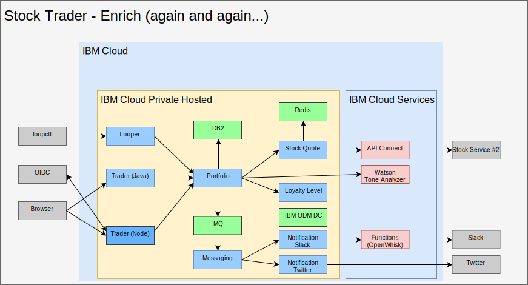

---

copyright:

  years:  2016, 2019

lastupdated: "2019-08-05"

subcollection: vmware-solutions

---

# Enrich with AI, analytics, and other public cloud services
{: #vcscontent-aianalytics}

Enriching Stock Trader is not a one-time step. For Todd and Jane, it is an iterative process. In the following figure, you see that Jane added the Watson Tone Analyzer service and a loyalty level rule by using ODM decision center. The following items highlight how Stock Trader was enriched.

{: caption="Figure 1. Further enrichment of Stock Trader" caption-side="bottom"}

## AI Watson Tone Analyzer
{: #vcscontent-aianalytics-ai-watson}

The following sample is a simple way to enrich an application, but is deceptively powerful. Jane browses the [{{site.data.keyword.cloud}} catalog](https://cloud.ibm.com/catalog) for [AI](https://cloud.ibm.com/catalog?category=ai) and [Analytics](https://cloud.ibm.com/catalog?category=analytics) services, and finds the catalog rich with content.

Jane selects [Tone Analyzer](https://cloud.ibm.com/catalog/services/tone-analyzer), opting for the Standard plan, and then is provided credentials to call.

Jane refactored Stock Trader and just creates a Kubernetes secret for Tone Analyzer. That way, even if Jane changes plans or regions, it isn't necessary to rebuild the code.

Thanks to refactoring, Jane experimented with various user interface frameworks without disrupting the user experience. As a result, the new user interface is available to use and to help understand the tone of the user feedback.

In the future, Jane can provide predictive stock recommendations based on the variety of analytics services available to run in the private cloud instance, {{site.data.keyword.cloud_notm}} Private.

## Loyalty Level business rule
{: #vcscontent-aianalytics-loyalty-rule}

Originally, Jane had logic in her code to determine what monetary amount that is likely to result in a bump in loyalty. However, after repeated requests to change the range from the Stock Trader marketing director, Jane decided to offload that decision into a business rule that the marketing director might alter without Jane’s involvement.

Jane talked to Todd, who added the [service](https://cloud.ibm.com/catalog/services/decision-optimization), then created the decision.

Now, Margaret, the marketing director, can log in and change the loyalty level ranges whenever a campaign is going on without changing any code.

## New Stock Service
{: #vcscontent-aianalytics-new-stock-service}

You might notice that the stock service was changed.
This can happen when a public service changes owner or its API structure. Thankfully, Jane used [API Connect](https://cloud.ibm.com/catalog/services/api-connect).
Originally, she used API Connect to simplify the response from the original stock service since it was a bit cumbersome to receive and format the data she wanted from the raw API she was given.

Now, Jane is delighted because when she changed the stock service, she just changed how it maps to the simplified API she created, and her code didn’t even have to restart. The Stock Trader solution just kept requesting the data from the same API as if it hadn't changed. All API changes were masked behind the scenes.

Further, with the monitoring and metering in API Connect, Jane is able to track who is using her simplified API.
