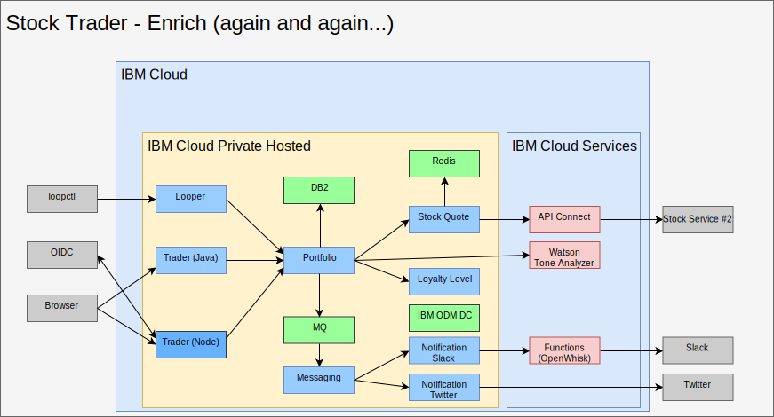

---

copyright:

  years:  2016, 2018

lastupdated: "2018-11-01"

---

# Enrich with AI, analytics, and other public cloud services

Enriching Stock Trader is not a one-time step. For Todd and Jane, it is an iterative process. In the following figure, you see that Jane added the Watson Tone Analyzer service, as well as a loyalty level rule by using ODM decision center. Here are some highlights as to how Stock Trader was enriched.

Figure 1. Further enrichment of Stock Trader

## AI - Watson Tone Analyzer

This is a simple way to enrich an application, but it is deceptively powerful. Jane browses the [{{site.data.keyword.cloud}} catalog](https://console.bluemix.net/catalog/) for [AI](https://console.bluemix.net/catalog/?category=ai) and [Analytics](https://console.bluemix.net/catalog/?category=analytics) services, and finds the catalog rich with content.

She selects [Tone Analyzer](https://console.bluemix.net/catalog/services/tone-analyzer), opting for the Standard plan, and then is provided credentials to call.
Since she has refactored Stock Trader, she just creates a Kubernetes secret for Tone Analyzer. That way, even if she changes plans or regions, it isn't necessary to rebuild her code.

Thanks to refactoring, she was able to experiment with various user interface frameworks without disrupting the user experience. As a result, she can try out her fancy new user interface and understand the tone of the user feedback.

In the future, she can provide predictive stock recommendations based on the variety of analytics services she can run in her private cloud instance, {{site.data.keyword.cloud_notm}} Private, or access from her public cloud instance (depending on the sensitivity of the data she will use).

## Loyalty Level business rule

Originally, Jane had logic in her code to determine what monetary amount
should result in a bump in loyalty. However, after repeated requests to
change the range from the Stock Trader marketing director, she decided
to offload that decision into a business rule that the marketing
director could alter without Jane’s involvement.

She talked to Todd, who added the
[service](https://console.bluemix.net/catalog/services/decision-optimization), then she created the decision.

Now, Margaret, the marketing director, can log in and change the loyalty level ranges whenever a campaign is going on without changing any code.

## New Stock Service

Last, but not least, you may notice that the stock service was changed.
This can happen when a public service changes owner or its API
structure. Thankfully, Jane had been using [API
Connect](https://console.bluemix.net/catalog/services/api-connect).
Originally, she used API Connect to simplify the response from the
original stock service since it was a bit cumbersome to receive and
format the data she wanted from the raw API she was given.

Now, she is delighted because when she changed which stock service she
used, she just changed how it mapped to the simplified API she created,
and her code didn’t even have to restart. The Stock Trader solution just
kept requesting the data from the same API as if it hadn't changed. All
API changes were masked behind the scenes.

Further, with the monitoring and metering in API Connect, she is able to
track who is using her simplified API.

### Related links

* [VCS Hybridity Bundle overview](../vcs/vcs-hybridity-intro.html)
