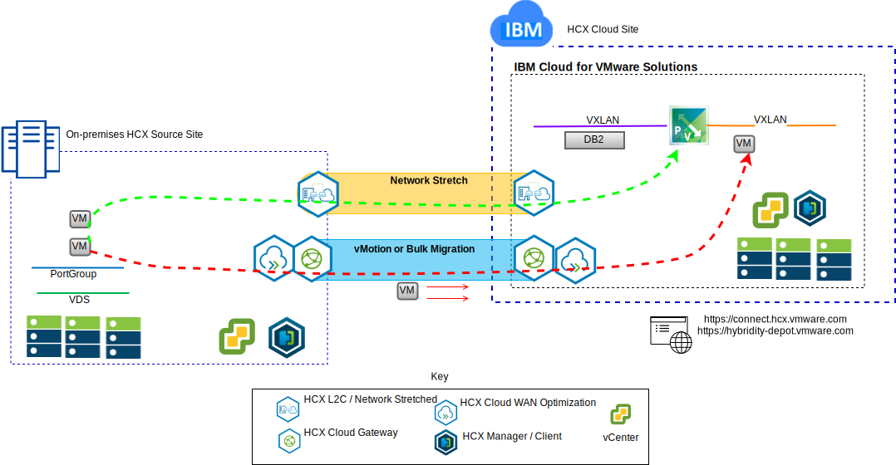

---

copyright:

  years:  2016, 2019

lastupdated: "2019-02-15"

subcollection: vmware-solutions

---

# Lift and shift Stock Trader VMs into IBM Cloud
{: #vcscontent-hcx}

Todd wants to seamlessly extend their on-premises VMware SDDC instance
into a VMware vCenter Server on {{site.data.keyword.cloud}} for the first step in their
modernization journey. The business must remain up and running
and the downtime must keep to a minimum.

The VMware vCenter Server on {{site.data.keyword.cloud_notm}} with Hybridity Bundle enables the creation of a seamless
connection between vCenter Server instances and an
on-premises VMware virtualized datacenter.

The vCenter Server with Hybridity Bundle components, which are deployed
as virtual machines in the {{site.data.keyword.cloud_notm}} VMware target site enable the
establishment of a connection with the HCX components that are installed to
the peer on-premises source site.

Figure 1. vCenter Server with Hybridity Bundle

Hybridity creates a loosely coupled interconnection between on-premises
and {{site.data.keyword.cloud_notm}} and enables the following capabilities:

* Simple interconnectivity – logical network connections are established
easily over any physical connection that includes the public internet, private
VPN, or direct link.
* Layer 2 extension – on-premises networks are extended into the cloud and includes on-premises subnets and IP addressing.
* Encryption – network traffic is securely encrypted between the two
sides.
* Optimized network – selects the best connection and efficiently floods
the connection so that network traffic is moved as fast as possible.
* Data deduplication – as much as 50% reduction in network traffic can
be achieved.
* Intelligent routing – when a workload is moved, proximity routing can
change the network gateway so that network traffic uses the
target site gateway and doesn't hairpin back to the originating site.
* Zero downtime migration – a running system can be moved to (or back
from) the cloud by using vMotion.
* Scheduled migration – any number of virtual machines can be replicated
to the destination site and then activated on that site at a designated
time, replacing the systems that are running on the originating site.
* Migration of security policies – if NSX is used on-premises any
security policies, firewalls, and other security items are moved along with the workload.

Todd is able to migrate Stock Trader from their
on-premises VMware environment to the VMware on {{site.data.keyword.cloud_notm}} environment and meets their requirements of little to no downtime and no
application reconfiguration.

## Related links
{: #vcscontent-hcx-related}

* [vCenter Server on {{site.data.keyword.cloud_notm}} with Hybridity Bundle overview](/docs/services/vmwaresolutions/archiref/vcs?topic=vmware-solutions-vcs-hybridity-intro)
