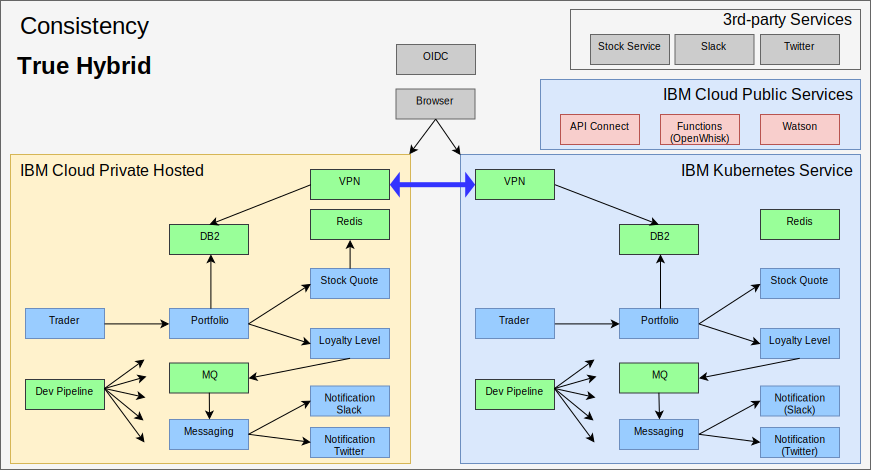

---

copyright:

  years:  2016, 2018

lastupdated: "2018-11-01"

---

# True hybrid with IBM Cloud Kubernetes Service

As Jane’s test team expands, she wanted to provide a test environment
that would run major portions of her application and still use the data she has
in her environment. Further, she wants her test team to focus on testing
her application and not managing the Kubernetes cluster. Therefore, she and Todd
stand up an [{{site.data.keyword.cloud}} Kubernetes
Service](https://www.ibm.com/cloud/container-service) instance and she
deploys Stock Trader, without code changes, into it.

Todd then adds the strongSwan VPN to connect between the private
networks of each cluster.

Figure 1. Stock Trader as a true hybrid application

## Related links

* [VCS Hybridity Bundle overview](../vcs/vcs-hybridity-intro.html)
