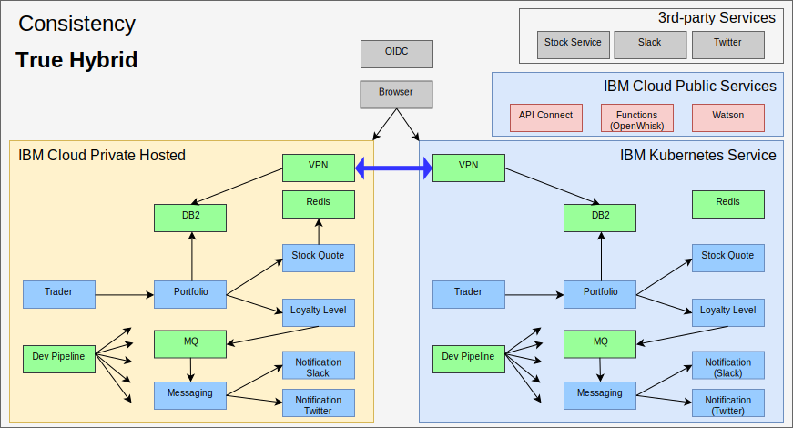

---

copyright:

  years:  2016, 2019

lastupdated: "2019-11-25"

subcollection: vmware-solutions

---

# True hybrid with IBM Cloud Kubernetes Service
{: #vcscontent-iks}

As Jane’s test team expands, she wanted to provide a test environment that would run major portions of her application and still use the data she has
in her environment. Jane wants her test team to focus on testing her application and not managing the Kubernetes cluster. Jane and Todd decide to stand up an [{{site.data.keyword.cloud}} Kubernetes Service](https://www.ibm.com/cloud/container-service/) instance and Jane deploys Stock Trader, without code changes, into it.

Todd then adds the strongSwan VPN to connect between the private networks of each cluster.

{: caption="Figure 1. Stock Trader as a true hybrid application" caption-side="bottom"}

**Next topic:** [Stock Trader summary](/docs/services/vmwaresolutions?topic=vmware-solutions-vcscontent-summary)
