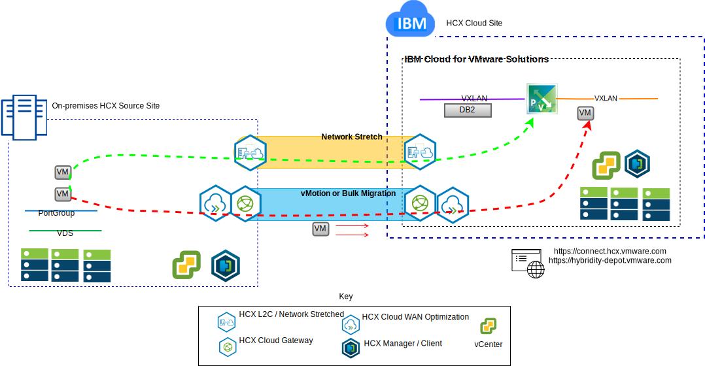

---

copyright:

  years:  2016, 2019

lastupdated: "2019-02-16"

---

# VMware Hybrid Cloud Services introduction
{: #vcshcx-intro}

VMware Hybrid Cloud Services (HCX), allows disparate instances of vSphere software defined data centers (SDDC) to interoperate across various network types. These include LAN or WAN whether or not secured on public internet. HCX is designed to address the security, compatibility, complexity, and performance concerns one would encounter in trying to achieve a multi-instance, multi-site, deployment of vSphere extending across on-premises and cloud provider boundaries.

Figure 1. VMware Hybrid Cloud Services

As such, HCX is the preferred method for interoperation between the fully automated vSphere offerings within {{site.data.keyword.cloud}} and any other deployed instance of vSphere. HCX is now a fully integrated offering within the {{site.data.keyword.vmwaresolutions_short}}.

This guide is intended for the deployment and operations of HCX including best practices and troubleshooting as currently accepted and understood. As HCX is developed by using the agile development methodology, do not use this guide as the de facto source of supported versions or supported platforms.

## Related links
{: #vcshcx-intro-related}

* [vCenter Server on {{site.data.keyword.cloud_notm}} with Hybridity Bundle overview](/docs/services/vmwaresolutions/archiref/vcs?topic=vmware-solutions-vcs-hybridity-intro)   
