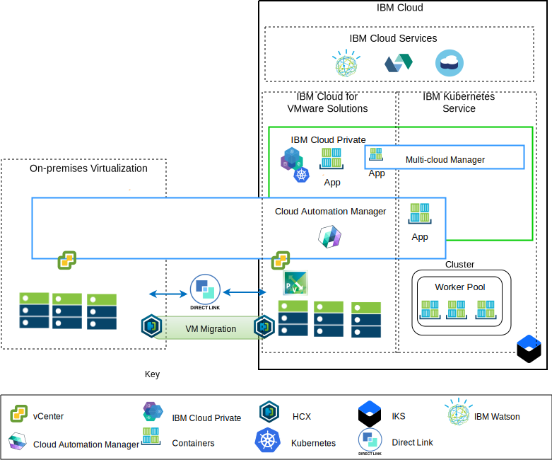

---

copyright:

  years:  2016, 2019

lastupdated: "2019-02-15"

---

# Application modernization overview
{: #vcsicp-appmod}

The following diagram shows the application modernization reference architecture that Acme Skateboards deploys. The architecture is described in depth in this series of documents.

Figure 1. Architecture overview diagram

This hybrid architecture allows Acme Skateboards to achieve the following goals:
- Migrate VMware virtual machines (VMs) from on-premises to {{site.data.keyword.cloud}} with little or no downtime and no application reconfiguration.
- Enable the beginning of the application modernization journey by allowing focus on containerizing the simpler web interfaces and middleware while allowing more complex databases to remain as VMs.
- Use {{site.data.keyword.cloud_notm}} Automation Manager (CAM) to script infrastructure as code (IaC) to compose and orchestrate services that are made from both VMs and containers to integrate with their DevOps toolchains and their ITSM solution.

The reference architecture has the following key components:
- **On-premises virtualization** – A VMware cluster that currently hosts the Acme Skateboards VMs. These VMs currently host the applications to be modernized. This cluster is required to meet the prerequisites of the [VMware HCX on {{site.data.keyword.cloud_notm}} Solution Architecture](https://www.ibm.com/cloud/garage/files/HCX_Architecture_Design.pdf) architecture so that it can run HCX. HCX extends the on-premises networks into the {{site.data.keyword.cloud_notm}} allowing customers to migrate VMs into the VMware vCenter Server on {{site.data.keyword.cloud_notm}} instance that is running on {{site.data.keyword.cloud_notm}}, and back if required.

- **{{site.data.keyword.vmwaresolutions_short}}** – The vCenter Server instance provides the fundamental VMware building blocks, such as vSphere, vCenter Server, NSX-V, and storage options that include vSAN or {{site.data.keyword.cloud_notm}} Endurance storage, needed to automatically deploy a VMware Software Defined Data Center (SDDC) solution. The VMware cluster is the target for the migrated VMs and some of the modernized applications in containers hosted in {{site.data.keyword.icpfull_notm}}. The following are key components in vCenter Server:
    - **NSX-V** - NSX-V provides the network virtualization layer in VCS that provides a network overlay for Acme Skateboards VMs. NSX-V enables BYOIP and isolates the workload networks from the IBM Cloud networks. NSX-V is programmed by HCX to create the networks that Acme Skateboards extend from on-premises.

    - **NSX-T** - NSX-T provides a common set of tools for network and security management across both containers and VMs. NSX-T is fully compatible with Kubernetes Container Networking Interface (CNI) and integrates with CNI to provide container networking. NSX-T provides the overlay network that the modernized applications use and is replacing Calico, which is used natively by {{site.data.keyword.icpfull_notm}} and {{site.data.keyword.containerlong_notm}}.

- **{{site.data.keyword.icpfull_notm}}** - {{site.data.keyword.icpfull_notm}} is an application platform for developing and managing containerized applications. {{site.data.keyword.icpfull_notm}} is an integrated environment that includes the container orchestrator Kubernetes, a private image repository, a management console, monitoring frameworks and a graphical user interface that provides a centralized location from where Acme Skateboards can deploy, manage, monitor, and scale their applications. The vCenter Server instance hosts the {{site.data.keyword.icpfull_notm}} components, master nodes, worker nodes, running them as VMs. {{site.data.keyword.icpfull_notm}} hosts the following:
    - **{{site.data.keyword.cloud_notm}} Automation Manager** – CAM is an enterprise-ready infrastructure as code (IaC) platform that provides a single pane of glass to provision VM workloads, on-premises or on VCS, alongside Kubernetes workloads, in {{site.data.keyword.icpfull_notm}} or {{site.data.keyword.containerlong_notm}}, by using templates. CAM is a Dockerized application that runs on an {{site.data.keyword.icpfull_notm}} installation and is tightly integrated for authorization, role-based access control (RBAC), and other functions.
    - The containerized Acme Skateboards applications that customers want to deploy in this environment.

- **{{site.data.keyword.containerlong_notm}}** – {{site.data.keyword.containerlong_notm}} enables Acme Skateboards to deploy their modernized applications in Docker containers that run in Kubernetes clusters. The master modes are fully managed by IBM while the worker nodes in the worker pool are deployed into the same {{site.data.keyword.cloud_notm}} account as their vCenter Server instance. Worker nodes can be bare metal, public, or dedicated virtual server instances. Calico is installed and configured automatically in {{site.data.keyword.containerlong_notm}}. Calico provides secure network connectivity for containers and is configured in {{site.data.keyword.containerlong_notm}} to use IP-in-IP encapsulation for packets that are traveling across subnets and to use NAT for outgoing connections from the containers.

- **Direct Link** – {{site.data.keyword.cloud_notm}} Direct Link uses Acme Skateboard’s WAN provider to connect their data center to {{site.data.keyword.cloud_notm}} to provide a reliable, low latency, secure network connection. This connection provides the following:
    - Access to the cloud hosted applications from your Enterprise users.
    - Inter VM traffic between on-premises VMs and cloud VMs.
    - Traffic between heritage systems in the on-premises data center and cloud VMs.

## Key benefits to Acme Skateboards
{: #vcsicp-appmod-benefits}

vCenter Server provides the fundamental building blocks that include VMware vSphere, vCenter Server, NSX, and shared storage options that include vSAN, which is needed to design a VMware Software Defined Data Center (SDDC) flexible solution that best fits your workloads.

In summary, the {{site.data.keyword.vmwaresolutions_short}} offerings provide the following benefits:

* Accelerates delivery of IT projects to Developers and lines of business by reducing the time that it takes for procurement, architecture, implementation, and deployment of resources from weeks or months, to hours.
* Enhances security with dedicated bare metal servers in a hosted private cloud, including private endpoint deployment to {{site.data.keyword.cloud_notm}} services, including {{site.data.keyword.containerlong_notm}} and KMIP.
* Enables consistent management and governance of the deployed hybrid cloud by providing full administrative access to virtualization management, preserving your existing VMware tools, scripts, and investments in training.
* Uses VMware expertise at global scale with IBM Professional and Managed Services spanning 30+ {{site.data.keyword.CloudDataCents_notm}} worldwide.

Customers moving toward cloud native application platforms such as {{site.data.keyword.icpfull_notm}} and {{site.data.keyword.containerlong_notm}} are focused on speed and innovation and don’t always have security and networking in mind. Application time to value decreases if they need to wait until networking or security teams can order services like load balancers, firewalls, switches, and routers.

This reference architecture shows how VCS, {{site.data.keyword.icpfull_notm}}, and {{site.data.keyword.containerlong_notm}} move Acme Skateboards securely along the application modernization journey.

## Related links
{: #vcsicp-appmod-related}

* [vCenter Server on {{site.data.keyword.cloud_notm}} with Hybridity Bundle overview](/docs/services/vmwaresolutions/archiref/vcs?topic=vmware-solutions-vcs-hybridity-intro)
