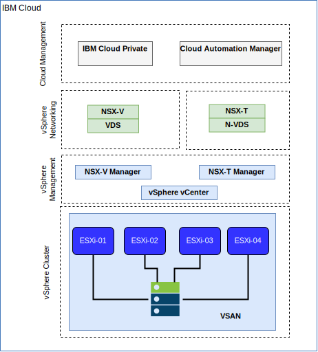

---

copyright:

  years:  2016, 2018

lastupdated: "2018-10-30"

---

# IBM Cloud networking and infrastructure

## Virtual Routing and Forwarding (VRF)

IBM Cloud accounts can also be configured as a VRF account. This provides similar functionality to VLAN spanning, enabling automatic routing between subnet IP blocks. All accounts with Direct-Link connections must be converted to, or created as, a VRF account.

## Direct Link

IBM Cloud Direct Link Connect offers private access to your IBM Cloud infrastructure and to any other clouds linked to your Network Service Provider, through your local IBM Cloud data center. This option is perfect for creating multi-cloud connectivity in a single environment. We connect customers to the IBM Cloud private network, using a shared bandwidth topology. As with all Direct-Link products, you can add global routing, which enables private network traffic to all IBM Cloud locations.

## Virtual private networks

### strongSwan VPN

The strongSwan IPSec VPN service provides a secure end-to-end communication channel over the internet that is based on the industry-standard Internet Protocol Security (IPSec) protocol suite.

### Hybridity (HCX)

The VCS Hybridity Bundle on IBM Cloud service can seamlessly extend the networks of on-premises data centers into IBM Cloud, which allows virtual machines (VMs) to be migrated to and from the IBM Cloud without any conversion or change.

## Physical structure

The physical infrastructure required to deploy an IBM Cloud Private (ICP) production instance onto a VMware vCenter Server on IBM Cloud (VCS) cluster, requires the following minimum specification.

Table 1. VCS specification for ICP

| NFS Deployment  |  vSAN Deployment |
:--|:----:|:----:
Number of Servers  |  3 |  4
CPU | 28 Cores 2.2 GHz | 28 Cores 2.2 GHz
Memory | 384 GB | 384 GB
Storage | 2000 GB 2IOPS/GB Management, 2000-GB 4IOPS/GB Workload, 4000 GB 4IOPS/GB ICP | Min 960-GB SSD x 2

In addition to the IBM Cloud Private hardware requirements, you must create persistent volumes in the ICP environment to store Cloud Automation Manager (CAM) database and log data. While CAM supports all of the persistent volume types that ICP supports, the two recommended storage configurations for CAM are NFS and GlusterFS.

## Virtual structure

Figure 1. Physical structure of VCS and ICP deployment

Within the VCS instance, the ICP instance is deployed with a dedicated NSX Edge Services Gateway (ESG) and Distributed Logical Router (DLR). The ICP installation is loaded into the VXLAN subnet defined in the above components.

The ESG is configured with a source NAT rule (SNAT) to allow outbound traffic, enabling internet connectivity to download the ICP prerequisites and connectivity to GitHub and Docker or a web-proxy can be used to provide the internet connectivity. The ESG is also configured to provide access to DNS and NTP services.

The ESG is also configured with a destination NAT rule (DNAT) to the ICP Master/Proxy virtual IP addresses from the IBM Cloud 10.x network through to the VXLAN environment.

### Related links

* [VCS Hybridity Bundle overview](../vcs/vcs-hybridity-intro.html)
