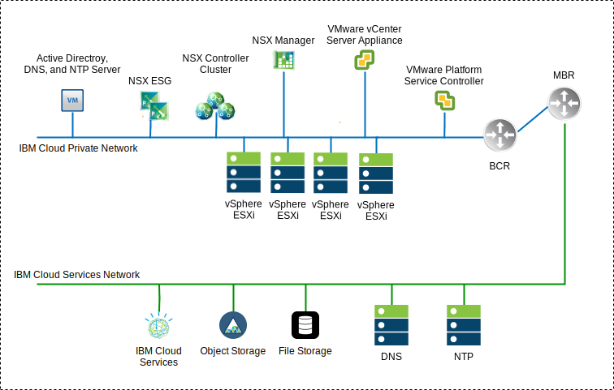
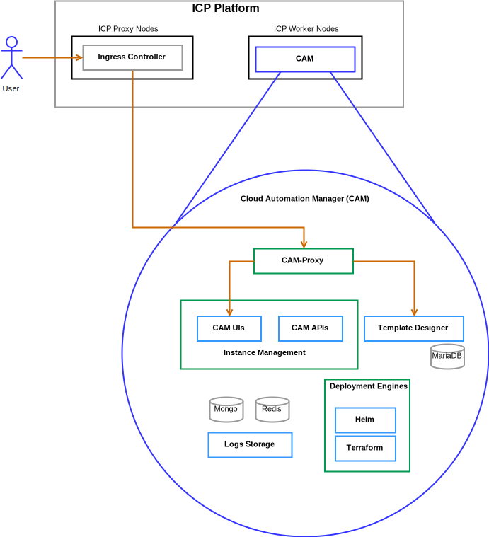

---

copyright:

  years:  2016, 2018

lastupdated: "2018-10-30"

---

# Solution components

## VCS components

Figure 1. VCS environment diagram

### Platform Service Controller

The VCS deployment uses a single, external platform services controller installed on a portable subnet in the private VLAN associated with management virtual machines. Its default gateway is set to the backend customer router (BCR).

### vCenter Server

Like the platform services controller, the vCenter Server is deployed as an appliance. Additionally, the vCenter Server is installed on a portable subnet on the private VLAN associated with management virtual machines. Its default gateway is set to the IP address assigned on the BCR for that particular subnet.

### NSX Manager

The NSX Manager is deployed on the initial cluster. Additionally, the NSX Manager is assigned a VLAN–backed IP address from the private portable address block that is designated for management components and configured with the DNS and NTP servers

### NSX Controllers

The IBM Cloud automation deploys three NSX Controllers within the initial cluster. The controllers are assigned a VLAN–backed IP address from the private portable subnet that is designated for management components.

### NSX Edge / DLR

NSX Edge Services Gateway (ESG) pairs are deployed. In all cases, one gateway pair is used for outbound traffic from automation components that reside on the private network. For vCenter Server and ICP, a second gateway, which is known as the icp–managed edge, is deployed and configured with an uplink to the public network and an interface that is assigned to the private network. Any required NSX component such as Distributed Logical Router (DLR), logical switches, and firewalls can be configured by the administrator. The [vCenter Server networking guide](../vcsnsxt/vcsnsxt-intro.html) provides greater detail on the network design.

The following table summarizes the ICP ESG / DLR specifications.

Table 1. ICP ESG specifications

Attribute  |  Specification
--|--
Edge Service Gateway  |  Virtual appliance
Edge size	Large |   Number of vCPUs	2
Memory	| 1-GB Disk	| 1000 GB on local datastore

Table 2. ICP DLR specifications

Attribute  |  Specification
--|--|
Distributed Logical Router | 	Virtual appliance
Edge size	Compact | Number of vCPUs	1
Memory	| 512-MB Disk	| 1000 GB on local datastore

## ICP components
IBM Cloud Private is an application platform for developing and managing on-premises, containerized applications. It is an integrated environment for managing containers that includes the container orchestrator Kubernetes, a private image repository, a management console, and monitoring frameworks.

Figure 2. Virtual ICP deployment with VCS

###	Boot Node

A boot or bootstrap node (optional) is used for running installation, configuration, node scaling, and cluster updates. Only one boot node is required for any cluster. You can use a single node for both master and boot.

### Master Node

A master node provides management services and controls the worker nodes in a cluster. Master nodes host processes that are responsible for resource allocation, state maintenance, scheduling, and monitoring. Because a high availability (HA) environment contains multiple master nodes, if the leading master node fails, failover logic automatically promotes a different node to the master role. Hosts that can act as the master are called master candidates.

###	Worker Node

A worker node is a node that provides a containerized environment for running tasks. As demands increase, more worker nodes can easily be added to your cluster to improve performance and efficiency. A cluster can contain any number of worker nodes, but a minimum of one worker node is required.

### Proxy Node

A proxy node is a node that transmits external request to the services created inside your cluster. Because a high availability (HA) environment contains multiple proxy nodes, if the leading proxy node fails, failover logic automatically promotes a different node to the proxy role. While you can use a single node as both master and proxy, it is best to use dedicated proxy nodes to reduce the load on the master node. A cluster must contain at least one proxy node if load balancing is required inside the cluster.

### Management Node

A management node is an optional node that hosts only management services such as monitoring, metering, and logging. By configuring dedicated management nodes, you can prevent the master node from becoming overloaded. You can enable the management node only during IBM Cloud Private installation.

###	VA Node

A VA (Vulnerability Advisor) node is an optional node that is used for running the Vulnerability Advisor services. Vulnerability Advisor services are resource-intensive. If you use the Vulnerability Advisor service, specify a dedicated VA node.

Virtual machine specifications required for a Highly Available ICP instance:

Table 3. ICP virtual machine specifications

Node | 	Instances	| IP	| CPU	| RAM (GB)	| DISK (GB)
:-----|------------:|:----|----:|----------:|----------:|
Master|	3	| IP (x3) VIP (x1)	| 4	| 64	| 200
Management	|3	| IP (x3)	|8	|64	|500
Proxy	| 3	| IP (x3)VIP (x1)	|2	|4	|150
Vulnerability Advisor	|3	| IP (x3)	| 4	| 16	|500
GlusterFS	| 3	| IP (x3)	|8	|16	|150
Worker	| 3-6	| IP (x3)	|4-8	|4	|150

CAM requires worker nodes to have a higher vCPU and memory configuration.

Table 4. ICP virtual machine specifications

Node | 	Instances	| IP	| CPU	| RAM (GB)	| DISK (GB)
:-----|------------:|:----|----:|----------:|----------:|
worker  |  3 | IP (x3)  |  4-8 |16-20   |  150

## CAM Components

IBM Cloud Automation Manager (CAM) is a multi-cloud, self-service management platform running on ICP that empowers developers and administrators to meet business demands.

Fig 3. CAM component reference

### CAM Proxy

Provides a nginx proxy access into CAM.

### CAM UI

The UI components are split across multiple containers: cloud connections UI, Library of Templates UI and deployed instances UI.

### CAM API

The CAM APIs are split across multiple containers.

### Helm

A container with the required binaries to deploy helm charts into Kubernetes clusters.

### Terraform

A container with the required binaries to deploy Terraform resources across multiple clouds.

### Logs

The location for the container logs.

### Mongo database

The Core database for the CAM Application.

### Redis

The Redis database is used to store session caching and locks within CAM.

### Template Designer

A graphical user interface to create Terraform templates, with a drag and drop capabilities of Terraform modules.

### Maria DB

The database for the template designer application.

### Related links

* [VCS Hybridity Bundle overview](../vcs/vcs-hybridity-intro.html)
