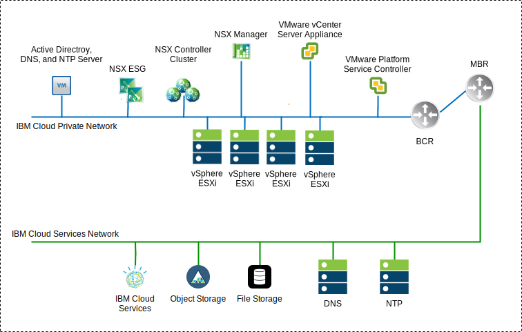
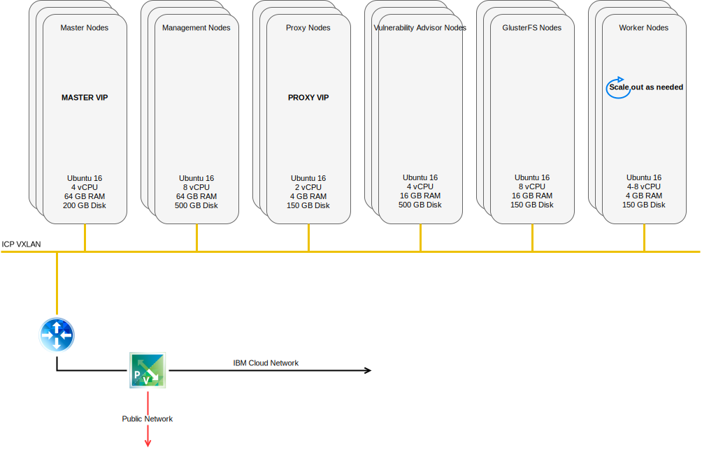
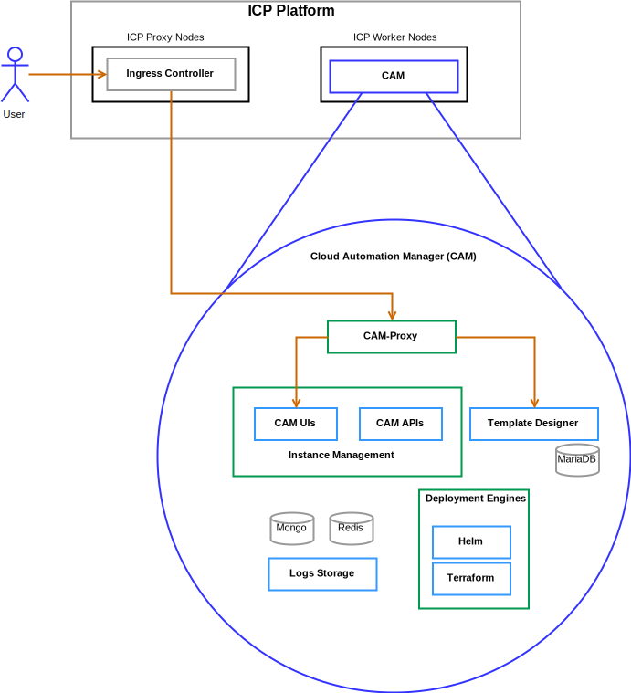

---

copyright:

  years:  2016, 2019

lastupdated: "2019-12-04"

subcollection: vmware-solutions

---

# Solution components
{: #vcsicp-arch-overview-solution}

## VMware vCenter Server components
{: #vcsicp-arch-overview-solution-vcs-comp}

{: caption="Figure 1. vCenter Server environment diagram" caption-side="bottom"}

### Platform Service Controller
{: #vcsicp-arch-overview-solution-psc}

The vCenter Server deployment uses a single, external platform services controller installed on a portable subnet in the private VLAN associated with management virtual machines (VMs). Its default gateway is set to the backend customer router (BCR).

### vCenter Server
{: #vcsicp-arch-overview-solution-vcs}

Like the platform services controller, the vCenter Server is deployed as an appliance. Additionally, the vCenter Server is installed on a portable subnet on the private VLAN associated with management VMs. Its default gateway is set to the IP address assigned on the BCR for that particular subnet.

### NSX Manager
{: #vcsicp-arch-overview-solution-nsx-manager}

The NSX Manager is deployed on the initial cluster. Additionally, the NSX Manager is assigned a VLAN–backed IP address from the private portable address block that is designated for management components and configured with the DNS and NTP servers

### NSX Controllers
{: #vcsicp-arch-overview-solution-nsx-controllers}

The {{site.data.keyword.cloud}} automation deploys three NSX Controllers within the initial cluster. The controllers are assigned a VLAN–backed IP address from the private portable subnet that is designated for management components.

### NSX Edge and Distributed Logical Router (DLR)
{: #vcsicp-arch-overview-solution-nsx-edge}

NSX Edge Services Gateway (ESG) pairs are deployed. In all cases, one gateway pair is used for outbound traffic from automation components that reside on the private network. For vCenter Server and {{site.data.keyword.icpfull_notm}}, a second gateway, which is known as the icp–managed edge, is deployed and configured with an uplink to the public network and an interface that is assigned to the private network. Any required NSX component such as Distributed Logical Router (DLR), logical switches, and firewalls can be configured by the administrator. The [vCenter Server networking guide](/docs/services/vmwaresolutions?topic=vmware-solutions-vcsnsxt-intro) provides greater detail on the network design.

The following table summarizes the {{site.data.keyword.icpfull_notm}} ESG specifications.

| Attribute | Specification |
|:--------- |:------------- |
| Edge Service Gateway | Virtual appliance |
| Edge size	Large | Number of vCPUs	2 |
| Memory | 1-GB Disk 1000 GB on local datastore |
{: caption="Table 1. {{site.data.keyword.icpfull_notm}} ESG specifications" caption-side="bottom"}

The following table summarizes the {{site.data.keyword.icpfull_notm}} DLR specifications.

| Attribute | Specification |
|:--------- |:------------- |
| Distributed Logical Router | Virtual appliance |
| Edge size	Compact | Number of vCPUs	1 |
| Memory	| 512-MB Disk 1000 GB on local datastore |
{: caption="Table 2. {{site.data.keyword.icpfull_notm}} DLR specifications" caption-side="bottom"}

## IBM Cloud Private components
{: #vcsicp-arch-overview-solution-icp-comp}

{{site.data.keyword.icpfull_notm}} is an application platform for developing and managing on-premises, containerized applications. It is an integrated environment for managing containers that includes the container orchestrator Kubernetes, a private image repository, a management console, and monitoring frameworks.

{: caption="Figure 2. Virtual {{site.data.keyword.icpfull_notm}} deployment with vCenter Server" caption-side="bottom"}

###	Boot Node
{: #vcsicp-arch-overview-solution-boot-node}

A boot or bootstrap node (optional) is used for running installation, configuration, node scaling, and cluster updates. Only one boot node is required for any cluster. You can use a single node for both master and boot.

### Master Node
{: #vcsicp-arch-overview-solution-master-node}

A master node provides management services and controls the worker nodes in a cluster. Master nodes host processes that are responsible for resource allocation, state maintenance, scheduling, and monitoring. Because a high availability (HA) environment has more than one master node, if the leading master node fails, failover logic automatically promotes a different node to the master role. Hosts that can act as the master are called master candidates.

###	Worker Node
{: #vcsicp-arch-overview-solution-worker-node}

A worker node is a node that provides a containerized environment for running tasks. As demands increase, more worker nodes can easily be added to your cluster to improve performance and efficiency. A cluster can contain any number of worker nodes, but a minimum of one worker node is required.

### Proxy Node
{: #vcsicp-arch-overview-solution-proxy-node}

A proxy node is a node that transmits external request to the services created inside your cluster. Because a high availability (HA) environment has more than one proxy node, if the leading proxy node fails, failover logic automatically promotes a different node to the proxy role. While you can use a single node as both master and proxy, use dedicated proxy nodes to reduce the load on the master node. A cluster must have at least one proxy node if load balancing is required inside the cluster.

### Management Node
{: #vcsicp-arch-overview-solution-mgmt-node}

A management node is an optional node that hosts only management services such as monitoring, metering, and logging. By configuring dedicated management nodes, you can prevent the master node from becoming overloaded. You can enable the management node only during {{site.data.keyword.icpfull_notm}} installation.

###	Vulnerability Advisor Node
{: #vcsicp-arch-overview-solution-va-node}

A Vulnerability Advisor node is an optional node that is used for running the Vulnerability Advisor services. Vulnerability Advisor services are resource-intensive. If you use the Vulnerability Advisor service, specify a dedicated VA node.

The following VMs specifications are required for a Highly Available {{site.data.keyword.icpfull_notm}} instance.

| Node | Instances | IP	| CPU	| RAM (GB)	| DISK (GB) |
|:---- |:--------- |:-- |:--- |:--------- |:--------- |
| Master | 3	| IP (x3) VIP (x1)	| 4	| 64	| 200 |
| Management	| 3	| IP (x3)	| 8	| 64	| 500 |
| Proxy	| 3	| IP (x3)VIP (x1)	| 2	| 4	| 150 |
| Vulnerability Advisor	| 3	| IP (x3)	| 4	| 16	| 500 |
| GlusterFS	| 3	| IP (x3)	| 8	| 16	| 150 |
| Worker	| 3-6	| IP (x3)	| 4-8	| 4	| 150 |
{: caption="Table 3. {{site.data.keyword.icpfull_notm}} virtual machine specifications" caption-side="bottom"}

CAM requires worker nodes to have a higher vCPU and memory configuration.

| Node | Instances	| IP | CPU	| RAM (GB)	| DISK (GB) |
|:---- |:---------- |:-- |:---- |:--------- |:--------- |
| worker | 3 | IP (x3) | 4-8 | 16-20 | 150 |
{: caption="Table 4. CAM requirements for IBM Cloud Private worker virtual machines" caption-side="bottom"}

## CAM components
{: #vcsicp-arch-overview-solution-cam-comp}

{{site.data.keyword.cloud_notm}} Automation Manager (CAM) is a multi-cloud, self-service management platform that runs on {{site.data.keyword.icpfull_notm}} that empowers Developers and administrators to meet business demands.

{: caption="Figure 3. CAM component reference" caption-side="bottom"}

### CAM proxy
{: #vcsicp-arch-overview-solution-cam-proxy}

Provides a nginx proxy access into CAM.

### CAM user interface
{: #vcsicp-arch-overview-solution-cam-ui}

The user interface components are split across more than one container. The components are included in the cloud connections user interface, the Library of Templates user interface, and the deployed instances user interface.

### CAM API
{: #vcsicp-arch-overview-solution-cam-api}

The CAM APIs are split across more than one container.

### Helm
{: #vcsicp-arch-overview-solution-helm}

A container with the required binary files to deploy helm charts into Kubernetes clusters.

### Terraform
{: #vcsicp-arch-overview-solution-terraform}

A container with the required binary files to deploy Terraform resources across more than one cloud.

### Logs
{: #vcsicp-arch-overview-solution-logs}

The location for the container logs.

### Mongo database
{: #vcsicp-arch-overview-solution-mongo-db}

The Core database for the CAM Application.

### Redis
{: #vcsicp-arch-overview-solution-redis}

The Redis database is used to store session caching and locks within CAM.

### Template Designer
{: #vcsicp-arch-overview-solution-template-designer}

A graphical user interface to create Terraform templates, with a drag feature of Terraform modules.

### Maria database
{: #vcsicp-arch-overview-solution-maria-db}

The database for the template designer application.

**Next topic:** [Detailed design](/docs/services/vmwaresolutions?topic=vmware-solutions-vcsicp-detail-design)
