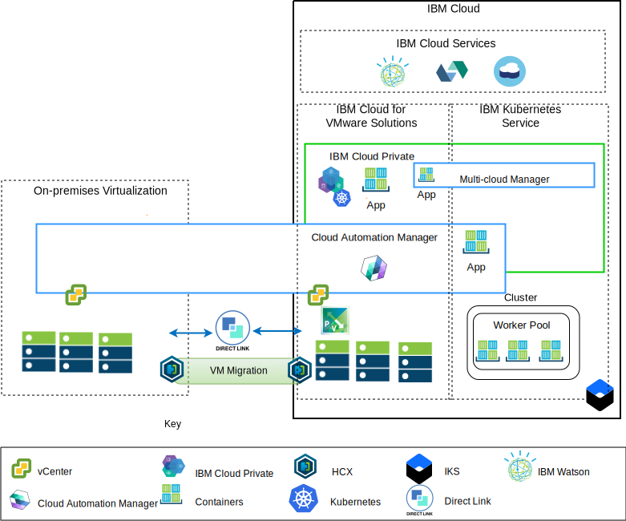
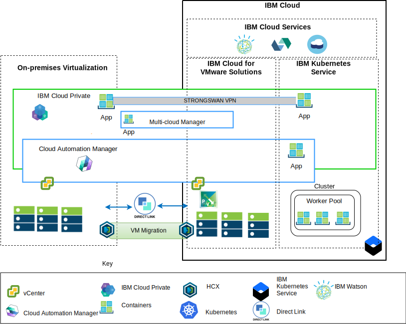

---

copyright:

  years:  2016, 2018

lastupdated: "2018-11-21"

---

# Architecture overview

The {{site.data.keyword.vmwaresolutions_full}} offerings provide automation to deploy VMware technology components in {{site.data.keyword.CloudDataCents_notm}} across the globe.
The architecture consists of a single cloud region and supports the ability to extend into more cloud regions that are located in another geography or into another {{site.data.keyword.cloud_notm}} pod within the same data center.

You can manually deploy the {{site.data.keyword.cloud_notm}} Private (ICP) and Cloud Automation Manager (CAM) products into your on-premises virtualization platform, enabling cloud management from on-premises locations. Alternatively, ICP and CAM are offered as service extensions to an existing or new VMware vCenter Server on {{site.data.keyword.cloud_notm}} deployment, through automation, enabling cloud management from {{site.data.keyword.cloud_notm}}.

ICP is an application platform for developing and managing on-premises, containerized applications. ICP is an integrated environment for managing containers that includes the container orchestrator Kubernetes, a private image repository, a management console, and monitoring frameworks.

IBM Multi-Cluster Manager (MCM) provides user visibility, application-centric management (policy, deployments, health, operations), and policy-based compliance across clouds and clusters. With MCM, you have control of your Kubernetes clusters. You can ensure that your clusters are secure, operating efficiently, and delivering a service management platform that runs on ICP that empowers Developers and administrators to meet business demands.
Use Cloud Automation Manager Service Composer to display hybrid cloud services in the ICP catalog.

## IBM Cloud side cloud management platform

The following diagram is an example of an ICP and CAM deployment with the {{site.data.keyword.cloud_notm}} infrastructure, with connections to the on-premises vCenter and IBM Kubernetes Service (IKS) service deployed on {{site.data.keyword.cloud_notm}}. Users can deploy virtual machines (VMs) on-premises and VMs into a vCenter Server instance, and containers to the ICP and IKS cluster.

Figure 1. Cloud management from cloud side

In the diagram, CAM logically creates cloud connections to the vCenters, cloud providers, ICP, and IKS environments. ICP Clusters must be deployed to each data center cloud environment, with MCM providing the mechanism to connect the ICP clusters into a single management view.

You can deploy ICP with NSX-V or NSX-T components. ICP with NSX-V, enables the ICP VMs to run on the VXLAN network and use Kubernetes Calico internal networking.

ICP with NSX-T, allowing users to control and configure networking, subnet, policies from central UI (NSX-T Manager). See [vCenter Server networking guide](../vcsnsxt/vcsnsxt-intro.html) for the differences between NSX-V and NSX-T.

## On-premise cloud management platform

The following diagram in an example of an ICP and CAM deployment in the on-premises infrastructure, with connections to the vCenter and IKS deployed on {{site.data.keyword.cloud_notm}}. Users can deploy VMs and containers on-premises, VMs into vCenter Server instances, and containers to the IKS cluster.

Figure 2. Cloud management from on-premises side

The strongSwan VPN is used to established connectivity with the deployed IKS containers. The strongSwan VPM might be replaced with Direct link connectivity.

In the diagram, CAM logically creates cloud connections to the vCenters, cloud providers, ICP, and IKS environments. ICP clusters must be deployed to each data center cloud environment, with MCM providing the mechanism to connect the ICP clusters into a single management view.

### Related links

* [vCenter Server on {{site.data.keyword.cloud_notm}} with Hybridity Bundle overview](../vcs/vcs-hybridity-intro.html)
