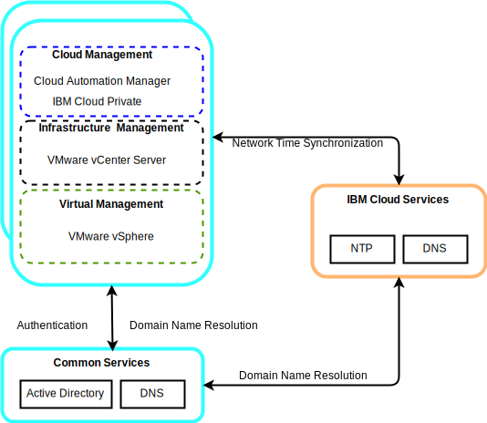
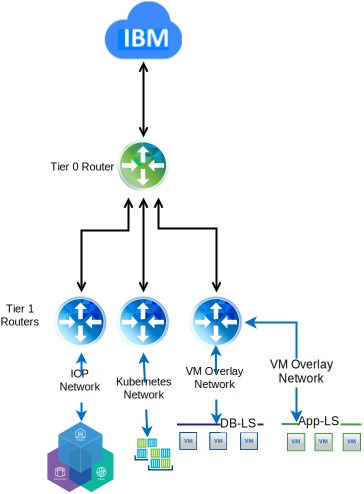

---

copyright:

  years:  2016, 2019

lastupdated: "2019-01-23"

---

# Detailed design

## Common services components

Common services provide the services that are used by other services in the cloud management platform. Common services include identity and access services, domain name services, and NTP services.

Figure 1. {{site.data.keyword.icpfull_notm}} common services

### Identity and access services
As part of the VMware vCenter Server on {{site.data.keyword.cloud}} automation, a Microsoft Active Directory (AD) is employed for Identity  Management. A single AD virtual server instance (VSI) is deployed. The vCenter is configured to use AD authentication and you can configure {{site.data.keyword.icpfull_notm}} for LDAP Authentication.

###	Domain Name Services
The vCenter Server deployment uses the deployed AD VSIs as DNS servers for the instance. All deployed components, such as, vCenter, PSC, NSX, and ESXi hosts, are configured to point to AD as their default DNS.

###	NTP services
The vCenter Server deployment uses the {{site.data.keyword.cloud_notm}} infrastructure NTP servers. All deployed components are configured to use these NTP servers. Having all components within the design that uses the same NTP servers is critical for certificates and AD authentication to function correctly.

## Networking

### NSX-V networking

NSX-V is designed so that a single NSX-V manager platform is tied to a single vCenter Server instance. It provides networking services to applications that run within a vSphere environment.

Using the NSX-V networking included in the VCS deployment, we can deploy {{site.data.keyword.icpfull_notm}} into a VXLAN overlay network.

{{site.data.keyword.icpfull_notm}} is deployed with the default Calico networking stack for Kubernetes, which provides network isolation within your cluster.

Figure 2. {{site.data.keyword.icpfull_notm}} with NSX-V networking

For more information, see [vCenter Server networking guide](/docs/services/vmwaresolutions/archiref/vcsnsxt/vcsnsxt-intro.html).

### NSX-T networking

NSX-T is designed so that a single networking platform that can connect to any type of application, being virtual machine or container based, running inside or outside a vSphere environment.

{{site.data.keyword.icpfull_notm}} provides an option to replace the Calico networking with an NSX-T instance, providing a single location for managing networking and security.

Figure 3. {{site.data.keyword.icpfull_notm}} with NSX-T networking

### Related links

* [vCenter Server on {{site.data.keyword.cloud_notm}} with Hybridity Bundle overview](/docs/services/vmwaresolutions/archiref/vcs/vcs-hybridity-intro.html)
