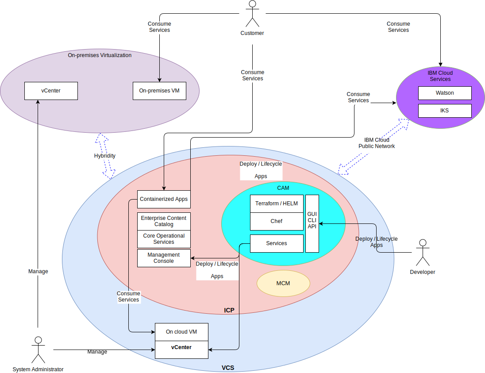

---

copyright:

  years:  2016, 2019

lastupdated: "2019-02-15"

---

# System context
{: #vcsicp-systemcontext}

Figure 1. System context diagram

The following are the core components:

- **On-premises virtualization** – This component is a VMware environment that is hosted on the client’s premises or a third-party location and currently hosts the virtual machines (VMs) that run the applications to be modernized. On-premises virtualization is the source environment for VM migrations and is loosely coupled to an {{site.data.keyword.cloud}} instance via VMware Hybridity (HCX).
- **vCenter Server** – VMware vCenter Server on {{site.data.keyword.cloud_notm}} is an {{site.data.keyword.vmwaresolutions_short}} instance that is the target for migrated VMs from the on-premises environment. Together with the on-premises virtualized environment, it forms a hybrid environment that enables VMs to move from one site to the other.
- **{{site.data.keyword.containerlong_notm}}** - {{site.data.keyword.containerlong_notm}} uses Kubernetes as the container orchestration solution. IBM operates and manages the Kubernetes master node while the worker nodes are deployed to customer-managed infrastructure. IBM provides management tools for operating system patch deployment, Docker engine upgrades, and new Kubernetes versions. {{site.data.keyword.containerlong_notm}} provides an isolated and secure platform for managing containers that is portable, extensible, and self-healing if failovers occur.
- **{{site.data.keyword.icpfull_notm}}** - {{site.data.keyword.icpfull_notm}} is an application platform for developing and managing containerized applications. {{site.data.keyword.icpfull_notm}} is an integrated environment that includes the container orchestrator Kubernetes, a private image repository, a management console, monitoring frameworks and a graphical user interface, which provides a centralized location from where you can deploy, manage, monitor, and scale applications.
- **{{site.data.keyword.cloud_notm}} Automation Manager** – CAM is an enterprise-ready infrastructure as code (IaC) platform that provides a single pane of glass to provision VMware based workloads alongside Kubernetes based workloads. Automation of workload provisioning for virtual machines, containers, and their infrastructure prerequisites is enabled via CAM.
- **IBM Multi Cloud Manager** – MCM provides user visibility, application-centric management (policy, deployments, health, operations), and policy-based compliance across clouds and clusters. With MCM, you have control of your Kubernetes clusters.
- **{{site.data.keyword.cloud_notm}} Services** – {{site.data.keyword.cloud_notm}} Services are a wide range of consumable services available including analytics, AI, and IoT offerings.

## Actors
{: #vcsicp-systemcontext-actors}

Table 1. Actors

Actor | Description
--|--
System Administrator | VMware vSphere skilled resource who uses vCenter Server to manage the on-premises virtualization and the vCenter Server instance.
Developer | Container skilled resource who uses the CAM console to create and manage containers. They create the new services as part of application modernization. Using CAM, the Developer provisions workloads on vCenter Server, {{site.data.keyword.icpfull_notm}}, or {{site.data.keyword.containerlong_notm}}, composes and orchestrates services that are built with VMs and containers, and integrates DevOps toolchains and day-2 ITSM solutions.
Customer | External actor who consumes services from the enterprise. For Acme Skateboards, the customer is a skater who wants to purchase skateboarding products. The customer requires secure internet access to the catalog.
{{site.data.keyword.containerlong_notm}} | IBM resource managing the {{site.data.keyword.containerlong_notm}} Master Node for the service.

## Systems
{: #vcsicp-systemcontext-systems}

Table 2. Systems

Actor | Description
--|--
vCenter Server | Primary interface the system administrator uses to manage both the on-premises VMs and the {{site.data.keyword.cloud_notm}} VMs in the vCenter Server instance.
On-premise VMs| Virtualized servers that host the applications targeted for migration into {{site.data.keyword.cloud_notm}}. Initially migrated as VMs and refactored from VMs to containers for application modernization.
{{site.data.keyword.cloud_notm}} VMs | Virtualized servers that host the applications migrated from the on-premises data center. For this reference architecture and for Acme Skateboards, one of the {{site.data.keyword.cloud_notm}} VMs is a database server, which is part of the online presence workload.
Enterprise Content catalog | Centralized location from which you can browse for and install packages in your cluster. The catalog has a number of IBM packages that are used to create containers and access to Helm charts. Helm is a tool for managing Kubernetes charts. Charts are packages of preconfigured Kubernetes resources that makes it easy to version, package, release, deploy, delete, upgrade and even rollback container deployments. Helm is the Kubernetes native package management system, and is used for application management inside an {{site.data.keyword.icpfull_notm}} cluster.
Core Operational Services | {{site.data.keyword.icpfull_notm}} includes a number of tools to collect, store, and query logs and metrics. These tools provide a centralized store for all logs and metrics and deliver improved performance and increased stability when they access and query logs and metrics.
Management Console | The {{site.data.keyword.icpfull_notm}} management console manages, monitors, and troubleshoots your applications and cluster from a single, centralized, and secure management console.
Terraform | Handles the provisioning of cloud and infrastructure resources by using providers such as VMware vSphere, {{site.data.keyword.cloud_notm}}, Microsoft Azure, Amazon Web Services, Google Cloud Platform, and OpenStack.
HELM | Package manager for Kubernetes. Helm charts are used to define Kubernetes resources and deploy applications.
Chef | Responsible for configuration management and compliance automation. Chef deploys and configures middleware and applications after Terraform completes initial provisioning.
Services | Represents the Service Composer, which is where administrators author, compose and design services that are constructed from Kubernetes resources and one or more VMs.
Containerized applications | Applications that completed the application modernization journey and are now running as containers. For this reference architecture and for Acme Skateboards, one of the containerized applications is a web server, which is part of the online presence workload.
Watson | For this reference architecture and Acme Skateboards, Watson represents the AI service that is used in the “Concept Car” architecture.

Application migration, networking, and security often are the most challenging aspects of application modernization. vCenter Server, VMware Hybridity, VMware NSX, {{site.data.keyword.icpfull_notm}}, and the {{site.data.keyword.containerlong_notm}} address these challenges and enable you to build resilient, secure, and robust modern applications.

## Related links
{: #vcsicp-systemcontext-related}

* [vCenter Server on {{site.data.keyword.cloud_notm}} with Hybridity Bundle overview](/docs/services/vmwaresolutions/archiref/vcs/vcs-hybridity-intro.html)
