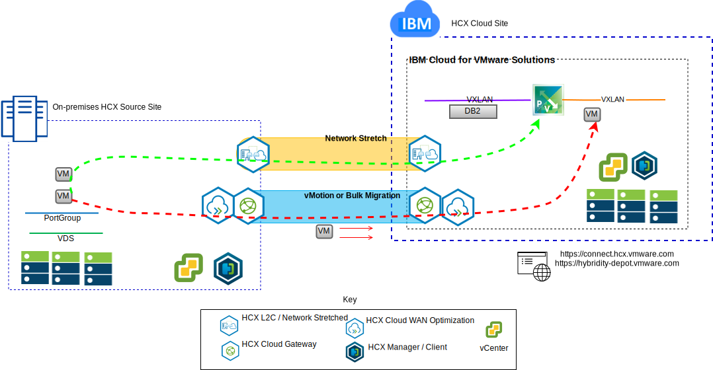
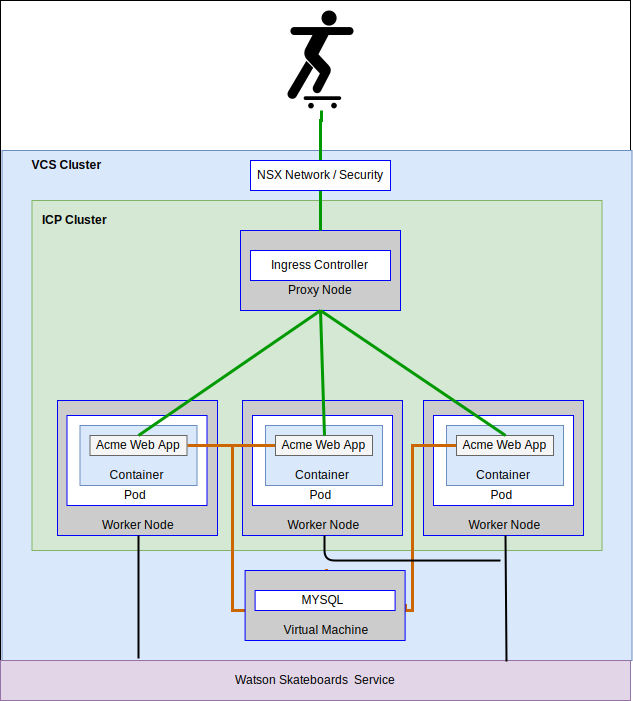
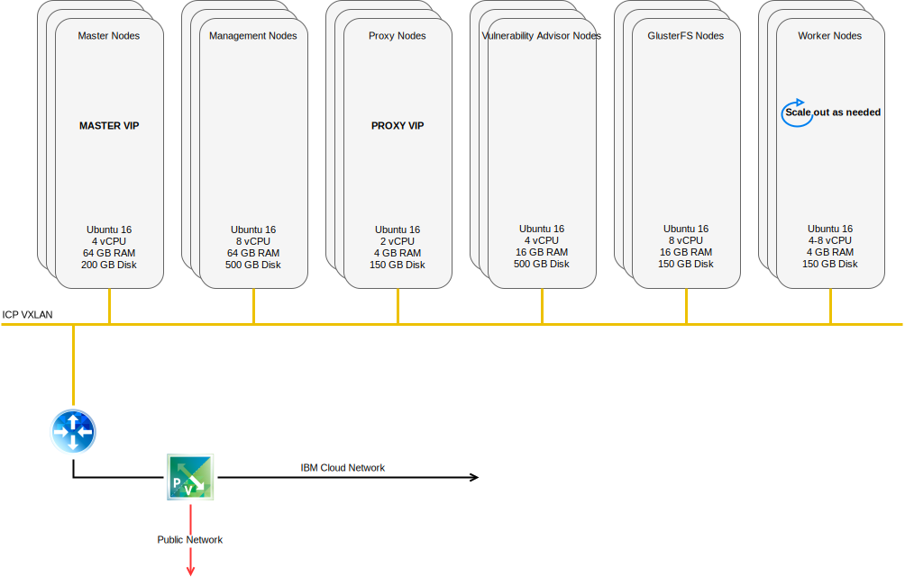

---

copyright:

  years:  2016, 2018

lastupdated: "2018-11-20"

---

# Use cases

## Workload migration to IBM Cloud
Acme Skateboards wants to seamlessly extend their on-premises VMware SDDC into a VMware vCenter Server on {{site.data.keyword.cloud}} instance. They need to keep their business up and running and keep their downtime to a minimum. Reconfiguring their applications to run in the cloud isn't an optimal solution.

VMware vCenter Server on {{site.data.keyword.cloud_notm}} with Hybridity Bundle enables the creation of seamless connections between {{site.data.keyword.cloud_notm}} and an on-premises VMware virtualized datacenter.

The vCenter Server with Hybridity Bundle offering from {{site.data.keyword.cloud_notm}} enables secure connections between the peer on-premises source site and the {{site.data.keyword.cloud_notm}} target site.

Figure 1. VMware Hybridity services

VMware Hybrid Cloud Extension Services creates a loosely coupled interconnectivity between on-premises and {{site.data.keyword.cloud_notm}} and enables capabilities such as:
- **Simple interconnectivity** – logical network connections are established easily over any physical connection that includes public internet, private VPN, or {{site.data.keyword.cloud_notm}} Direct Link.
- **Layer 2 extension** – on-premises networks are extended into the cloud that includes on-premises subnets and IP addressing.
- **Encryption** – network traffic is securely encrypted between the peer sites.
- **Network optimization** – selects the best connection and efficiently floods the connection so that network traffic is moved as fast as possible.
- **Data deduplication** – as much as 50% reduction in network traffic can be achieved.
- **Intelligent routing** – when a workload is moved, proximity routing can change the network path (that is, gateway) so that network traffic uses the target site gateway and does not “hairpin” back to the originating site.
- **Zero downtime migration** – use vMotion to move a running virtual machine (VM) to, or back from, the cloud.
- **Scheduled migration** – you can replicate any number of VMs to the destination site and then activate on that site at a designated time to replace the systems that run on the originating site.
- **Migration of security policies** – if NSX is used on-premises any security policies, firewalls, and so on, are moved along with the workload.

Using this solution Acme Skateboards successfully migrated their on-premises VMware workloads to the {{site.data.keyword.cloud_notm}} meeting their requirements of little to no downtime and no application reconfiguration.

## Hybrid architecture deployment

Acme Skateboards wants to deploy a hybrid architecture on {{site.data.keyword.cloud_notm}} consisting of vCenter Server and ICP, for their journey to application modernization. Their requirements are to run their databases on virtual machines, the applications and web services in containers, and use a common set of tools for network and security management.

Figure 2. Acme Skateboards hybrid application

{{site.data.keyword.vmwaresolutions_short}} provides automation to deploy VMware technology components in {{site.data.keyword.CloudDataCents_notm}} across the globe. The architecture consists of a single cloud region and supports the ability to extend into more cloud regions that are located in another geography or into another {{site.data.keyword.cloud_notm}} pod within the same data center.

The {{site.data.keyword.cloud_notm}} Private (ICP) and Cloud Automation Manager (CAM) products are manually deployed into your on-premises virtualization platform, enabling cloud management from the on-premises location. Alternatively, ICP and CAM are offered as a service extension to an existing or new vCenter Server deployment, via automation, enabling cloud management from {{site.data.keyword.cloud_notm}}.

The following diagram represents ICP running on top of a vCenter Server instance. NSX-V is configured with a dedicated switch/VXLAN, a DLR, and an ESG specifically for the ICP overlay network, routing is set up through the ESG for access to the underlay network.

Using the {{site.data.keyword.cloud_notm}} automation, Acme Skateboards can provision a hybrid solution that encompasses VMware on {{site.data.keyword.cloud_notm}} to run their database VMs and ICP on VMware on {{site.data.keyword.cloud_notm}} to run their apps and front-end web services in containers. NSX gives them a common set of management tools for network and security in the overlay network.

Figure 3. vCenter Server with ICP

### Related links

* [vCenter Server on {{site.data.keyword.cloud_notm}} with Hybridity Bundle overview](../vcs/vcs-hybridity-intro.html)
