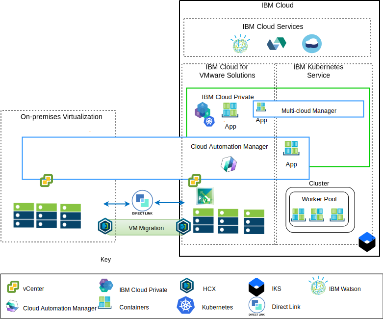

---

copyright:

  years:  2016, 2018

lastupdated: "2018-10-30"

---

# Application modernization overview

The following diagram shows the application modernization reference architecture that Acme Skateboards will deploy and is described in depth in this series of documents.

Figure 1. Architecture overview diagram

This hybrid architecture will allow Acme Skateboards to:
- Migrate VMware VMs from on-premises to IBM Cloud with little or no downtime and no application reconfiguration.
- Enable them to start the application modernization journey by allowing them to focus on containerizing the simpler web interfaces and middleware while allowing more complex databases to remain as VMs.
- Leverage Cloud Automation Manager (CAM) to script infrastructure as code (IaC) to compose and orchestrate services made from both VMs and containers to integrate with their DevOps toolchains and their ITSM solution.

The reference architecture has the following key components:
- **On-premises virtualization** – This is a VMware cluster that currently hosts the Acme Skateboards VMs. It is these VMs that are currently hosting the applications that will be modernized. This cluster is required to meet the prerequisites of the [VMware HCX on IBM Cloud Solution Architecture](https://www.ibm.com/cloud/garage/files/HCX_Architecture_Design.pdf) architecture so that it can run HCX.

HCX extends the on-premises networks into the IBM Cloud allowing customers to migrate VMs into the VMware vCenter Server on IBM Cloud (VCS) instance running on IBM Cloud, and back if required.
- **IBM Cloud for VMware Solutions** – The VCS instance provides the fundamental VMware building blocks, such as vSphere, vCenter Server, NSX-V, and storage options including vSAN or IBM Cloud Endurance storage, needed to automatically deploy a VMware Software Defined Data Center (SDDC) solution. The VMware cluster is the target for the migrated VMs as well as some of the modernized applications in containers hosted in ICP. The key components in VCS are as follows:
  - **NSX-V** - NSX-V provides is the network virtualization layer in VCS that provides a network overlay for Acme Skateboards VMs. NSX-V enables BYOIP and isolates the workload networks from the IBM Cloud networks. NSX-V is programmed by HCX to create the networks that Acme Skateboards will extend from on-premises.
  - **NSX-T** - NSX-T provides a common set of tools for network and security management across both containers and VMs. NSX-T is fully compatible with Kubernetes Container Networking Interface (CNI) and integrates with CNI to provide container networking. NSX-T provides the overlay network that the modernized applications use and is replacing Calico, which is used natively by ICP and IKS.

- **IBM Cloud Private** - ICP is an application platform for developing and managing containerized applications. ICP is an integrated environment that includes the container orchestrator Kubernetes, a private image repository, a management console, monitoring frameworks and a graphical user interface that provides a centralized location from where Acme Skateboards can deploy, manage, monitor, and scale their applications. The VCS instance hosts the ICP components, master nodes, worker nodes, and so on, running them as VMs. ICP hosts:
- **IBM Cloud Automation Manager** – CAM is an enterprise-ready infrastructure as code (IaC) platform that provides a single pane of glass to provision VM workloads, on-premises or on VCS, alongside Kubernetes workloads, in ICP or IKS, by simply using templates. CAM is a Dockerized application that runs on top of ICP and is tightly integrated for authorization, role-based access control (RBAC), and other functions.
    - The containerized Acme Skateboards applications that they want to
deploy in this environment.

- **IBM Kubernetes Service** – IKS enables Acme Skateboards to deploy their modernized applications in Docker containers that run in Kubernetes clusters. The master modes are fully managed by IBM while the worker nodes in the worker pool are deployed into the same IBM Cloud account as their VCS instance. Worker nodes can be: bare metal, public, or dedicated virtual server instances. Calico is installed and configured automatically in IKS. Calico provides secure network connectivity for containers and is configured in IKS to use IP-in-IP encapsulation for packets traveling across subnets and to use NAT for outgoing connections from the containers.

- **Direct Link** – IBM Cloud Direct Link uses Acme Skateboard’s WAN provider to connect their data center to IBM Cloud to provide a reliable, low latency, secure network connection. This connection provides:
  - Access to the cloud hosted applications from your Enterprise users.
  - Inter VM traffic between on-premises VMs and cloud VMs.
  - Traffic between legacy systems in the on-premises data center and cloud VMs.

## Key benefits to Acme Skateboards

VMware vCenter Server on IBM Cloud (VCS) provides the fundamental building blocks that include VMware vSphere, vCenter Server, NSX, and shared storage options including vSAN, needed to flexibly architect a VMware Software Defined Data Center (SDDC) solution that best fits the client’s workloads.

In summary, the IBM Cloud for VMware offerings:
* Accelerate delivery of IT projects to developers and lines of
business by reducing the time that it takes for procurement, architecture,
implementation, and deployment of resources from weeks or months, to
hours.
* Enhance security with dedicated bare metal servers in a hosted
private cloud, including private endpoint deployment to IBM Cloud
services, including IKS and KMIP.
* Enable consistent management and governance of the deployed hybrid
cloud by providing full administrative access to virtualization
management, thus preserving your existing VMware tools, scripts, and
investments in training.
* Leverage VMware expertise at global scale with IBM Professional and
Managed Services spanning 30+ IBM Cloud data centers worldwide.

IBM Cloud Kubernetes Service (IKS) is a managed Kubernetes offering to
deliver powerful management tools, an intuitive user experience, and
built-in security and isolation to enable rapid delivery of applications
all while leveraging Cloud Services including cognitive capabilities
from Watson. IBM is a Cloud Native Computing Foundation (CNCF) Platinum
member and our offering complies with the CNCF Kubernetes conformance
testing program.

IKS provides native Kubernetes capabilities such as:

-   Intelligent scheduling will maximize utilization of the underlying
cluster resources by deploying apps in a way that ensure CPU-intensive
and RAM-intensive pods are colocated.
-   Self-healing for containerized applications and microservices
ensuring those components are redeployed automatically if something
goes awry.
-   Horizontal scaling to allow you to configure a deployment policy,
which the orchestrator will utilize to ensure that the workloads have the
required capacity.
-   Service discovery and load balancing provide a lightweight DNS within
the Kubernetes cluster allowing services to register themselves and
eliminate the need for static coding of your microservices. Load
balancing will distribute incoming requests to the number of instances
running in your architecture.
-   Automated rollouts and rollbacks support teams deploying new
features and fixes in a controlled manner. Should something break, we
can automatically roll back to the previously known good version of the
image.
-   Secret and configuration management. Secrets are an object within
Kubernetes that stores sensitive data such as a password, token, or a
key. These secrets are encrypted by default and ensure that access to this sensitive data is controlled.

Customers moving toward cloud native application platforms such as ICP
and IKS are focused on speed and innovation and don’t always have
security and networking in mind. Waiting on networking or security teams
to provision services like load balancers, firewalls, switches, and
routers decreases application time to value. This reference architecture
shows how VCS, ICP, and IKS securely move Acme Skateboards along the
application modernization journey.

### Related links

* [VCS Hybridity Bundle overview](../vcs/vcs-hybridity-intro.html)
