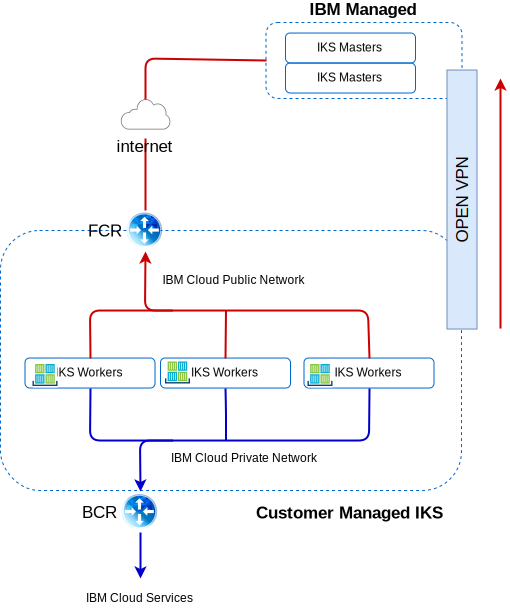

---

copyright:

  years:  2016, 2019

lastupdated: "2019-02-15"

---

# IBM Cloud networking and infrastructure
{: #vcsiks-arch-overview-infrastructure}

## Virtual Routing and Forwarding
{: #vcsiks-arch-overview-infrastructure-vrf}

{{site.data.keyword.cloud}} accounts can also be configured as a Virtual Routing and Forwarding (VRF) account. VRF accounts provide similar functions to VLAN spanning, enabling automatic routing between subnet IP blocks. All accounts with Direct-Link connections must be converted to, or created as, a VRF account.

## Direct Link
{: #vcsiks-arch-overview-infrastructure-direct-link}

{{site.data.keyword.cloud_notm}} Direct Link Connect offers private access to your {{site.data.keyword.cloud_notm}}
infrastructure and to any other clouds linked to your Network Service
Provider, through your local {{site.data.keyword.CloudDataCent_notm}}. This option is
perfect for creating multi-cloud connectivity in a single environment.
We connect customers to the {{site.data.keyword.cloud_notm}} Private network, by using a shared
bandwidth topology. As with all Direct-Link products, you can add global
routing, which enables private network traffic to all {{site.data.keyword.cloud_notm}}
locations.

## Virtual private networks
{: #vcsiks-arch-overview-infrastructure-virt-private-network}

### strongSwan VPN
{: #vcsiks-arch-overview-infrastructure-strongswan}

The strongSwan IPSec VPN service provides a secure end-to-end
communication channel over the internet that is based on the
industry-standard Internet Protocol Security (IPSec) protocol suite.

### Hybridity (HCX)
{: #vcsiks-arch-overview-infrastructure-hcx}

The VMware vCenter Server on {{site.data.keyword.cloud_notm}} with Hybridity Bundle seamlessly extends the
networks of on-premises data centers into {{site.data.keyword.cloud_notm}}, which allows
virtual machines (VMs) to be migrated to and from the {{site.data.keyword.cloud_notm}} without
any conversion or change.

## Physical structure
{: #vcsiks-arch-overview-infrastructure-physical-structure}

The physical infrastructure required to deploy a vCenter Server cluster, requires
the following minimum specification.

Table 1. vCenter Server specifications

  | NFS Deployment | VSAN Deployment
---|---|---
Number of Servers | 3 | 4
CPU | 28 Cores 2.2GHZ | 28 Cores 2.2GHZ
Memory | 384 GB | 384 GB
Storage|Mgmt: 2 TB 2 IOPS, Workload: 2 TB 4 IOPS|Min SSD: 960 GB(x2)   

The {{site.data.keyword.containerlong_notm}} deployment options vary based on your worker node requirements.

Table 2. {{site.data.keyword.containerlong_notm}} specifications

  | virtual machine | Bare Metal
--|---|--
Number of Servers | 3 | 3
CPU | 2 – 56 Core | 4 – 28 Core
Memory | 4 GB - 242 GB | 32 GB - 512 GB
Storage | 100 GB |  SATA: 2 TB / SSD: 960 GB

## Virtual structure
{: #vcsiks-arch-overview-infrastructure-virtual-structure}

Figure 1. Physical structure of {{site.data.keyword.containerlong_notm}} and {{site.data.keyword.icpfull_notm}} deployments

Within the vCenter Server instance, the customer VMSs are deployed to dedicated NSX
Edge Services Gateways (ESG) and Distributed Logical Routers (DLR).

The ESG is configured with a source NAT rule (SNAT) to allow outbound traffic, which enables internet connectivity to download the {{site.data.keyword.icpfull_notm}} prerequisites and to connect to GitHub and Docker. Alternatively, you can use a web-proxy for internet connectivity. The ESG is configured to access DNS and NTP services via the private network. Integration to the {{site.data.keyword.containerlong_notm}} instance is available via {{site.data.keyword.cloud_notm}} networking between the vCenter Server instance and {{site.data.keyword.containerlong_notm}}.

## vCenter Server components
{: #vcsiks-arch-overview-infrastructure-vcs-comp}

Figure 2. vCenter Server platform components

### Platform Service Controller
{: #vcsiks-arch-overview-infrastructure-psc}

The vCenter Server deployment uses a single, external platform services controller
(PSC) installed on a portable subnet in the private VLAN associated with
management VMs. Its default gateway is set to the backend
customer router (BCR).

### vCenter Server
{: #vcsiks-arch-overview-infrastructure-vcs}

Like the PSC, the vCenter Server is deployed as an appliance.
Additionally, the vCenter is installed on a portable subnet in the
private VLAN associated with management VMs. Its default
gateway is set to the BCR.

### NSX Manager
{: #vcsiks-arch-overview-infrastructure-nsx-manager}

The NSX Manager is deployed on the initial vCenter Server cluster. Additionally,
the NSX Manager is assigned an IP address from the private portable
address block that is designated for management components.

### NSX Controllers
{: #vcsiks-arch-overview-infrastructure-nsx-controllers}

The {{site.data.keyword.cloud_notm}} automation deploys three NSX Controllers within the
initial cluster. The controllers are assigned IP addresses from the
private portable subnet that is designated for management components.

### NSX ESGs / DLRs
{: #vcsiks-arch-overview-infrastructure-nsx-esg}

NSX Edge Services Gateway (ESG) pairs are deployed. In all cases, one
gateway pair is used for outbound traffic from automation components that
reside on the private network. For vCenter Server and {{site.data.keyword.icpfull_notm}}, a second gateway, which is known as the
icp–managed edge, is deployed and configured with an uplink to the
public network and an interface that is assigned to the private network.
Any required NSX component such as Distributed Logical
Router (DLR), logical switches, and firewalls can be configured by the
administrator. For more information about the NSX Edges that are
deployed as part of the solution, see [vCenter Server networking guide](/docs/services/vmwaresolutions/archiref/vcsnsxt?topic=vmware-solutions-vcsnsxt-intro).

The following tables summarize the {{site.data.keyword.icpfull_notm}} ESG / DLR specifications.

Table 3. {{site.data.keyword.icpfull_notm}} ESG specifications

Attribute |  Specification
--|--
Edge Service Gateway | Virtual appliance
Edge size	Large | Number of vCPUs	2
Memory	| 1 GB
Disk	| 1000 GB on local datastore

Table 4. {{site.data.keyword.icpfull_notm}} DLR specifications

Attribute  |  Specification
--|--|
Distributed Logical Router |	Virtual appliance
Edge size	Compact | Number of vCPUs	1
Memory	| 512 MB
Disk	| 1000 GB on local datastore

## IBM Cloud Kubernetes Service components
{: #vcsiks-arch-overview-infrastructure-iks-comp}

Figure 3. {{site.data.keyword.containerlong_notm}} components

### Kubernetes master
{: #vcsiks-arch-overview-infrastructure-kube-master}

The Kubernetes master is tasked with managing all compute, network, and
storage resources in the cluster. The Kubernetes master ensures that
your containerized apps and services are equally deployed to the worker
nodes in the cluster.

###	Worker node
{: #vcsiks-arch-overview-infrastructure-worker-node}

Each worker node is a physical machine (bare metal) or a VM
that runs on physical hardware in the cloud environment. When you
provision a worker node, you determine the resources that are available
to the containers that are hosted on that worker node. Out of the box,
your worker nodes are set up with an IBM-managed Docker Engine, separate
compute resources, networking, and a volume service. The built-in
security features provide isolation, resource management capabilities,
and worker node security compliance.

## Related links
{: #vcsiks-arch-overview-infrastructure-related}

* [vCenter Server on {{site.data.keyword.cloud_notm}} with Hybridity Bundle overview](/docs/services/vmwaresolutions/archiref/vcs?topic=vmware-solutions-vcs-hybridity-intro)
